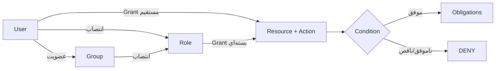

# سطوح دسترسی و مجوزدهی

## واژگان

| مفهوم | معنا | جدول/مدل |
|---|---|---|
| User | هویت یک شخص از issuer خارجی | `app_user` / `user` |
| Group | گروه سازمانی و عضویت افراد | `directory_group` / `group` |
| Role | بسته‌ای از مجوزها | `application_role` / `role` |
| Resource | چیزی که محافظت می‌شود | `resource` |
| Action | عملی که روی منبع انجام می‌شود | `action` |
| Grant | انتساب subject + resource + action | `authorization_grant` |
| Relation | نمایش رابطه برای OpenFGA | `viewer`, `editor`, `manager`, ... |
| Condition | شرط ساختاریافته مانند شعبه یا زمان | `condition_definition` |
| Obligation | محدودیت خروجی مانند mask یا row filter | `data_policy.obligations` |

## درخت منابع

هر `resource` می‌تواند `parent_id` داشته باشد. نوع‌های معتبر:

- `APPLICATION`
- `MODULE`
- `PAGE`
- `UI_COMPONENT`
- `BUSINESS_RESOURCE`
- `EXTERNAL_RESOURCE`

نمونه:

```text
application:aurevia
├── module:hr
│   └── business_resource:employee
├── module:finance
│   └── business_resource:payment
└── external_resource:superset-public
    └── external_resource:superset-public:dashboard:welcome-dashboard
```

در schema فعلی PostgreSQL parent ثبت می‌شود، اما inheritance خودکار grant از parent در queryهای manifest پیاده نشده است. inheritance رابطه‌ای باید در OpenFGA یا evaluator مشخص اجرا شود.

## actionها و سطوح عملیاتی

catalog اولیه actionهای `view`, `create`, `update`, `approve`, `admin` را ایجاد می‌کند. مدل OpenFGA روابط دقیق‌تری دارد:

| منبع | رابطه | permission حاصل |
|---|---|---|
| application | `viewer` | `can_view` |
| application | `manager` | `can_view`, `can_manage` |
| resource | `viewer` | `can_view` |
| resource | `creator` | `can_create` |
| resource | `editor` | `can_view`, `can_edit` |
| resource | `deleter` | `can_delete` |
| resource | `manager` | همه مجوزهای resource |
| external_resource | `viewer` | `can_view` |
| external_resource | `editor` | `can_view`, `can_edit` |
| external_resource | `sharer` | `can_share` |
| external_resource | `exporter` | `can_export` |
| external_resource | `manager` | همه مجوزهای external resource |

## مسیر محاسبه دسترسی



`AuthorizationController.check` درخواست را به `RelationshipAuthorizationPort` می‌دهد. adapter، subject را مانند `user:alice` و resource را مطابق model OpenFGA بررسی می‌کند. نتیجه با `ALLOW/DENY`، reason code، model version و decision id برمی‌گردد.

## Manifest رابط کاربری

`GET /api/v1/me/manifest` از BFF به Authorization Service می‌رود. خروجی شامل:

```json
{
  "version": "manifest-...",
  "expiresAt": "...",
  "panels": [],
  "permissions": {
    "business_resource:employee": ["view", "update"]
  }
}
```

UI می‌تواند دکمه یا route را بر اساس این manifest پنهان کند، اما پنهان‌کردن UI کنترل امنیتی نهایی نیست؛ API نیز باید همان مجوز را enforce کند.

## انتصاب دسترسی مستقیم به کاربر

1. کاربر را در بخش مدیریت ایجاد/انتخاب کنید.
2. resource را در درخت انتخاب کنید.
3. action متصل به resource را انتخاب کنید.
4. relation مناسب را وارد کنید.
5. در صورت نیاز `expiresAt` تعیین کنید.
6. Admin MFE درخواست `POST /api/v1/admin/grants` را با CSRF می‌فرستد.
7. BFF آن را به `/internal/v1/registry/grants` منتقل می‌کند.
8. رکورد `authorization_grant` و audit ساخته می‌شود.

بدنه نمونه:

```json
{
  "userId": "UUID",
  "resourceId": "UUID",
  "actionId": "UUID",
  "relation": "viewer",
  "expiresAt": null
}
```

لغو دسترسی با `DELETE /api/v1/admin/grants/{id}` انجام و grant به `ARCHIVED` تبدیل می‌شود.

## انتصاب گزارش یا داشبورد به کاربر

1. asset با `POST /api/v1/admin/superset-assets` ثبت می‌شود.
2. سرویس هم‌زمان یک `EXTERNAL_RESOURCE` فرزند `external_resource:superset-public` می‌سازد.
3. action `view` به resource متصل می‌شود.
4. با API grant، action `view` آن resource به user داده می‌شود.
5. `GET /api/v1/reports` فقط assetهای publish‌شده و grant مستقیم فعال/منقضی‌نشده کاربر را برمی‌گرداند.
6. کلیک روی گزارش runtime عملیاتی را از tunnel امن باز می‌کند.

## policy ساختاریافته

`StructuredPolicyEvaluator` فقط fieldهای زیر را قبول می‌کند:

```text
ownerId, orgUnit, branch, classification, request.ipClass, time
```

operatorها: `eq`, `in`, `before`, `after`.

obligationهای مجاز:

```text
rowFilters, allowedColumns, maskedColumns, maximumRows,
exportAllowed, printAllowed, watermark
```

field/operator ناشناخته، context ناقص یا خطای parse همگی DENY می‌شوند.

## قواعد دامنه

- `enforceOrgScope` فقط ردیف‌های واحد سازمانی کاربر را نگه می‌دارد.
- `enforcePaymentApproval` مانع می‌شود سازنده یک پرداخت همان پرداخت را تأیید کند؛ این همان Separation of Duties است.

## شکاف‌های فعلی که باید قبل از Production بسته شوند

1. `AdminProxyController` فعلاً هر کاربر authenticated را عبور می‌دهد و `admin` را صریح check نمی‌کند.
2. query مربوط به manifest همه panelهای فعال را برمی‌گرداند و panel-level filtering ندارد.
3. query گزارش‌ها فقط grant مستقیم `USER` را می‌بیند؛ grantهای Role و Group را پوشش نمی‌دهد.
4. `AccessAdminController` هنگام grant/revoke رکورد outbox برای OpenFGA نمی‌سازد؛ همگام‌سازی کامل PostgreSQL و OpenFGA لازم است.
5. `OpenFgaRelationshipAdapter` در محیط خطا default-deny دارد، ولی rollout، retry و drift reconciliation باید operationally پایش شوند.
6. endpointهای داخلی از Basic Auth مشترک استفاده می‌کنند؛ Production باید mTLS/secret rotation و network policy داشته باشد.
7. UI authorization جایگزین enforcement سمت API نیست.

این موارد «نقص مستندات» نیستند؛ وضعیت واقعی کد در نسخه فعلی‌اند.
