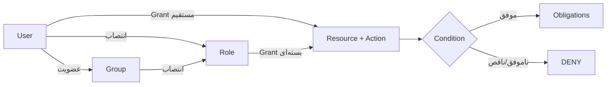

# سطوح دسترسی و مجوزدهی

## واژگان

| مفهوم | معنا | جدول/مدل |
|---|---|---|
| User | هویت یک شخص از issuer خارجی | `app_user` / `user` |
| Group | گروه سازمانی و عضویت افراد | `directory_group` / `group` |
| Role | بسته‌ای از مجوزها | `application_role` / `role` |
| Resource | چیزی که محافظت می‌شود | `resource` |
| Action | عملی که روی منبع انجام می‌شود | `action` |
| Grant | انتساب subject + resource + action | `authorization_grant` |
| Relation | نمایش رابطه برای OpenFGA | `viewer`, `editor`, `manager`, ... |
| Condition | شرط ساختاریافته مانند شعبه یا زمان | `condition_definition` |
| Obligation | محدودیت خروجی مانند mask یا row filter | `data_policy.obligations` |

## درخت منابع

هر `resource` می‌تواند `parent_id` داشته باشد. نوع‌های معتبر:

- `APPLICATION`
- `MODULE`
- `PAGE`
- `UI_COMPONENT`
- `API_RESOURCE`
- `BUSINESS_RESOURCE`
- `EXTERNAL_RESOURCE`

نمونه:

```text
application:aurevia
├── module:hr
│   └── business_resource:employee
├── module:finance
│   └── business_resource:payment
└── external_resource:superset-public
    └── external_resource:superset-public:dashboard:welcome-dashboard
```

والد هم در PostgreSQL و هم به‌صورت tuple در OpenFGA Store ثبت می‌شود. مدل OpenFGA ارث‌بری مجوزهای والد را صریحاً اعمال می‌کند و manifest مؤثر فقط گره‌های مجاز و ancestorهای لازم برای نمایش درخت را برمی‌گرداند.

## actionها و سطوح عملیاتی

catalog اولیه actionهای `view`, `create`, `update`, `approve`, `admin` را ایجاد می‌کند. مدل OpenFGA روابط دقیق‌تری دارد:

| منبع | رابطه | permission حاصل |
|---|---|---|
| application | `viewer` | `can_view` |
| application | `manager` | `can_view`, `can_manage` |
| resource | `viewer` | `can_view` |
| resource | `creator` | `can_create` |
| resource | `editor` | `can_view`, `can_edit` |
| resource | `deleter` | `can_delete` |
| resource | `manager` | همه مجوزهای resource |
| external_resource | `viewer` | `can_view` |
| external_resource | `editor` | `can_view`, `can_edit` |
| external_resource | `sharer` | `can_share` |
| external_resource | `exporter` | `can_export` |
| external_resource | `manager` | همه مجوزهای external resource |

## مسیر محاسبه دسترسی



`AuthorizationController.check` درخواست را به `RelationshipAuthorizationPort` می‌دهد. adapter، subject را مانند `user:alice` و resource را مطابق model OpenFGA بررسی می‌کند. نتیجه با `ALLOW/DENY`، reason code، model version و decision id برمی‌گردد.

## Manifest رابط کاربری

`GET /api/v1/me/manifest` از BFF به Authorization Service می‌رود. خروجی شامل:

```json
{
  "version": "manifest-...",
  "expiresAt": "...",
  "panels": [],
  "permissions": {
    "business_resource:employee": ["view", "update"]
  }
}
```

UI می‌تواند دکمه یا route را بر اساس این manifest پنهان کند، اما پنهان‌کردن UI کنترل امنیتی نهایی نیست؛ API نیز باید همان مجوز را enforce کند.

## انتصاب دسترسی مستقیم به کاربر

1. کاربر را در بخش مدیریت ایجاد/انتخاب کنید.
2. resource را در درخت انتخاب کنید.
3. action متصل به resource را انتخاب کنید.
4. relation مناسب را وارد کنید.
5. در صورت نیاز `expiresAt` تعیین کنید.
6. Admin MFE درخواست `POST /api/v1/admin/grants` را با CSRF می‌فرستد.
7. BFF آن را به `/internal/v1/registry/grants` منتقل می‌کند.
8. رکورد `authorization_grant` و audit ساخته می‌شود.

بدنه نمونه:

```json
{
  "userId": "UUID",
  "resourceId": "UUID",
  "actionId": "UUID",
  "relation": "viewer",
  "expiresAt": null
}
```

لغو دسترسی با `DELETE /api/v1/admin/grants/{id}` انجام و grant به `ARCHIVED` تبدیل می‌شود.

## انتصاب گزارش یا داشبورد به کاربر

برای محل تعریف Superset عمومی و عملیاتی، مالکیت routeها و قرارداد نمایش گزارش داخل MFE، ابتدا [راهنمای Superset routing و embedding](superset-routing-and-embedding-fa.md) را ببینید.

1. Admin MFE فهرست Dashboard و Chart را از API زنده Operation Superset دریافت می‌کند.
2. دارایی انتخاب‌شده با `POST /api/v1/admin/superset-assets` در درخت ثبت می‌شود.
3. سرویس یک `EXTERNAL_RESOURCE` فرزند `external_resource:superset-public` می‌سازد.
4. actionهای `view`، `update` و `admin` به resource متصل می‌شوند.
5. سطح‌های UI به‌ترتیب به `viewer/view`، `editor/update` و `manager/admin` نگاشت می‌شوند.
6. `GET /api/v1/reports` assetهای publish‌شده با هرکدام از این سطوح فعال را برمی‌گرداند.
7. کلیک روی گزارش runtime عملیاتی را از tunnel امن باز می‌کند.

## policy ساختاریافته

`StructuredPolicyEvaluator` فقط fieldهای زیر را قبول می‌کند:

```text
ownerId, orgUnit, branch, classification, request.ipClass, time
```

operatorها: `eq`, `in`, `before`, `after`.

obligationهای مجاز:

```text
rowFilters, allowedColumns, maskedColumns, maximumRows,
exportAllowed, printAllowed, watermark
```

field/operator ناشناخته، context ناقص یا خطای parse همگی DENY می‌شوند.

## قواعد دامنه

- `enforceOrgScope` فقط ردیف‌های واحد سازمانی کاربر را نگه می‌دارد.
- `enforcePaymentApproval` مانع می‌شود سازنده یک پرداخت همان پرداخت را تأیید کند؛ این همان Separation of Duties است.

## الزامات استقرار Production

- admin registry با `X-Actor` و grant فعال `application:aurevia/admin` محافظت می‌شود.
- grant مستقیم USER و grantهای GROUP/ROLE در manifest مؤثر محاسبه می‌شوند.
- grant/revoke در همان transaction رکورد outbox می‌سازد و reconciler آن را idempotent در OpenFGA اعمال می‌کند.
- خطاهای OpenFGA default-deny هستند؛ backlog، retry و drift باید alert عملیاتی داشته باشند.
- Basic Auth داخلی فقط bootstrap محلی است؛ Production به mTLS، secret rotation و network policy نیاز دارد.
- UI authorization جایگزین enforcement سمت API نیست.
- نمایش panel باید با permission سطح panel/application هم‌راستا بماند؛ افزودن panel جدید بدون resource/action متناظر پذیرفته نیست.
