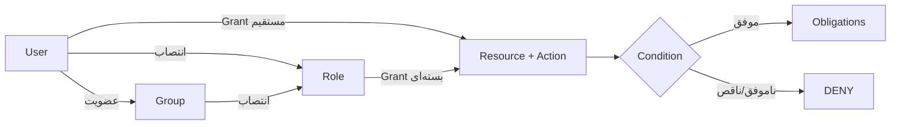

# سطوح دسترسی و مجوزدهی

## واژگان

| مفهوم | معنا | جدول/مدل |
|---|---|---|
| User | هویت یک شخص از issuer خارجی | `app_user` / `user` |
| Group | گروه سازمانی و عضویت افراد | `directory_group` / `group` |
| Role | بسته‌ای از مجوزها | `application_role` / `role` |
| Resource | چیزی که محافظت می‌شود | `resource` |
| Action | عملی که روی منبع انجام می‌شود | `action` |
| Grant | انتساب subject + resource + action | `authorization_grant` |
| Relation | نمایش رابطه برای OpenFGA | `viewer`, `editor`, `manager`, ... |
| Condition | شرط ساختاریافته مانند شعبه یا زمان | `condition_definition` |
| Obligation | محدودیت خروجی مانند mask یا row filter | `data_policy.obligations` |

## درخت منابع

هر `resource` می‌تواند `parent_id` داشته باشد. نوع‌های معتبر:

- `APPLICATION`
- `MODULE`
- `PAGE`
- `UI_COMPONENT`
- `FIELD`
- `BUSINESS_RESOURCE`
- `EXTERNAL_RESOURCE`

نمونه:

```text
application:aurevia
├── module:hr
│   └── business_resource:employee
├── module:finance
│   └── business_resource:payment
└── external_resource:superset-public
    └── external_resource:superset-public:dashboard:welcome-dashboard
```

والد هم در PostgreSQL و هم به‌صورت tuple در OpenFGA Store ثبت می‌شود. مدل OpenFGA ارث‌بری مجوزهای والد را صریحاً اعمال می‌کند و manifest مؤثر فقط گره‌های مجاز و ancestorهای لازم برای نمایش درخت را برمی‌گرداند.

## actionها و سطوح عملیاتی

catalog اولیه actionهای `view`, `create`, `update`, `approve`, `admin` را ایجاد می‌کند. مدل OpenFGA روابط دقیق‌تری دارد:

| منبع | رابطه | permission حاصل |
|---|---|---|
| application | `viewer` | `can_view` |
| application | `manager` | `can_view`, `can_manage` |
| resource | `viewer` | `can_view` |
| resource | `creator` | `can_create` |
| resource | `editor` | `can_view`, `can_edit` |
| resource | `deleter` | `can_delete` |
| resource | `manager` | همه مجوزهای resource |
| external_resource | `viewer` | `can_view` |
| external_resource | `editor` | `can_view`, `can_edit` |
| external_resource | `sharer` | `can_share` |
| external_resource | `exporter` | `can_export` |
| external_resource | `manager` | همه مجوزهای external resource |

## مسیر محاسبه دسترسی



`AuthorizationController.check` درخواست را به `RelationshipAuthorizationPort` می‌دهد. adapter، subject را مانند `user:alice` و resource را مطابق model OpenFGA بررسی می‌کند. نتیجه با `ALLOW/DENY`، reason code، model version و decision id برمی‌گردد.

## Manifest رابط کاربری

`GET /api/v1/me/manifest` از BFF به Authorization Service می‌رود. خروجی شامل:

```json
{
  "version": "manifest-...",
  "expiresAt": "...",
  "panels": [],
  "permissions": {
    "business_resource:employee": ["view", "update"]
  }
}
```

UI می‌تواند دکمه یا route را بر اساس این manifest پنهان کند، اما پنهان‌کردن UI کنترل امنیتی نهایی نیست؛ API نیز باید همان مجوز را enforce کند.

## دسترسی Micro Frontend به کاربر، گروه و نقش

### اصل طراحی

جدول `panel` فقط اطلاعات استقرار Micro Frontend مانند `slug`، آدرس
`remoteEntry.js` و `exposedModule` را نگه می‌دارد. مجوز داخل جدول Panel ذخیره
نمی‌شود. برای هر Panel باید یک Resource فعال از نوع `APPLICATION` با این قرارداد
وجود داشته باشد:

```text
application:aurevia/<panel-slug>
```

چهار Panel پیش‌فرض پروژه چنین نگاشتی دارند:

| Micro Frontend | Panel slug | Resource مورد بررسی |
|---|---|---|
| مدیریت | `admin` | `application:aurevia/admin` |
| منابع انسانی | `hr` | `application:aurevia/hr` |
| مالی | `finance` | `application:aurevia/finance` |
| گزارش‌ها | `reports` | `application:aurevia/reports` |

Shell هنگام دریافت Manifest برای هر Panel فعال این OpenFGA check را اجرا می‌کند:

```text
user: <subject حاصل از Public IAM>
relation: can_view
object: application:aurevia/<panel-slug>
```

فقط Panelهایی که نتیجه آن‌ها `ALLOW` باشد وارد `manifest.panels` می‌شوند. در نتیجه
Shell منوی Panel غیرمجاز را نمی‌سازد و Remote Entry آن را بارگذاری نمی‌کند.

### روش اول: اعطای مستقیم به یک کاربر

در پنل مدیریت مراحل زیر را انجام دهید:

1. وارد «استودیوی دسترسی» شوید.
2. از درخت Manifest گره Application موردنظر، مثلاً
   `application:aurevia/hr`، را انتخاب کنید.
3. مطمئن شوید action با کلید `view` به Resource متصل است.
4. در قسمت «تخصیص دسترسی»، نوع هویت را «کاربر» انتخاب کنید.
5. کاربر را انتخاب و عملیات `view` را اعطا کنید.

کنترل‌پلین relation ارسالی UI را مرجع تصمیم نمی‌داند و براساس نوع Resource و
action، نگاشت canonical زیر را اعمال می‌کند:

```text
view -> viewer -> can_view
```

tuple حاصل در OpenFGA از نظر مفهومی چنین است:

```text
user:<external-subject> viewer application:aurevia/hr
```

درخواست API معادل از طریق BFF:

```http
POST /api/v1/admin/grants
Content-Type: application/json
X-CSRF-TOKEN: <token دریافتی از /api/v1/csrf>
```

```json
{
  "subjectType": "USER",
  "subjectId": "<app-user-uuid>",
  "resourceId": "<application-resource-uuid>",
  "actionId": "<view-action-uuid>",
  "expiresAt": null
}
```

شناسه‌های لازم را می‌توان از endpointهای زیر دریافت کرد:

```http
GET /api/v1/admin/users
GET /api/v1/admin/resource-tree
GET /api/v1/admin/actions
```

### روش دوم: اعطا از طریق نقش کاربردی

برای محیط عملیاتی، اعطای Role-based معمولاً قابل نگه‌داری‌تر از grant مستقیم است:

1. در «گروه‌ها و نقش‌ها» یک نقش با کلید پایدار، مثلاً `hr-viewer`، بسازید.
2. در «استودیوی دسترسی»، نوع هویت را «نقش» انتخاب کنید.
3. روی `application:aurevia/hr`، عملیات `view` را به `hr-viewer` اعطا کنید.
4. در «گروه‌ها و نقش‌ها ← تخصیص نقش»، نقش را به کاربر یا گروه سازمانی بدهید.

دو رابطه اصلی OpenFGA برای کاربر چنین خواهند بود:

```text
role:hr-viewer#assignee viewer application:aurevia/hr
user:<external-subject> assignee role:hr-viewer
```

ساخت نقش:

```http
POST /api/v1/admin/roles
```

```json
{
  "roleKey": "hr-viewer",
  "nameFa": "مشاهده‌گر منابع انسانی",
  "nameEn": "HR Viewer"
}
```

تخصیص نقش به کاربر:

```http
POST /api/v1/admin/role-assignments
```

```json
{
  "subjectType": "USER",
  "subjectId": "<app-user-uuid>",
  "roleId": "<role-uuid>",
  "expiresAt": null
}
```

### روش سوم: گروه سازمانی به نقش

گروه‌های Keycloak/LDAP نقش کاربردی نیستند. عضویت گروه از IAM همگام می‌شود و نقش
کاربردی به گروه تخصیص داده می‌شود:

```json
{
  "subjectType": "GROUP",
  "subjectId": "<directory-group-uuid>",
  "roleId": "<role-uuid>",
  "expiresAt": null
}
```

مسیر مؤثر دسترسی:

```text
user -> member of group -> assignee of role -> viewer of application
```

به این ترتیب تغییر اعضای سازمانی در IAM انجام می‌شود و لازم نیست برای هر عضو
grant جداگانه ساخته شود.

### مجوز داخل خود Micro Frontend

مجوز `view` روی Application فقط نمایش و بارگذاری MFE را کنترل می‌کند. صفحات،
بخش‌های حساس، فیلدها و عملیات کسب‌وکار باید Resource و action مستقل داشته باشند؛
برای مثال:

```text
application:aurevia/hr
└── module:hr.payroll
    ├── page:hr.payroll.list
    ├── component:hr.payroll.salary-grid
    ├── field:hr.employee.salary
    └── business:hr.salary-record
```

Shell بعد از Login قرارداد زیر را دریافت می‌کند:

```http
GET /api/v1/me/manifest
```

نمونه مصرف داخل MFE:

```ts
const canViewSalary =
  manifest.permissions['field:hr.employee.salary']?.includes('view') ?? false;

const canEditSalary =
  manifest.permissions['business:hr.salary-record']?.includes('update') ?? false;
```

این نتیجه فقط برای UX، مانند hide، disable یا read-only، استفاده می‌شود. کاربر
نباید با دانستن URL یا دست‌کاری JavaScript بتواند API را فراخوانی کند. هر Route
عملیاتی در BFF باید Resource و action مشخص داشته باشد و Authorization Service
دوباره OpenFGA را با endpoint داخلی `/internal/v1/authorize/check` بررسی کند.

### اعمال، لغو و مشاهده نتیجه

Grant، لغو Grant و تخصیص Role ابتدا همراه audit در PostgreSQL ثبت می‌شوند. همان
transaction یک Outbox Event می‌سازد و Reconciler آن را idempotent به OpenFGA
منتقل می‌کند. بنابراین همگام‌سازی OpenFGA کوتاه‌مدت و eventual است.

برای مشاهده Manifest مؤثر کاربر:

```http
GET /api/v1/me/manifest
```

پس از اعمال Outbox، صفحه را refresh کنید. در پاسخ باید:

- Panel موردنظر داخل `panels` باشد؛
- Resourceهای مجاز داخل `permissions` باشند؛
- گره مجاز و ancestorهای آن داخل `resourceTree` باشند.

برای لغو grant:

```http
DELETE /api/v1/admin/grants/{grantId}
```

برای لغو انتساب نقش:

```http
DELETE /api/v1/admin/role-assignments/{subjectType}/{subjectId}/{roleId}
```

### چک‌لیست عیب‌یابی

اگر Micro Frontend برای کاربر دیده نشد، به‌ترتیب بررسی کنید:

1. Panel فعال و `slug` آن با suffix کلید Application یکسان باشد.
2. Resource متناظر `ACTIVE` و action `view` به آن متصل باشد.
3. کاربر، گروه یا نقش grant فعال و منقضی‌نشده داشته باشد.
4. در حالت Role-based، خود کاربر یا گروه به Role منتسب شده باشد.
5. Outbox در وضعیت retry/dead-letter متوقف نشده باشد.
6. OpenFGA check برای `application:aurevia/<slug>` و `can_view` برابر ALLOW باشد.
7. `GET /api/v1/me/manifest` پاسخ جدید بدهد؛ Manifest قبلی را مبنای API
   authorization قرار ندهید.

اگر Panel دیده می‌شود ولی API آن `403` می‌دهد، این معمولاً درست و نشانه نبودن
grant روی Resource/action عملیاتی است؛ مجوز Application جایگزین مجوز API یا
Business Resource نیست.

## انتصاب دسترسی مستقیم به کاربر

1. کاربر را در بخش مدیریت ایجاد/انتخاب کنید.
2. resource را در درخت انتخاب کنید.
3. action متصل به resource را انتخاب کنید.
4. relation مناسب را وارد کنید.
5. در صورت نیاز `expiresAt` تعیین کنید.
6. Admin MFE درخواست `POST /api/v1/admin/grants` را با CSRF می‌فرستد.
7. BFF آن را به `/internal/v1/registry/grants` منتقل می‌کند.
8. رکورد `authorization_grant` و audit ساخته می‌شود.

بدنه نمونه:

```json
{
  "userId": "UUID",
  "resourceId": "UUID",
  "actionId": "UUID",
  "relation": "viewer",
  "expiresAt": null
}
```

لغو دسترسی با `DELETE /api/v1/admin/grants/{id}` انجام و grant به `ARCHIVED` تبدیل می‌شود.

## انتصاب گزارش یا داشبورد به کاربر

برای محل تعریف Superset عمومی و عملیاتی، مالکیت routeها و قرارداد نمایش گزارش داخل MFE، ابتدا [راهنمای Superset routing و embedding](superset-routing-and-embedding-fa.md) را ببینید.

1. Admin MFE فهرست Dashboard و Chart را از API زنده Operation Superset دریافت می‌کند.
2. دارایی انتخاب‌شده با `POST /api/v1/admin/superset-assets` در درخت ثبت می‌شود.
3. سرویس یک `EXTERNAL_RESOURCE` فرزند `external_resource:superset-public` می‌سازد.
4. actionهای `view`، `update` و `admin` به resource متصل می‌شوند.
5. سطح‌های UI به‌ترتیب به `viewer/view`، `editor/update` و `manager/admin` نگاشت می‌شوند.
6. `GET /api/v1/reports` assetهای publish‌شده با هرکدام از این سطوح فعال را برمی‌گرداند.
7. کلیک روی گزارش runtime عملیاتی را از tunnel امن باز می‌کند.

## policy ساختاریافته

`StructuredPolicyEvaluator` فقط fieldهای زیر را قبول می‌کند:

```text
ownerId, orgUnit, branch, classification, request.ipClass, time
```

operatorها: `eq`, `in`, `before`, `after`.

obligationهای مجاز:

```text
rowFilters, allowedColumns, maskedColumns, maximumRows,
exportAllowed, printAllowed, watermark
```

field/operator ناشناخته، context ناقص یا خطای parse همگی DENY می‌شوند.

## قواعد دامنه

- `enforceOrgScope` فقط ردیف‌های واحد سازمانی کاربر را نگه می‌دارد.
- `enforcePaymentApproval` مانع می‌شود سازنده یک پرداخت همان پرداخت را تأیید کند؛ این همان Separation of Duties است.

## الزامات استقرار Production

- admin registry با `X-Actor` و grant فعال `application:aurevia/admin` محافظت می‌شود.
- grant مستقیم USER و grantهای GROUP/ROLE در manifest مؤثر محاسبه می‌شوند.
- grant/revoke در همان transaction رکورد outbox می‌سازد و reconciler آن را idempotent در OpenFGA اعمال می‌کند.
- خطاهای OpenFGA default-deny هستند؛ backlog، retry و drift باید alert عملیاتی داشته باشند.
- Basic Auth داخلی فقط bootstrap محلی است؛ Production به mTLS، secret rotation و network policy نیاز دارد.
- UI authorization جایگزین enforcement سمت API نیست.
- نمایش panel باید با permission سطح panel/application هم‌راستا بماند؛ افزودن panel جدید بدون resource/action متناظر پذیرفته نیست.
