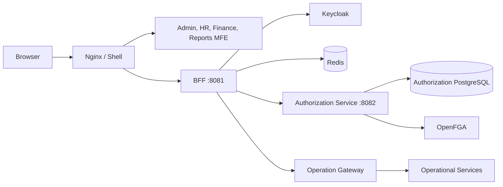
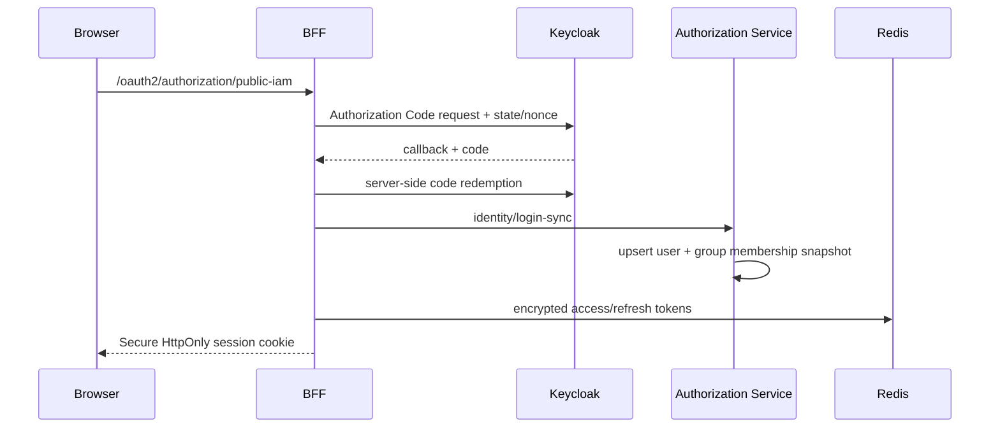
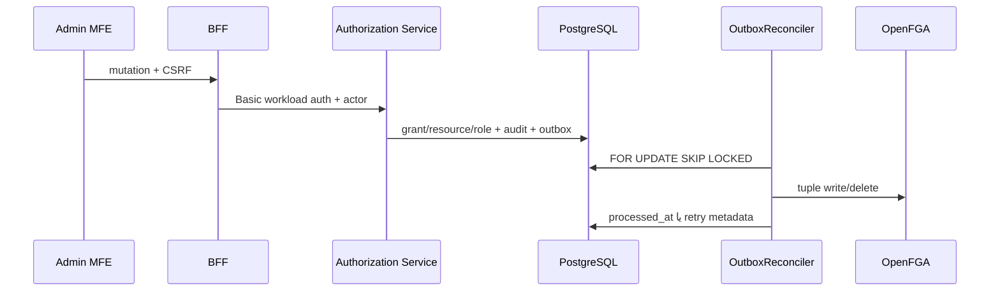
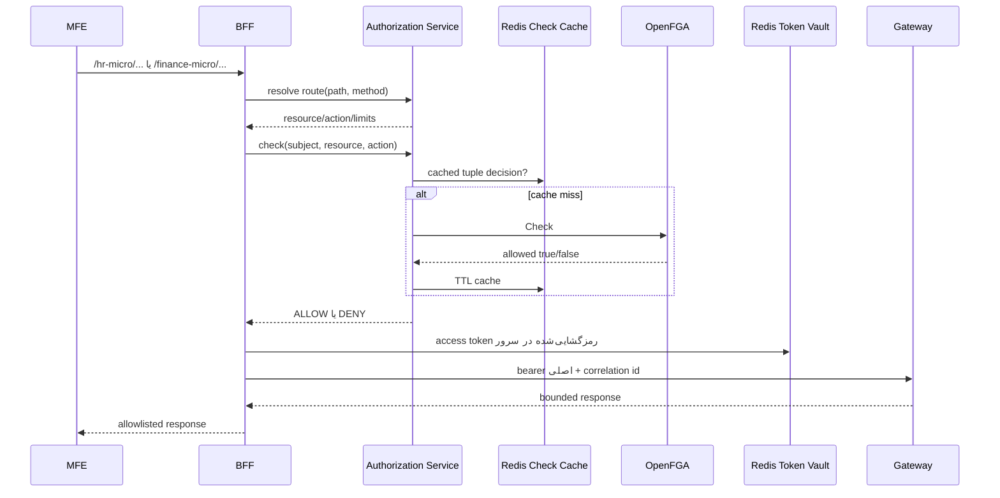

# مرجع جامع معماری و سطوح دسترسی OpenFGA

این سند مرجع یکپارچه معماری اجرایی Aurevia Super App و مدل مجوزدهی آن است. مطالب بر اساس کد، migrationها و مدل OpenFGA موجود در همین مخزن نوشته شده‌اند. هرجا پیاده‌سازی فعلی با مدل کامل دامنه فاصله دارد، آن مورد با عنوان «محدودیت فعلی» مشخص شده است.

## ۱. نمای کلان سامانه



مرز مسئولیت اجزا:

| جزء | مسئولیت اصلی | منبع حقیقت |
|---|---|---|
| Shell | بارگذاری manifest و MFEهای مجاز | ندارد |
| MFE | رابط کاربری دامنه؛ بدون token OAuth | ندارد |
| Nginx | ingress مرورگر، static assets و same-origin proxy | پیکربندی route |
| Keycloak | احراز هویت OIDC، کاربر و گروه directory | IAM database |
| BFF | session، CSRF، token vault و enforcement ورودی | Redis برای state موقت |
| Authorization Service | control plane، registry، audit و تصمیم دسترسی | PostgreSQL |
| OpenFGA | ارزیابی runtime گراف روابط | tuple projection |
| Redis | session، token رمز‌شده و cache کوتاه‌عمر check | داده موقت |
| Operation Gateway | تنها ورودی سرویس‌های عملیاتی | routeهای عملیاتی |

اصل امنیتی مهم این است که مرورگر هیچ access token یا refresh token دریافت نمی‌کند. JavaScript فقط cookie نشست opaque و HttpOnly دارد و تمام درخواست‌های داده از BFF عبور می‌کنند.

## ۲. ساختار کد

```text
apps/
├── shell/                 میزبان و loader مربوط به Module Federation
├── mfe-admin/             مدیریت پنل، resource، role و grant
├── mfe-hr/                رابط دامنه منابع انسانی
├── mfe-finance/           رابط دامنه مالی
└── mfe-reports/           فهرست و اجرای گزارش‌های مجاز
packages/
├── contracts/             قرارداد Manifest و RemoteModule
├── sh-core-ui/            guardهای نمایشی SHCan/SHAction/SHRouteGuard
└── i18n/                  ترجمه‌ها
services/
├── superapp-bff/          OAuth2 client، session، vault و proxy
└── authorization-service/ control plane و OpenFGA adapter
infra/
├── docker-compose/        topology اجرای محلی
├── keycloak/              realm و کاربران توسعه
├── openfga/               model و model tests
├── nginx/                 ingress اصلی
└── mfe/                   Nginx اجرای مستقل MFEها
```

برای شرح فایل‌به‌فایل به [مرجع کد](code-reference-fa.md) و برای ترتیب اجرای بلوک‌ها به [راهنمای خواندن کد](code-walkthrough-fa.md) مراجعه کنید.

## ۳. جریان ورود و نشست



- `OidcLoginSuccessHandler` هویت و claim گروه‌ها را sync می‌کند.
- `TokenVaultCrypto` tokenها را با AES-GCM رمز می‌کند.
- `TokenVaultService` رکورد رمز‌شده را در namespace جداگانه Redis می‌گذارد.
- فقط handle رکورد vault در session ذخیره می‌شود.
- `RefreshCoordinator` از refresh هم‌زمان چند درخواست جلوگیری می‌کند.
- logout هم session و هم token vault را حذف می‌کند.

## ۴. منابع: هفت نوع دامنه و سه نوع OpenFGA

PostgreSQL هفت نوع resource دارد:

| نوع دامنه | کاربرد | نمونه |
|---|---|---|
| `APPLICATION` | ریشه یک برنامه | `application:aurevia` |
| `MODULE` | ماژول کسب‌وکاری | `module:hr` |
| `PAGE` | صفحه رابط کاربری | `page:hr.employees` |
| `UI_COMPONENT` | دکمه، تب یا component حساس | `component:hr.employee.create` |
| `API_RESOURCE` | endpoint یا مجموعه API | `api:hr.employees` |
| `BUSINESS_RESOURCE` | موجودیت کسب‌وکاری | `business:hr.employee` |
| `EXTERNAL_RESOURCE` | دارایی سامانه خارجی | `external_resource:superset-public` |

OpenFGA برای ساده نگه‌داشتن مدل فقط سه object type محافظت‌شده دارد:

| نوع PostgreSQL | object در OpenFGA |
|---|---|
| `APPLICATION` | `application:<resource-key-without-application-prefix>` |
| `EXTERNAL_RESOURCE` | `external_resource:<resource-key-without-external_resource-prefix>` |
| پنج نوع دیگر | `resource:<resource-key>` |

بنابراین تفاوت `MODULE`، `PAGE`، `UI_COMPONENT`، `API_RESOURCE` و `BUSINESS_RESOURCE` در catalog و UX حفظ می‌شود، اما همگی از relationهای مشترک type `resource` استفاده می‌کنند.

نمونه تبدیل:

```text
application:aurevia              -> application:aurevia
module:hr                        -> resource:module:hr
page:hr.employees                -> resource:page:hr.employees
component:hr.employee.create     -> resource:component:hr.employee.create
api:hr.employees                 -> resource:api:hr.employees
business:hr.employee             -> resource:business:hr.employee
external_resource:superset-public -> external_resource:superset-public
```

## ۵. subjectها و روش دریافت مجوز

سه subject قابل grant وجود دارد:

| subject دامنه | نمایش OpenFGA | معنا |
|---|---|---|
| `USER` | `user:<external-id>` | دسترسی مستقیم شخص |
| `GROUP` | `group:<external-id>#member` | دسترسی تمام اعضای گروه |
| `ROLE` | `role:<role-key>#assignee` | دسترسی دارندگان نقش |

روابط واسط:

```text
user:ali --member--> group:hr
group:hr#member --assignee--> role:hr-viewer
role:hr-viewer#assignee --viewer--> resource:business:hr.employee
```

در این مثال `ali` از مسیر گروه و نقش به `can_view` می‌رسد. role با گروه سازمانی یکی نیست: گروه از Keycloak/LDAP sync می‌شود، ولی role یک بسته قابلیت کاربردی در Authorization Service است.

## ۶. مدل OpenFGA

مدل canonical در `infra/openfga/model.fga` است.

### `application`

روابط مستقیم:

- `parent`
- `viewer`
- `manager`

مجوزهای مشتق‌شده:

| permission | قواعد allow |
|---|---|
| `can_view` | viewer یا manager یا `can_view` والد |
| `can_create` | manager یا مجوز والد |
| `can_edit` | manager یا مجوز والد |
| `can_delete` | manager یا مجوز والد |
| `can_share` | manager یا مجوز والد |
| `can_export` | manager یا مجوز والد |
| `can_manage` | manager یا مجوز والد |

### `resource`

روابط مستقیم:

- `parent`: یکی از application، resource یا external_resource
- `viewer`
- `creator`
- `editor`
- `deleter`
- `manager`

| permission | قواعد allow |
|---|---|
| `can_view` | viewer، editor، manager یا والد |
| `can_create` | creator، manager یا والد |
| `can_edit` | editor، manager یا والد |
| `can_delete` | deleter، manager یا والد |
| `can_share` | manager یا والد |
| `can_export` | manager یا والد |
| `can_manage` | manager یا والد |

### `external_resource`

روابط مستقیم:

- `parent`
- `viewer`
- `editor`
- `sharer`
- `exporter`
- `manager`

| permission | قواعد allow |
|---|---|
| `can_view` | viewer، editor، manager یا والد |
| `can_create` | manager یا والد |
| `can_edit` | editor، manager یا والد |
| `can_delete` | manager یا والد |
| `can_share` | sharer، manager یا والد |
| `can_export` | exporter، manager یا والد |
| `can_manage` | manager یا والد |

`manager` بالاترین سطح است و تمام permissionهای نوع object را می‌دهد. `editor` به‌صورت ضمنی view هم دارد، ولی `creator` و `deleter` الزاماً view ندارند.

## ۷. نگاشت action به relation و permission

سه مفهوم را نباید با هم اشتباه گرفت:

- action: واژه کسب‌وکاری ذخیره‌شده در PostgreSQL؛ مانند `update`.
- relation: tuple مستقیمی که نوشته می‌شود؛ مانند `editor`.
- permission: رابطه محاسباتی که check می‌شود؛ مانند `can_edit`.

نگاشت check در `AuthorizationController`:

| action درخواست | permission بررسی‌شده |
|---|---|
| `list`, `view` | `can_view` |
| `create` | `can_create` |
| `update`, `approve`, `reject` | `can_edit` |
| `delete` | `can_delete` |
| `admin`, `manage` | `can_manage` |
| مقدار شروع‌شونده با `can_` | همان مقدار |
| هر مقدار دیگر | `unsupported_action` و در عمل DENY |

نگاشت tuple هنگام ساخت grant در `AccessAdminController`:

| action catalog | relation نوشته‌شده |
|---|---|
| `view` | `viewer` |
| `create` | `creator` |
| `update`, `approve` | `editor` |
| `admin` | `manager` |
| سایر actionها | مقدار `relation` ارسال‌شده در grant |

برای جلوگیری از tuple نامعتبر، relation باید با object type سازگار باشد. برای نمونه `creator` روی `external_resource` در مدل تعریف نشده و نباید نوشته شود.

## ۸. ارث‌بری درخت منابع

`resource.parent_id` منبع حقیقت hierarchy در PostgreSQL است. هر اتصال والد/فرزند از outbox به tuple زیر تبدیل می‌شود:

```text
<parent-object> parent <child-object>
```

در syntax سه‌تایی OpenFGA:

```text
user: application:aurevia
relation: parent
object: resource:module:hr
```

مدل روی فرزند عبارت `can_view from parent` و مشابه آن را محاسبه می‌کند. در نتیجه manager برنامه می‌تواند منابع پایین‌دست را مدیریت کند، مگر اینکه در نسخه آینده مدل deny/exception صریح اضافه شود. OpenFGA فعلی deny tuple ندارد؛ نبود مسیر allow برابر deny است.

قواعد ایمنی درخت در API مدیریت:

- والد باید وجود داشته باشد.
- resource نمی‌تواند والد خودش باشد.
- recursive query از ایجاد cycle جلوگیری می‌کند.
- تغییر والد باید tuple والد قبلی را حذف و tuple جدید را اضافه کند.

## ۹. control plane و outbox



رویدادهای projection:

| event | عملیات OpenFGA |
|---|---|
| `GRANT_WRITE` | write tuple مجوز |
| `GRANT_DELETE` | delete tuple مجوز |
| `ROLE_ASSIGNMENT_WRITE` | اتصال user/group به role |
| `ROLE_ASSIGNMENT_DELETE` | حذف اتصال role |
| `RESOURCE_PARENT_WRITE` | write رابطه parent |
| `RESOURCE_PARENT_DELETE` | حذف رابطه parent |

هر رویداد `idempotency_key` یکتا دارد. Reconciler حداکثر ۵۰ رکورد را با `FOR UPDATE SKIP LOCKED` می‌گیرد، خطا را در `last_error` ثبت می‌کند و تا سقف ۳۰۰ ثانیه backoff می‌دهد. OpenFGA هرگز مستقیماً از controller مدیریت نوشته نمی‌شود؛ ابتدا transaction پایگاه داده commit می‌شود.

## ۱۰. مسیر runtime یک درخواست عملیاتی



ترتیب enforcement:

1. `RouteNormalizer` traversal، backslash و encoded slash مبهم را رد می‌کند.
2. registry با longest-prefix، HTTP method و pattern مسیر را resolve می‌کند.
3. resource/action از registry می‌آید، نه از ورودی دلخواه مرورگر.
4. OpenFGA permission را check می‌کند.
5. هر exception در OpenFGA برابر DENY است.
6. BFF سقف body، response و timeout ثبت‌شده را enforce می‌کند.
7. token کاربر بدون Token Exchange به Gateway ارسال می‌شود.

## ۱۱. Redis در مجوزدهی و token

Redis دو کاربرد مستقل دارد:

| namespace/داده | کاربرد | رفتار هنگام خرابی |
|---|---|---|
| session + token vault | نشست و access/refresh token رمز‌شده | درخواست عملیاتی 401؛ login مجدد |
| `aurevia:openfga:check:<sha256>` | cache نتیجه check | مستقیماً OpenFGA فراخوانی می‌شود |

کلید cache از SHA-256 ترکیب `user + relation + object` ساخته می‌شود و TTL پیش‌فرض ۵ ثانیه است. write/delete همان tuple cache مربوط را invalidate می‌کند. Redis منبع حقیقت authorization نیست.

نکته consistency: ارث‌بری باعث می‌شود تغییر tuple والد روی cache check فرزند اثر بگذارد، ولی invalidation فعلی فقط کلید tuple دقیق نوشته‌شده را پاک می‌کند؛ stale بودن احتمالی تصمیم فرزند با TTL کوتاه محدود می‌شود.

## ۱۲. manifest و مجوز نمایشی

`GET /api/v1/me/manifest` شامل موارد زیر است:

- نسخه و زمان انقضا؛
- پنل‌هایی که OpenFGA برای آن‌ها `can_view` داده است؛
- permissionهای مستقیم و مؤثر USER/GROUP/ROLE از PostgreSQL؛
- گره‌های مجاز resource tree به همراه ancestorهای لازم برای نمایش.

`SHCan`، `SHAction` و `SHRouteGuard` می‌توانند UI را hide، disable یا read-only کنند. این guardها کنترل امنیتی نهایی نیستند. هر API عملیاتی دوباره در BFF و Authorization Service بررسی می‌شود.

## ۱۳. سطوح پیشنهادی کسب‌وکاری

| سطح UX | relation | توانایی |
|---|---|---|
| مشاهده‌گر | `viewer` | مشاهده |
| ایجادکننده | `creator` | ایجاد؛ مخصوص `resource` |
| ویرایشگر | `editor` | مشاهده و ویرایش |
| حذف‌کننده | `deleter` | حذف؛ مخصوص `resource` |
| اشتراک‌گذار | `sharer` | اشتراک؛ مخصوص `external_resource` |
| صادرکننده | `exporter` | خروجی؛ مخصوص `external_resource` |
| مدیر | `manager` | همه permissionهای object و ارث‌بری به فرزندان |

برای عملیات مالی حساس، OpenFGA فقط مجوز کلی را تعیین می‌کند. قاعده maker-checker در `OperationalRules.enforcePaymentApproval` جداگانه enforce می‌شود تا سازنده همان پرداخت نتواند آن را تأیید کند.

## ۱۴. policy ساختاریافته و ABAC

`StructuredPolicyEvaluator` فقط fieldهای allowlist‌شده زیر را می‌پذیرد:

```text
ownerId, orgUnit, branch, classification, request.ipClass, time
```

operatorها:

```text
eq, in, before, after
```

obligationهای مجاز:

```text
rowFilters, allowedColumns, maskedColumns, maximumRows,
exportAllowed, printAllowed, watermark
```

field، operator یا obligation ناشناخته، context ناقص و parse error همگی DENY هستند. relation check و policy evaluation دو لایه مستقل‌اند: ابتدا رابطه کلی، سپس شرط و محدودیت داده‌ای.

## ۱۵. راهنمای افزودن resource و دسترسی

### افزودن resource

1. یک `resource_key` پایدار و globally unique انتخاب کنید.
2. یکی از هفت type را تعیین کنید.
3. والد صحیح، owner domain و classification را مشخص کنید.
4. actionهای معتبر را در `resource_action` متصل کنید.
5. اگر resource در route عملیاتی استفاده می‌شود، `route_operation` را ثبت کنید.
6. رسیدن `RESOURCE_PARENT_WRITE` به OpenFGA را بررسی کنید.

### افزودن role

1. role کاربردی با `role_key` پایدار بسازید.
2. grantهای role به resource/action را ثبت کنید.
3. role را به user یا group assign کنید.
4. پردازش `ROLE_ASSIGNMENT_WRITE` و `GRANT_WRITE` را کنترل کنید.
5. check مثبت و حداقل یک check منفی بنویسید.

### افزودن action جدید

افزودن رکورد action به‌تنهایی کافی نیست:

1. semantics آن را تعریف کنید.
2. نگاشت action به permission را در `AuthorizationController` اضافه کنید.
3. نگاشت action به relation را در تولید outbox اضافه کنید.
4. relation/permission لازم را در `model.fga` تعریف کنید.
5. model test و integration test بنویسید.
6. migration forward-only ایجاد کنید.

## ۱۶. تست و عیب‌یابی OpenFGA

مواردی که باید تست شوند:

- grant مستقیم user؛
- user از طریق group؛
- user/group از طریق role؛
- inheritance از application و resource والد؛
- editor دارای view؛
- subject نامرتبط برابر deny؛
- revoke پس از projection برابر deny؛
- expiry در manifest/control plane؛
- unavailable بودن OpenFGA برابر deny؛
- tuple نامعتبر در outbox دارای retry و `last_error`.

برای عیب‌یابی به ترتیب زیر عمل کنید:

1. هویت: `external_id` و issuer کاربر درست است؟
2. catalog: resource و action فعال و به هم متصل‌اند؟
3. grant: subject type/id، relation، status و expiry درست است؟
4. outbox: event پردازش شده یا `last_error` دارد؟
5. tuple: نام user/relation/object دقیقاً با model سازگار است؟
6. model: `OPENFGA_STORE_ID` و `OPENFGA_MODEL_ID` صحیح‌اند؟
7. cache: حداکثر TTL پنج‌ثانیه‌ای را در نظر گرفته‌اید؟
8. runtime: action به permission مورد انتظار نگاشت شده است؟

## ۱۷. محدودیت‌های فعلی پیاده‌سازی

این موارد باید در توسعه بعدی بسته شوند:

1. `share` و `export` در مدل وجود دارند، اما actionهای ساده آن‌ها در `AuthorizationController.permission` نگاشت نشده‌اند؛ فعلاً فقط ارسال مستقیم `can_share`/`can_export` قابل check است.
2. تولید tuple برای `delete` و actionهای ناشناخته به مقدار relation ورودی تکیه دارد؛ validation مرکزی relation بر اساس object type لازم است.
3. `creator` برای `external_resource` معتبر نیست، ولی نگاشت عمومی action `create` آن را تولید می‌کند؛ API باید این ترکیب را قبل از outbox رد کند.
4. manifest permissionها را از PostgreSQL می‌سازد و inheritance گراف OpenFGA را برای تمام گره‌ها materialize نمی‌کند؛ پنل‌ها جداگانه با OpenFGA check می‌شوند.
5. `StructuredPolicyEvaluator` موجود است، اما `AuthorizationController.check` هنوز policyهای DB و obligationها را در مسیر اصلی بارگذاری و اجرا نمی‌کند.
6. جدول `authorization_decision_log` وجود دارد، ولی check فعلی decision را در آن ثبت نمی‌کند.
7. cache invalidation فقط tuple دقیق را حذف می‌کند؛ invalidation وابستگی‌های inherited به TTL متکی است.
8. OpenFGA مدل deny صریح ندارد؛ exception/overrideهای deny نیازمند مدل یا policy لایه بالاتر هستند.

## ۱۸. قواعد production

- OpenFGA و PostgreSQL باید persistent، backup‌شده و monitor شوند.
- Store ID و Model ID باید immutable deployment configuration باشند.
- Basic Auth داخلی محلی باید با workload identity/mTLS جایگزین شود.
- secretها باید از secret manager و با rotation تأمین شوند.
- عمق و سن outbox، نرخ deny، latency check و OpenFGA error باید alert داشته باشند.
- تغییر model باید versioned، backward-compatible و همراه model test باشد.
- UI هرگز مرجع نهایی مجوز نیست.
- failure در route resolution، context، OpenFGA یا token vault باید fail closed باشد.

## ۱۹. فایل‌های مرجع

| موضوع | فایل |
|---|---|
| مدل OpenFGA | `infra/openfga/model.fga` |
| تست مدل | `infra/openfga/model-tests.yaml` |
| OpenFGA client | `OpenFgaConfiguration.java` |
| check و Redis cache | `OpenFgaRelationshipAdapter.java` |
| runtime authorization | `AuthorizationController.java` |
| grant و resource control plane | `AccessAdminController.java` |
| projection outbox | `OutboxReconciler.java` |
| policy ساختاریافته | `StructuredPolicyEvaluator.java` |
| قواعد دامنه | `OperationalRules.java` |
| proxy عملیاتی | `OperationalProxyController.java` |
| schema اصلی | `V1__control_plane.sql` |
| درخت هفت‌نوعی نمونه | `V12__complete_demo_resource_tree.sql` |
| bootstrap parent tuple | `V13__resource_parent_outbox.sql` |

