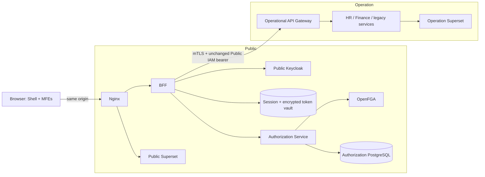
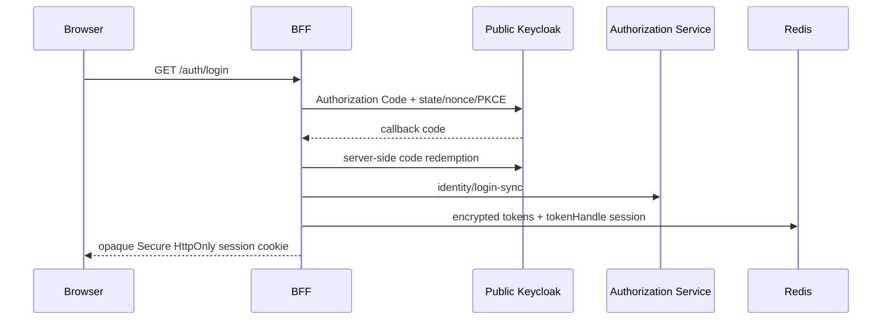

# Architecture

## Trust zones

There is no browser workload in the Operation zone. Authorization Service and OpenFGA are temporarily placed in Public, but their adapters and base URLs are configuration boundaries so relocation does not alter domain or frontend code.

## Login sequence

## Source-of-truth boundaries

PostgreSQL owns control-plane metadata, identity projections, audit, policy definitions, synchronization state, and the transactional outbox. OpenFGA is the runtime relationship projection. Redis owns transient sessions and encrypted token records in separate namespaces. Panel is deployment metadata only; resource permissions are never stored in it.

