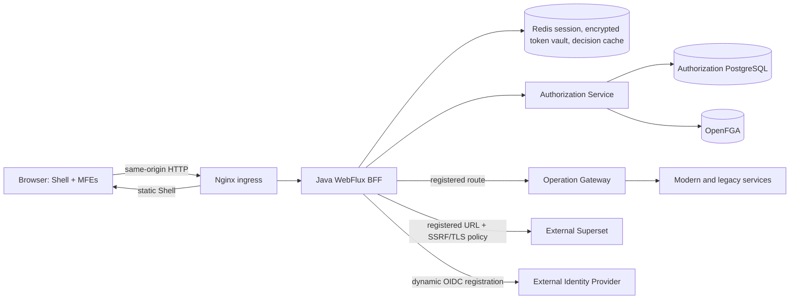
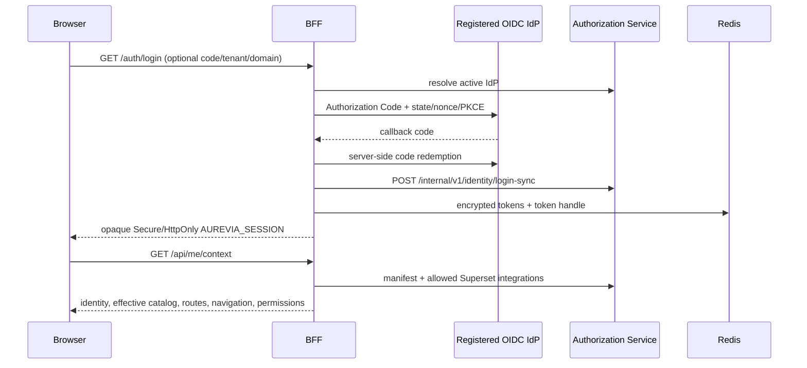
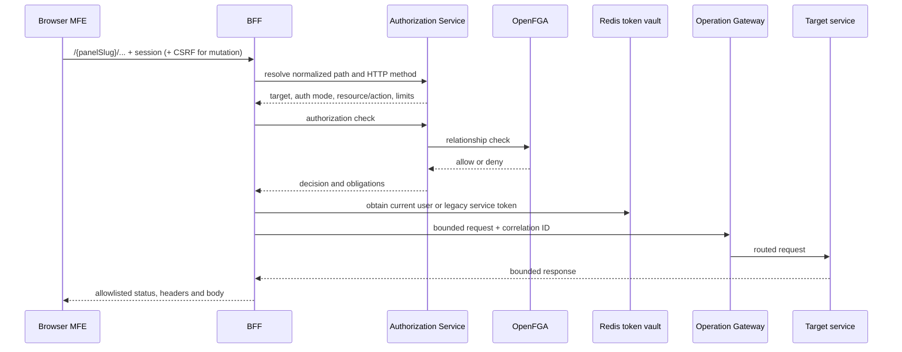
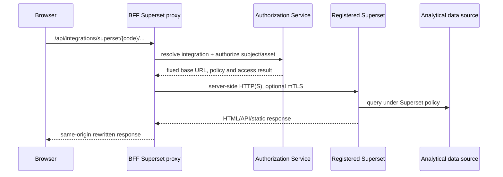
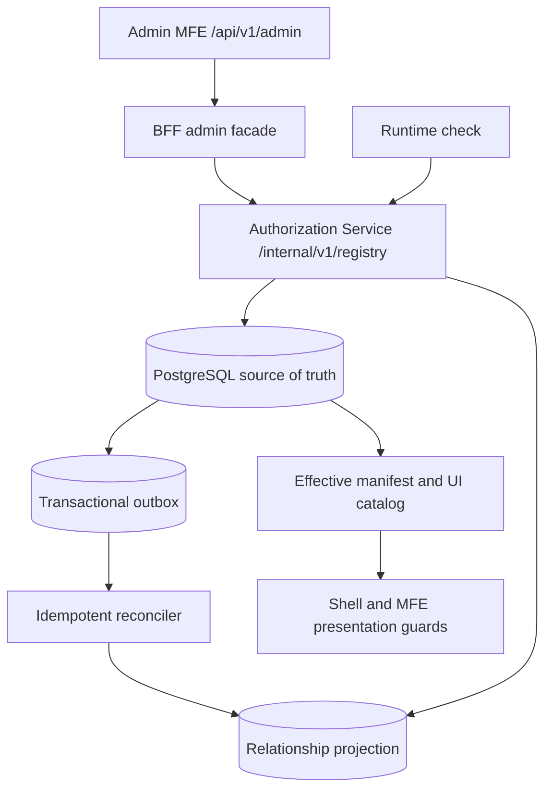

# Architecture

> Document status: canonical living architecture, synchronized with the source tree on
> 2026-09-15. See [current implementation status (FA)](current-state-fa.md) for the complete
> feature inventory and document precedence rules.

## Runtime boundaries

The browser never receives an OAuth access or refresh token and never connects directly to
Authorization Service, OpenFGA, operational services, or a registered Superset destination.
It receives only the opaque `AUREVIA_SESSION` cookie and uses relative URLs. Nginx is the only
browser ingress; authorization and destination selection happen in Java.

## Independent lifecycles

The base `infra/docker-compose/compose.yml` is the local Core: PostgreSQL, OpenFGA, Redis,
Authorization Service, BFF, Nginx, Operation Gateway, catalog initialization, and operational
mocks. It contains no Identity Provider, MFE artifact server, LDAP server, or Superset runtime.

- `compose.identity-demo.yml` owns optional Keycloak and directory fixtures.
- `compose.mfe-demo.yml` owns the four independently served MFE artifacts.
- `compose.superset-demo.yml` owns the optional local Superset demo.
- E2E and native-Superset overlays are test or connector configuration, not Core ownership.

Production providers, MFEs, service targets, and Superset instances are registered by URL and
policy. Their availability is not a Core startup dependency.

## Login and effective context

`GET /api/me/context` is the canonical single-fetch Shell contract. The older
`GET /api/v1/me/manifest` and focused `GET /api/ui/catalog` endpoints remain compatibility
projections. The BFF rewrites registered MFE artifact URLs to `/api/mfe/{moduleKey}/...`, so the
browser loads only authorized same-origin artifacts.

## Operational API flow

`service_target`, `proxy_route`, and `route_operation` are configuration data, never
caller-supplied destinations. Resolution enforces a path-segment boundary, allowed HTTP methods,
registered resource/action, request/response limits, and default deny. Modern routes forward the
current Public-IAM bearer token; Legacy routes resolve an approved connection and obtain/cache a
server-side service token without exposing its credential or value.

## Superset flow

Superset is an external integration with an independent lifecycle. The current connector does
not route Superset through Operation Gateway and does not require a public asset-only Superset.

Compatibility tunnels under `/api/v1/superset/**` and `/api/v1/superset-instances/**` are still
implemented. Superset owns CSRF for its tunnel; every other state-changing BFF endpoint retains
Spring CSRF. Network policy rejects unapproved schemes, hosts and address classes.

## Authorization control plane

PostgreSQL owns identity projections, resources, actions, grants, policies, registries, audit,
and outbox state. OpenFGA owns relationship decisions at runtime. Redis is transient and may
cache checks for a short TTL; writes invalidate matching entries. UI visibility improves UX but
never authorizes an API by itself.

## MFE governance

An MFE publishes two independent contracts:

- `mf-manifest.json` owns runtime integration, routes, and navigation defaults.
- `resource-manifest.json` owns authorization resources and actions.

The Panel registry stores canonical MFE identity and source URLs. MF sync creates immutable,
idempotent artifact revisions. Resource import creates a versioned draft and diff; only explicit
publish changes the effective catalog and emits OpenFGA outbox work. Navigation overlays can
change presentation without inventing authorization resources. Shell routing is built only from
the backend-filtered `uiCatalog` in `/api/me/context`.

## Deployment properties

BFF and Authorization Service are stateless apart from Redis/PostgreSQL and can be replicated.
Outbox consumers coordinate with `FOR UPDATE SKIP LOCKED`. Production profiles disable Swagger
and demo mutation/data, require integrity for MFE artifacts, reject HTTP destinations, require
mTLS between BFF and Authorization Service/Gateway, and enable TLS with client authentication on
Authorization Service. The base Compose remains a development environment; production still
requires platform-provided secret management, certificate rotation, HA/PITR, image governance,
rate limiting, monitoring, and tested recovery procedures.
