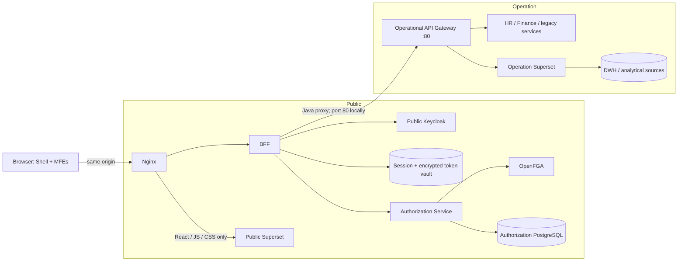
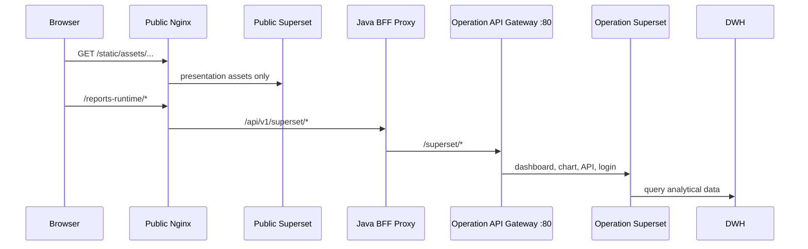
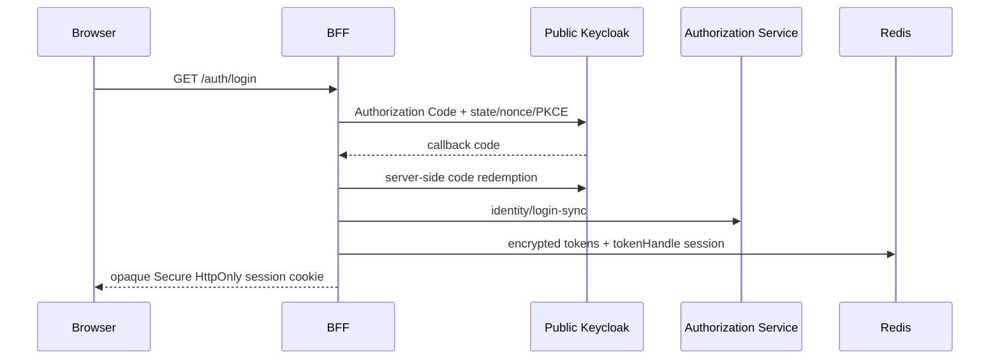

# Architecture

## Trust zones

There is no browser workload in the Operation zone. Authorization Service and OpenFGA are temporarily placed in Public, but their adapters and base URLs are configuration boundaries so relocation does not alter domain or frontend code.

## Superset request flow

Public Superset is a presentation artifact host. The browser may fetch only its compiled
React, JavaScript, CSS, fonts, and images through `/static/`. It does not own dashboards,
execute chart queries, or connect to the DWH.

Nginx has no network route to Operation Superset. All dynamic Superset traffic therefore
crosses the authenticated Java proxy and the Operation Gateway. Superset retains its own
CSRF validation on that tunnel; Spring CSRF remains enabled for every other BFF mutation.

## Login sequence

## Source-of-truth boundaries

PostgreSQL owns control-plane metadata, identity projections, audit, policy definitions, synchronization state, and the transactional outbox. OpenFGA is the runtime relationship projection. Redis owns transient sessions and encrypted token records in separate namespaces. Panel is deployment metadata only; resource permissions are never stored in it.
