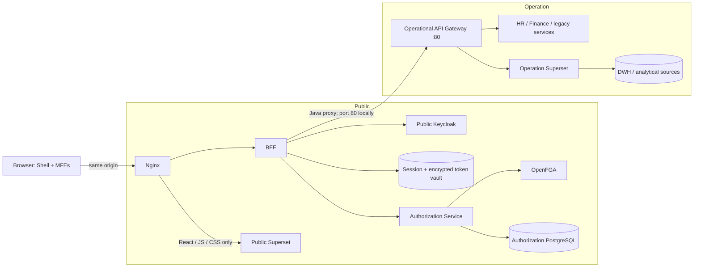
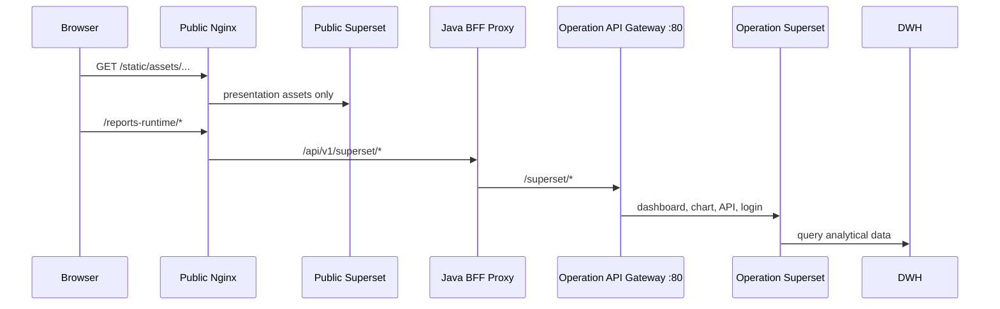
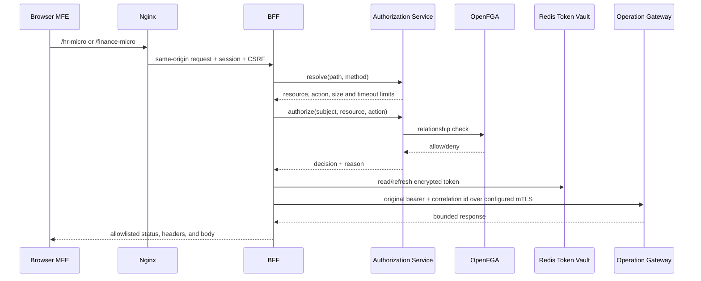
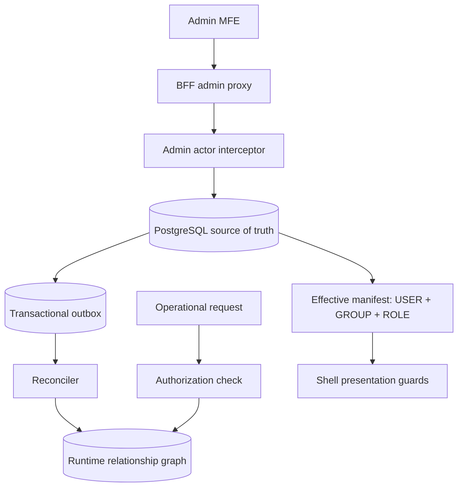
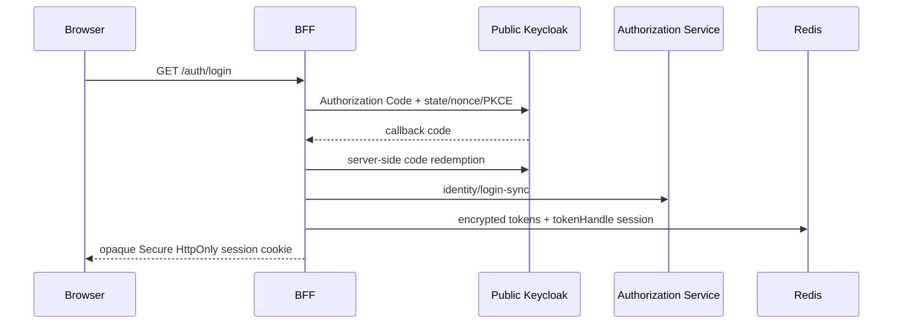

# Architecture

## Trust zones

There is no browser workload in the Operation zone. Authorization Service and OpenFGA are temporarily placed in Public, but their adapters and base URLs are configuration boundaries so relocation does not alter domain or frontend code.

## Superset request flow

Public Superset is a presentation artifact host. The browser may fetch only its compiled
React, JavaScript, CSS, fonts, and images through `/static/`. It does not own dashboards,
execute chart queries, or connect to the DWH.

Nginx has no network route to Operation Superset. All dynamic Superset traffic therefore
crosses the authenticated Java proxy and the Operation Gateway. Superset retains its own
CSRF validation on that tunnel; Spring CSRF remains enabled for every other BFF mutation.

## Operational API request flow

Route definitions are data, not user-provided destinations. `service_target` owns an allowlisted base URL; `proxy_route` owns a path prefix; `route_operation` binds HTTP method/pattern to a resource/action and request limit. Resolution requires a path-segment boundary and chooses the longest matching prefix.

## Authorization control and data planes

The control plane is eventually consistent with OpenFGA through idempotent outbox events. Runtime relationship failures deny access. UI manifest permissions improve presentation but never authorize an operational API by themselves. See [Authorization Engine architecture](authorization-engine-fa.md) for the complete model and failure semantics.

## Login sequence

## Source-of-truth boundaries

PostgreSQL owns control-plane metadata, identity projections, audit, policy definitions, synchronization state, and the transactional outbox. OpenFGA is the runtime relationship projection. Redis owns transient sessions and encrypted token records in separate namespaces. Panel is deployment metadata only; resource permissions are never stored in it.

## Deployment and scaling

BFF and Authorization Service are stateless apart from Redis/PostgreSQL and may be horizontally replicated. Outbox consumers coordinate with `FOR UPDATE SKIP LOCKED`. Redis must be shared by all BFF replicas. Database migrations run once before rolling application instances. Nginx is the only browser ingress; Operation Gateway and data services have no public browser route. Production requires TLS at ingress, verified mTLS to operational workloads, secret-manager injection, database backup/PITR, Redis HA, OpenFGA persistence, and metrics/alerts described in the runbooks.
