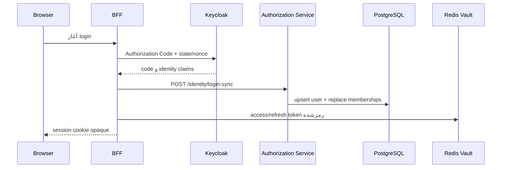
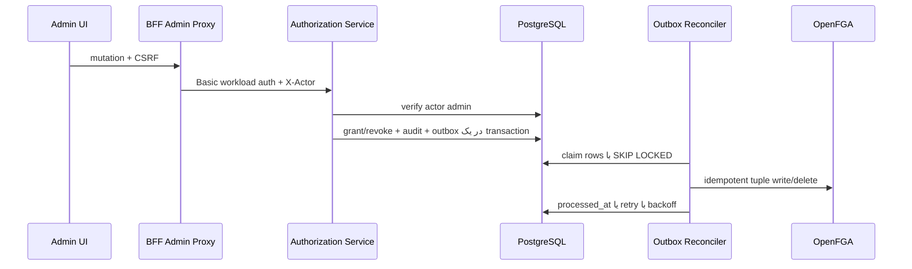

# معماری کامل Authorization Engine

این سند مرجع canonical موتور مجوزدهی Aurevia است. هدف، پاسخ‌دادن به سه پرسش مستقل است: «کاربر کیست؟»، «به چه چیزی و با چه عملی دسترسی دارد؟» و «در این درخواست مشخص چه محدودیت داده‌ای باید اعمال شود؟».

## اصول طراحی

- احراز هویت با مجوزدهی یکی نیست: Keycloak هویت را اثبات می‌کند؛ Authorization Service تصمیم دسترسی را مالک است.
- PostgreSQL منبع حقیقت control plane است؛ OpenFGA projection بهینه‌شده runtime است.
- هر نبودن یا ابهامی `DENY` است: route، resource، action، context، tuple و policy ناشناخته مجاز نمی‌شوند.
- UI فقط تجربه کاربری را تنظیم می‌کند؛ BFF و سرویس عملیاتی enforcement واقعی را انجام می‌دهند.
- شناسه خارجی immutable و همراه issuer ذخیره می‌شود؛ username برای نمایش/جست‌وجو است، نه هویت پایدار.
- تغییرات رابطه‌ای با transaction و outbox منتشر می‌شوند و مستقیماً از controller به دو datastore نوشته نمی‌شوند.

## اجزا و مالکیت داده

| جزء | مسئولیت | داده پایدار |
|---|---|---|
| Keycloak | OIDC، session هویتی و claim گروه‌ها | کاربر و گروه directory |
| BFF | session مرورگر، token vault، CSRF، proxy و enforcement ورودی | session و token رمز‌شده در Redis |
| Authorization Service | registry، policy، audit، تصمیم و synchronization | PostgreSQL |
| OpenFGA | ارزیابی graph رابطه‌ای با latency پایین | tuple و authorization model |
| Operation Gateway/Services | enforcement دامنه و محدودیت داده | داده عملیاتی |

## مدل subject

```text
USER  ← identity projection از issuer + subject
GROUP ← عضویت سازمانی از claim گروه‌ها
ROLE  ← بسته قابلیت مستقل از ساختار سازمانی
```

`user_group_membership` در هر login با snapshot جدید جایگزین می‌شود. `user_role_assignment` و `group_role_assignment` نقش را مستقیماً یا از طریق گروه می‌دهند. تاریخ انقضا هم در assignment و هم در grant کنترل می‌شود.

در OpenFGA همین مفاهیم به شکل زیر project می‌شوند:

```text
user:<external-id>
group:<external-id>#member
role:<role-key>#assignee
```

## مدل resource و action

resource یک نام canonical و یکی از هفت type دارد: `APPLICATION`, `MODULE`, `PAGE`, `UI_COMPONENT`, `API_RESOURCE`, `BUSINESS_RESOURCE` یا `EXTERNAL_RESOURCE`. `parent_id` hierarchy کاتالوگ را نگه می‌دارد و رابطه `parent` از طریق outbox در OpenFGA Store ثبت می‌شود. مدل OpenFGA ارث‌بری مجوز از والد را صریحاً تعریف می‌کند.

action واژگان business است؛ مانند `view`, `list`, `create`, `update`, `approve`, `reject`, `admin`. جدول `resource_action` مشخص می‌کند کدام action روی کدام resource معتبر است. grant برای ترکیب نامعتبر نباید ساخته شود.

نگاشت action به relation runtime:

| action | relation نوشته‌شده | permission بررسی‌شده |
|---|---|---|
| `view`, `list` | `viewer` | `can_view` |
| `create` | `creator` | `can_create` |
| `update`, `approve`, `reject` | `editor` | `can_edit` |
| `delete` | `deleter` | `can_delete` |
| `admin`, `manage` | `manager` | `can_manage` |

## جریان login و projection هویت



`OidcLoginSuccessHandler` ابتدا identity را sync می‌کند و سپس token را در vault می‌گذارد، session id را عوض می‌کند و redirect می‌دهد. claim گروه با mapper مربوط به Keycloak وارد ID/access/user-info token می‌شود. هیچ token OAuth وارد JavaScript یا cookie مرورگر نمی‌شود.

## جریان grant و revoke



قید unique partial فقط یک grant فعال برای subject/resource/action را می‌پذیرد. revoke حذف فیزیکی نیست؛ status را `ARCHIVED` می‌کند و نسخه را افزایش می‌دهد. idempotency key شامل event، grant و version است.

## جریان درخواست عملیاتی

1. Nginx فقط prefixهای منتشرشده را به BFF می‌دهد.
2. `RouteNormalizer` path مبهم، backslash، traversal و encoded slash را رد می‌کند.
3. Authorization Service با longest-prefix و مرز segment، route و operation را resolve می‌کند.
4. operation، resource/action و سقف body/response/timeout را برمی‌گرداند.
5. BFF درخواست check را به Authorization Service می‌دهد.
6. Authorization Service action را به permission تبدیل و OpenFGA را check می‌کند؛ خطای engine برابر deny است.
7. BFF token را از vault می‌خواند؛ نزدیک expiry آن را با single-flight refresh می‌کند.
8. bearer اصلی Public IAM بدون exchange به gateway عملیاتی ارسال می‌شود.
9. فقط headerهای allowlist‌شده منتقل و اندازه و timeout پاسخ کنترل می‌شوند.

## manifest و UI authorization

manifest شامل version، expiry، پنل‌ها و map مجوزهاست. هر پنل فعال تنها پس از check رابطه `application:aurevia/<slug>/can_view` وارد پاسخ می‌شود. BFF آن را same-origin به Shell می‌دهد. `SHCan`, `SHAction` و `SHRouteGuard` برای hide/disable/read-only استفاده می‌شوند. manifest کوتاه‌عمر و `no-cache` است و ETag دارد. این manifest مدرک امنیتی برای API نیست؛ API مجدداً check می‌شود.

## policy ساختاریافته و ABAC

`StructuredPolicyEvaluator` یک زبان محدود و قابل audit است؛ اجرای script یا expression دلخواه ممنوع است. fieldهای مجاز `ownerId`, `orgUnit`, `branch`, `classification`, `request.ipClass`, `time` و operatorهای مجاز `eq`, `in`, `before`, `after` هستند. context ناقص، field/operator ناشناخته، obligation نامعتبر یا parse error همگی deny می‌شوند.

obligation خروجی تصمیم است و enforcement آن بر عهده adapter/service مالک داده است: `rowFilters`, `allowedColumns`, `maskedColumns`, `maximumRows`, `exportAllowed`, `printAllowed`, `watermark`.

## consistency و failure modes

| failure | رفتار امن | بازیابی |
|---|---|---|
| OpenFGA unavailable | check برابر deny | retry سرویس و alert |
| outbox failure | event pending و grant هنوز در DB قابل مشاهده است | backoff و replay idempotent |
| identity sync failure | login کامل نمی‌شود | رفع DB/service و login مجدد |
| token vault missing | 401 و حذف session | login مجدد |
| refresh failure | session معتبر عملیاتی نیست | 401/login؛ token قبلی overwrite نمی‌شود |
| route ناشناخته | 404/deny | ثبت operation در registry |
| context ناقص | deny | تکمیل context توسط سرویس معتبر |

برای عملیات حساس، دسترسی تا رسیدن projection به وضعیت مورد انتظار نباید optimistic فرض شود. backlog، سن قدیمی‌ترین event، attempts، last_error و اختلاف tupleها باید metric و alert داشته باشند.

## audit و observability

- هر mutation مدیریتی actor، event، target و correlation id ثبت می‌کند.
- هر decision باید subject/resource/action/result/reason/model-version و hash امن context داشته باشد؛ token و PII خام log نمی‌شوند.
- correlation id از edge تا gateway و سرویس حفظ می‌شود.
- metricهای لازم: latency و deny-rate check، خطای OpenFGA، عمق/سن outbox، refresh failure، route miss، 401/403 و optimistic-lock conflict.

## مرزهای توسعه و production

Basic Auth داخلی و passwordهای `local-change-me` فقط bootstrap محلی‌اند. production باید secret manager، rotation، mTLS workload identity، network policy، TLS verification، database backup/PITR، Redis HA و alerting داشته باشد. هیچ default محلی مجوز deploy production نیست.

## چک‌لیست تغییر Authorization

1. resource/action canonical و مالک دامنه مشخص است؟
2. subject و expiry تعریف شده‌اند؟
3. مسیر allowlist و server-side check دارد؟
4. default deny و failure behavior تست شده است؟
5. migration forward-only و idempotent است؟
6. outbox، OpenFGA model/test و reconciliation به‌روز است؟
7. audit، correlation و metric وجود دارد؟
8. UI فقط بازتاب تصمیم server است؟
9. runbook rollback/repair نوشته شده است؟
