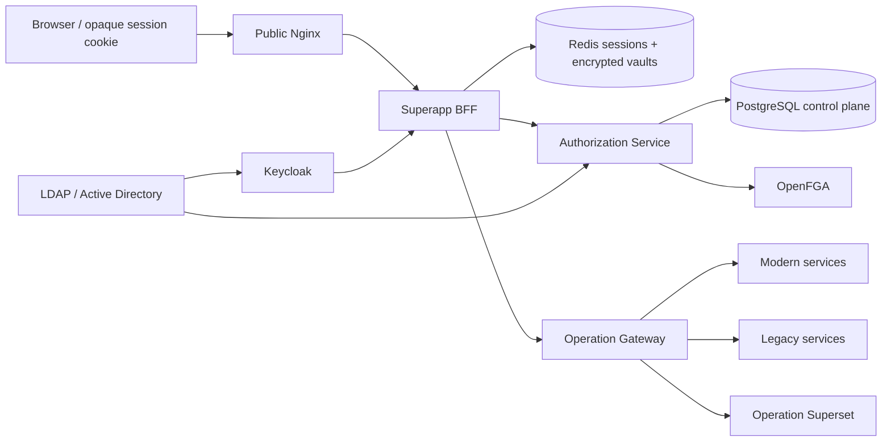
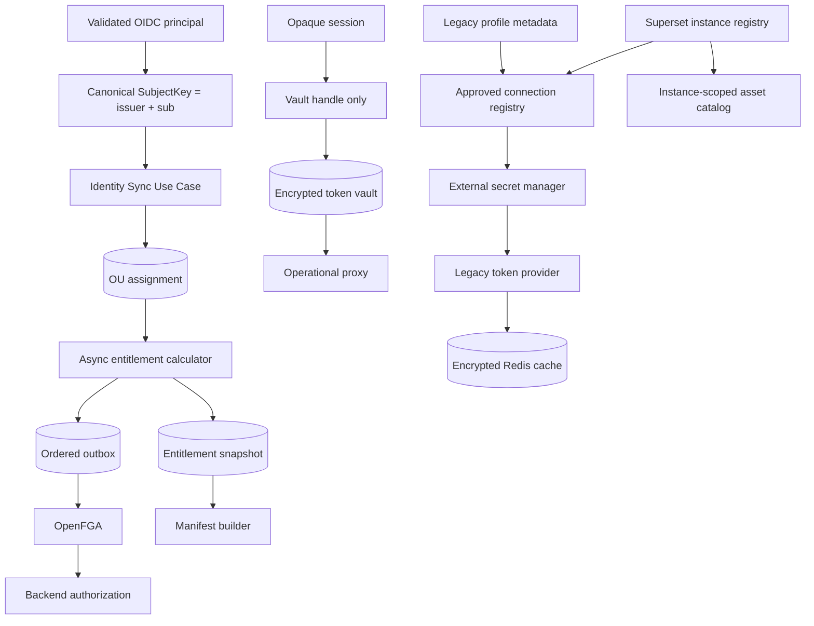

# ممیزی جامع معماری، Clean Code و SOLID — ۱۴۰۵/۰۶/۱۳

## شناسنامه و دامنه

- baseline کد: commit `1000dc8` روی شاخه `main`
- تاریخ بررسی: ۲۰۲۶-۰۹-۰۴
- دامنه: دو سرویس Java، Shell و چهار Micro Frontend، packageهای مشترک، ۳۳ migration، OpenFGA، Redis، Keycloak/LDAP، Gateway، Superset، Compose، تست‌ها و CI
- روش: خواندن جریان‌های اجرایی و مرزهای اعتماد، تطبیق schema با کد، بررسی قراردادهای HTTP/TypeScript، جست‌وجوی الگوهای تکراری و اجرای gateهای موجود
- این سند snapshot است. برای رفتار عملیاتی هر فیچر، [مرجع فیچرها و جریان‌های کد](codebase-feature-reference-2026-09-04-fa.md) را بخوانید.

درجه‌بندی یافته‌ها:

| سطح | تعریف |
|---|---|
| `P0` | نقض بالقوه مرز امنیتی یا ناسازگاری‌ای که می‌تواند دسترسی درست را مختل کند؛ پیش از Production باید بسته شود |
| `P1` | شکاف مهم معماری/عملیاتی که توسعه یا مقیاس‌پذیری امن را محدود می‌کند |
| `P2` | بدهی نگهداشت، کارایی، تست یا ابزار که باید برنامه‌ریزی شود |
| `P3` | بهبود کم‌ریسک و تدریجی |

## جمع‌بندی مدیریتی

پروژه از نظر انتخاب مرزهای کلان مسیر درستی دارد: مرورگر با BFF هم‌مبدأ کار می‌کند، تصمیم مجوز در Authorization Service/OpenFGA متمرکز است، توکن‌ها برای cache شدن رمز می‌شوند، outbox برای projection استفاده شده، routeها و resourceها registry-driven هستند و CI حداقل build/test/config را پوشش می‌دهد. این‌ها پایه‌های یک معماری enterprise قابل‌توسعه‌اند.

با این حال، وضعیت فعلی هنوز «آماده Production» نیست. سه finding اصلی باید قبل از توسعه‌ی بیشتر حل شوند:

1. هویت canonical در همه‌ی مسیرها یکسان نیست: login و OU از claim `sub` استفاده می‌کنند، اما manifest/proxy/Superset از `Principal.getName()` استفاده می‌کنند که با تنظیم فعلی `preferred_username` است. این اختلاف می‌تواند رابطه‌های OpenFGA تولیدشده برای یک شناسه را با check روی شناسه‌ای دیگر جدا کند و در حالت multi-issuer خطر collision ایجاد کند.
2. invariant «توکن Keycloak داخل WebSession نباشد» با تست اثبات نشده است. handler توکن را از `ServerOAuth2AuthorizedClientRepository` می‌خواند و در Token Vault می‌گذارد، ولی authorized client را از repository حذف نمی‌کند. با repository پیش‌فرض session-based، احتمال نگهداری نسخه‌ی دیگری از access/refresh token در Redis Session وجود دارد.
3. OU-based application access به panel متصل است، ولی ساخت permissions/routes در manifest هنوز فقط grantهای USER/GROUP/ROLE قدیمی را از `user_group_membership` می‌خواند. کاربری که فقط از مسیر OU دسترسی application دارد ممکن است panel را بگیرد اما route/menu قابل استفاده نداشته باشد.

همچنین Legacy و Superset هنوز نیاز کاربر را کامل نمی‌کنند: resolver امن Production برای secretهای Legacy وجود ندارد و token endpointها از یک connection سراسری استفاده می‌کنند؛ Superset نیز registry چند-instance برای آدرس/پورت محیط عمومی و عملیاتی ندارد.

## شواهد قابل تکرار

در baseline بالا نتایج زیر ثبت شد:

| gate | نتیجه |
|---|---|
| `./mvnw.cmd -B verify` | موفق؛ ۱۵ تست BFF و ۵۵ تست Authorization Service، بدون failure/error |
| `npm run typecheck` | موفق در همه workspaceها |
| `npm test -- --runInBand` | موفق؛ ۱۰ تست Frontend/contract |
| `npm run build` | موفق در همه workspaceها |
| `docker compose ... config --quiet` | موفق |

هشدارهای قابل اقدام:

- Mockito برای inline mock maker خود را به JVM attach می‌کند؛ JDKهای آینده این رفتار را به‌صورت پیش‌فرض مسدود می‌کنند. javaagent باید در Surefire صریح شود.
- همه‌ی bundleهای اصلی بالاتر از performance budget پیش‌فرض Webpack هستند: Admin حدود `1.09 MiB`، Finance حدود `1 MiB`، HR و Shell حدود `1.44 MiB` و Reports حدود `598 KiB`.
- عبور unit testها به معنی اثبات session/token isolation، LDAP واقعی، Redis، OpenFGA، Gateway یا Superset نیست؛ این مسیرها integration test کامل ندارند.

## نمای معماری موجود



مرز درست این معماری این است که Browser هیچ bearer token دریافت نکند، BFF تنها دارنده‌ی handle باشد، secretهای Legacy بیرون از دیتابیس باشند، Authorization Service تنها writer رابطه‌ها باشد و تمام backend endpointهای حساس مجوز را دوباره بررسی کنند.

## ماتریس نیازهای اصلی

| نیاز | وضعیت فعلی | حکم |
|---|---|---|
| OIDC Authorization Code Flow | در `application.yml` فعال و login handler اختصاصی وجود دارد | پیاده‌سازی شده |
| دریافت DN/OU و ذخیره‌ی خودکار کاربر | claimهای validateشده به `IdentitySyncController` و `OuAccessService` می‌رسند | پیاده‌سازی شده، sync دوره‌ای پیش‌فرض خاموش |
| ساخت access group و اتصال OU | API/UI و schema در V32 وجود دارد | پیاده‌سازی شده با ایراد provenance در `ALL_OF` |
| اتصال Micro Frontend به group | `application_group_grant` و projection به OpenFGA وجود دارد | پیاده‌سازی شده |
| مشاهده MFE توسط عضو OU | panel check وجود دارد | ناقص؛ permissions/routes همان مسیر را مصرف نمی‌کنند |
| session مرورگر بدون token | cookie opaque و handle اختصاصی وجود دارد | نیازمند اثبات؛ authorized-client copy محتمل است |
| دریافت token از Redis در هر proxy request | BFF Token Vault را می‌خواند و refresh می‌کند | پیاده‌سازی شده |
| تعریف route از نوع Legacy | target/profile/admin UI و gateway path وجود دارد | پیاده‌سازی پایه |
| secret امن Legacy | DB فقط reference نگه می‌دارد | طراحی درست، adapter Production موجود نیست |
| token امن Legacy در Redis | AES-GCM cache و TTL وجود دارد | پیاده‌سازی پایه؛ rotation/atomicity ناقص |
| تعریف چند Superset عمومی/عملیاتی با host/port دلخواه | hostها در Compose/Gateway ثابت‌اند | پیاده‌سازی نشده |
| رجیستری و انتشار runtime MFE | V33، artifact، activation و rollback وجود دارد | پیاده‌سازی پایه؛ trust policy و validation ناقص |

## یافته‌های اولویت‌دار

| شناسه | سطح | ناحیه | finding |
|---|---|---|---|
| `ID-001` | P0 | Identity | `sub` در login/OU و `preferred_username` در runtime check استفاده می‌شود؛ شناسه canonical واحد نیست |
| `TOK-001` | P0 | Session | حذف authorized client از repository دیده نمی‌شود؛ invariant نبود token در session اثبات نشده است |
| `AUTH-001` | P0 | Manifest | panel با OpenFGA/OU مجاز می‌شود ولی permissions از membership قدیمی ساخته می‌شوند |
| `LEG-001` | P1 | Legacy | `SecretResolver` واقعی Production وجود ندارد؛ حالت پیش‌فرض عمداً unavailable است |
| `SUP-001` | P1 | Superset | instance registry برای چند سرور، zone، host/port و credential وجود ندارد |
| `MFE-001` | P1 | Supply chain | URL مجاز remote از همان manifest می‌آید؛ allowlist مستقل/قابل اعتماد نیست |
| `OU-001` | P1 | OU | در `ALL_OF`، `groupId` به‌عنوان `source_id` membership ثبت می‌شود و provenance معتبر نیست |
| `OU-002` | P1 | OU | تغییر rule، `recalculateAll()` همگام و بدون batch/queue اجرا می‌کند |
| `TOK-002` | P1 | Vault | `vaultExpiresAt` هنگام read enforce نمی‌شود و Redis پنج دقیقه بیشتر نگه می‌دارد |
| `LEG-002` | P1 | Legacy | connect timeout پروفایل و فیلدهای client-secret مصرف نمی‌شوند؛ custom adapter واقعی نیست |
| `PRX-001` | P1 | Proxy | retry تنظیم‌شده در route به اجرای proxy متصل نیست؛ رفتار runtime ثابت است |
| `OPS-001` | P1 | Outbox | reconciler در transaction شبکه‌ی OpenFGA را صدا می‌زند و ordering aggregate صریح ندارد |
| `API-001` | P1 | Maintainability | controllerهای بزرگ HTTP، SQL، validation، audit و orchestration را مخلوط کرده‌اند |
| `CAT-001` | P1 | Resource catalog | enum/prefix قرارداد resource در DB، backend و TypeScript همگام نیست |
| `MFE-002` | P1 | Runtime contract | runtime APIهایی مانند current user/shared-state subscription به‌صورت no-op تحویل MFE می‌شوند |
| `SUP-002` | P1 | Authorization | safe runtimeهای Superset با داشتن هر asset مجاز می‌شوند و mapping path/query شکننده است |
| `MFE-003` | P2 | Concurrency | activation artifact optimistic lock ندارد و refresh دستی Shell می‌تواند race ایجاد کند |
| `OBS-001` | P2 | Observability | چند مسیر correlation جدید می‌سازند یا exception را به cache miss تبدیل می‌کنند |
| `PERF-001` | P2 | Performance | manifest برای هر panel check جداگانه و frontend bundleهای بزرگ دارد |
| `TEST-001` | P2 | Verification | integration test مرزهای Redis/LDAP/OIDC/OpenFGA/Gateway کم است |
| `REP-001` | P2 | Repository | binary و archiveهای OpenFGA CLI در Git ثبت شده‌اند و clone/history را سنگین می‌کنند |

## بررسی فیچر به فیچر

### ۱. Login، Keycloak و LDAP/OU

پیاده‌سازی موجود:

- BFF از Authorization Code Flow و OIDC استفاده می‌کند.
- Keycloak mapperها DN، شناسه‌ی LDAP، department، title و employeeType را وارد principal می‌کنند.
- `OidcLoginSuccessHandler` فقط claimهای principal validateشده را به sync داخلی می‌فرستد؛ Browser نمی‌تواند DN یا OU را تزریق کند.
- `DirectoryDnParser` از `LdapName` استفاده می‌کند و parser رشته‌ای دست‌ساز ندارد.
- `ActiveDirectorySyncJob` hierarchy OUها و ارتباط کاربران را دوره‌ای sync می‌کند.

نقاط قوت:

- fail-closed بودن DN نامعتبر و idempotent بودن upsertها مناسب است.
- جداسازی sync هنگام login از sync دوره‌ای directory، امکان convergence را فراهم می‌کند.
- mapping attributeها allowlist دارد و کل claim set بدون کنترل ذخیره نمی‌شود.

شکاف‌ها:

- profile مربوط به directory در اجرای عادی Compose فعال نیست و `DIRECTORY_SYNC_ENABLED=false` است؛ بنابراین وجود کد به معنی فعال بودن feature نیست.
- اتصال نمونه LDAP روی `ldap://...:389` است. Production باید LDAPS یا StartTLS، truststore و credential reference داشته باشد.
- fallback ساخت شناسه OU از hashِ DN در rename/move پایدار نیست. objectGUID باید شناسه‌ی اصلی و DN فقط attribute متغیر باشد.
- یک sync موفق با خروجی خالی می‌تواند OUهای قبلی را inactive کند. staging، minimum-result threshold و circuit breaker لازم است.
- catch کلی job خطا را ثبت می‌کند ولی health/metric/alert قوی برای «directory stale» دیده نمی‌شود.

حکم: طراحی پایه خوب، readiness عملیاتی ناقص (`P1`).

### ۲. OU → Access Group → Micro Frontend

پیاده‌سازی موجود:

- V32 موجودیت‌های `directory_ou`، `access_group`، rule، membership محاسبه‌شده و application grant را ایجاد می‌کند.
- پنل Admin ساخت گروه، انتخاب `EXACT/SUBTREE` و `ANY_OF/ALL_OF`، preview، membership explain و grant به application را پوشش می‌دهد.
- `OuAccessService` تغییر membership را به outbox/OpenFGA با `group:{code}#member` و `application viewer` projection می‌کند.

نقاط قوت:

- explainability، preview قبل از اعمال و soft state membership تصمیم‌های خوبی‌اند.
- unique constraintها و upsertها بخش بزرگی از تکرار sync را کنترل می‌کنند.
- backend منبع تصمیم است و UI صرفاً نمایش/مدیریت است.

شکاف‌ها:

- `ALL_OF` پس از match کامل، `groupId` را در مجموعه sourceها قرار می‌دهد. ستون `source_id` از نظر معنا باید rule را نشان دهد؛ در explain join آن به rule تهی می‌شود. membership باید یک aggregate source معتبر یا جدول evidence جدا داشته باشد.
- `recalculateAll()` از request ادمین به‌صورت همگام تمام کاربران و گروه‌ها را پیمایش می‌کند. این مسیر باید job صف‌بندی‌شده، batch، checkpoint و progress داشته باشد.
- الگوریتم چند query داخل loop دارد و با رشد کاربران/OUها N+1 می‌شود.
- rule mutationها version check یکنواخت ندارند و حذف، row count را assert نمی‌کند.
- grant تکراری به جای پاسخ domain-level می‌تواند unique conflict خام برگرداند.
- مهم‌تر از همه، `AuthorizationController.manifest` فقط برای panel از OpenFGA استفاده می‌کند و permissions را از جداول قدیمی می‌سازد. نتیجه‌ی OU باید به یک read model واحد برای panel/menu/route تبدیل شود.

حکم: feature از نظر UI و data model قابل مشاهده است، اما end-to-end correctness کامل نیست (`P0/P1`).

### ۳. Session و Token Vault کاربر

پیاده‌سازی موجود:

- cookie از نوع Secure/HttpOnly/SameSite و session server-side Redis است.
- Browser فقط handle تصادفی `tokenVaultHandle` را در session دارد.
- access/refresh token با AES-256-GCM، IV تصادفی و key ID در Redis ذخیره می‌شود.
- proxy در هر request handle را می‌خواند، token را از vault می‌گیرد و در صورت نیاز refresh می‌کند.
- logout رکورد vault و session Superset را حذف می‌کند و session را invalidate می‌کند.

نقاط قوت:

- توکن در response یا local/session storage فرانت قرار نمی‌گیرد.
- رمزنگاری authenticated است و `toString`های حساس redacted شده‌اند.
- session ID پس از login rotate می‌شود.

شکاف‌ها:

- handler ابتدا authorized client را از repository می‌خواند ولی آن را حذف یا با repository غیر-session جایگزین نمی‌کند. باید یک integration test Redis را پس از login dump کند و ثابت کند access/refresh token plaintext یا serialized authorized client در namespace session وجود ندارد.
- readِ vault، `vaultExpiresAt` را reject نمی‌کند؛ TTL نیز پنج دقیقه بعد از آن ادامه دارد. policy expiry باید پیش از decrypt/return enforce و رکورد منقضی حذف شود.
- زمان عمر vault برای refresh token برابر access expiry + 30 دقیقه فرض شده و از SSO/session policy مشتق نیست.
- key rotation چندنسخه‌ای وجود ندارد؛ تغییر key فعال، رکوردهای قبلی را غیرقابل decrypt می‌کند. decrypt-by-key-id و دوره‌ی overlap لازم است.
- handle با regex عمومی بررسی می‌شود؛ parse کردن UUID دقیق‌تر است.
- Redis TLS قابل تنظیم است ولی production guard صریح برای اجبار TLS/ACL/عدم استفاده از DB مشترک دیده نمی‌شود.

حکم: cryptographic primitive مناسب است، ولی invariant اصلی باید اصلاح و اثبات شود (`P0`).

### ۴. Authorization، OpenFGA و Manifest

پیاده‌سازی موجود:

- مدل OpenFGA روابط user/group/role/resource را بیان می‌کند.
- Authorization Service writer مرکزی relationshipهاست.
- check تکی و batch، audit تصمیم، cache/epoch invalidation و reconciliation وجود دارد.
- manifest برای UI fail-closed است و backend دوباره مجوز route/action را بررسی می‌کند.

نقاط قوت:

- port با نام `RelationshipAuthorizationPort` وابستگی domain به adapter OpenFGA را کم کرده است.
- policyهای structured و semantics testهای نسبتاً خوب دارند.
- outbox از dual-write مستقیم DB/OpenFGA جلوگیری می‌کند.

شکاف‌ها:

- canonical identity مشکل `ID-001` دارد. پیشنهاد: value object مثل `SubjectKey(issuer, sub)` و یک serializer واحد برای DB، OpenFGA، logs، cache و headerها.
- فیلد `issuer` در check دریافت می‌شود ولی tuple فعلی فقط `user:{subjectId}` است؛ دو issuer با `sub` یکسان collision دارند.
- manifest read model از grantهای relational و checkهای FGA مخلوط ساخته می‌شود و consistency مدل روشن نیست.
- برای هر panel یک call جدا به OpenFGA انجام می‌شود؛ batch check یا materialized entitlement snapshot لازم است.
- version مانیفست از Java `hashCode()` روی representation ساخته می‌شود؛ canonical JSON + SHA-256 یا revision monotonic مطمئن‌تر است.
- row داخلی panel/artifact تقریباً مستقیم در قرارداد response قرار می‌گیرد و coupling schema/API را زیاد می‌کند.
- `ResourceManifestController` و TypeScript همه‌ی enumهای DB جدید مانند `API_RESOURCE`، `DATA_RESOURCE` و `DATA_GOVERNANCE_RESOURCE` را یکسان پوشش نمی‌دهند. prefix `external:` نیز با canonical `external_resource:` ناسازگار است.

حکم: هسته‌ی مجوزدهی قوی‌تر از میانگین پروژه‌هاست، ولی identity و read-model باید قبل از Production یکپارچه شوند (`P0/P1`).

### ۵. Registry و Dynamic Micro Frontend

پیاده‌سازی موجود:

- V33 artifact immutable، active artifact، menu override، service slug و snapshot مانیفست را اضافه می‌کند.
- Admin امکان publish، validate، activate و rollback نسخه‌های MFE را دارد.
- Shell remote را در runtime بارگذاری، timeout/dedupe/cache و SRI syntax را کنترل می‌کند.
- contract نسخه‌ی plugin و lifecycle `mount/unmount` تعریف شده است.

نقاط قوت:

- جدا شدن artifact از panel راه rollback و audit deployment را باز می‌کند.
- URL با protocol محدود و integrity توسط loader بررسی می‌شود.
- error boundary و cleanup lifecycle برای remoteها وجود دارد.

شکاف‌ها:

- allowlist loader از همان catalogی ساخته می‌شود که URL remote را تحویل می‌دهد؛ پس مرز اعتماد مستقل نیست. publish باید domain/port allowlist سازمانی، HTTPS production، DNS/IP policy و approval امضاشده داشته باشد.
- remote JavaScript کد trusted با دسترسی origin است؛ `HostRuntime` sandbox امنیتی نیست. threat model باید این اعتماد را صریح کند.
- server فقط schema سطحی JSON، path و URI را validate می‌کند؛ integrity format، route/action key، menu ID، contract compatibility و checksum artifact باید validate شوند.
- activation version مورد انتظار ندارد و concurrent update می‌تواند lost update بدهد.
- CSP فعلی hostهای محلی ثابت را می‌شناسد؛ registry کاملاً dynamic بدون تولید CSP هماهنگ در Production کار نمی‌کند.
- قرارداد runtime، `session.getCurrentUser` را `null` و subscribeهای session/shared state را no-op برمی‌گرداند. یا باید پیاده‌سازی شوند یا از interface حذف شوند؛ وعده‌ی قراردادی بی‌اثر خلاف ISP/LSP است.
- refresh دستی Shell cleanup قبلی را مصرف نمی‌کند و requestهای هم‌زمان می‌توانند out-of-order state بنویسند. sequence token یا abort قبلی لازم است.

حکم: foundation مناسب برای platform، ولی supply-chain boundary و contract maturity ناکامل (`P1`).

### ۶. Dynamic Operational Proxy

پیاده‌سازی موجود:

- route resolution بر اساس panel، path normalized، method و pattern است.
- پیش از dispatch، resource/action از route گرفته و در Authorization Service بررسی می‌شود.
- request/response size محدود، header allowlist و gateway واحد وجود دارد.
- BFF مستقیم به targetهای دلخواه وصل نمی‌شود؛ gateway مرز egress است.

نقاط قوت:

- fail-closed روی route/operation تعریف‌نشده مناسب است.
- path traversal normalization و تست‌های آن وجود دارد.
- mTLS برای profile Production gateway پیش‌بینی شده است.

شکاف‌ها:

- `retryEnabled` و `maxRetries` از resolver برمی‌گردند اما controller آن‌ها را مصرف نمی‌کند؛ runtime یک retry ثابت روی 401 دارد.
- controller resolution، authorize، vault، buffering، dispatch، retry و response mapping را یکجا انجام می‌دهد.
- request/response کامل در حافظه buffer می‌شود؛ limit جلوی بی‌نهایت را می‌گیرد ولی برای payloadهای هم‌زمان فشار heap می‌سازد.
- issuer در request مجوز `public-iam` hard-code شده است.
- health-check target با permission عمومی GET registry (`can_view`) قابل دسترس است؛ عملیات probe بهتر است permission اختصاصی `manage/test_connection` داشته باشد.

حکم: مسیر امنیتی پایه مناسب، ولی policy runtime و decomposition ناقص (`P1`).

### ۷. Legacy Service Authentication

پیاده‌سازی موجود:

- DB metadata و secret reference را نگه می‌دارد، نه username/password/client secret واقعی را.
- BFF credential را از `SecretResolver` می‌گیرد، token endpoint را صدا می‌زند و نتیجه را AES-GCM در Redis cache می‌کند.
- cache با environment/profile/version namespace می‌شود و refresh coordination دارد.
- Gateway توکن Legacy داخلی را روی outbound Authorization قرار می‌دهد و header داخلی را حذف می‌کند.
- token endpoint policy، HTTPS، redirect، response-size، rate limit و circuit ساده دارد.

نقاط قوت:

- نگهداری reference به جای secret در control-plane اصل درستی است.
- `OutboundTokenProvider` و `SecretResolver` extension pointهای خوبی از DIP/OCP هستند.
- پاسخ token parser محدودیت اندازه/عمر/token length و redaction دارد.

شکاف‌ها:

- تنها resolver قابل استفاده از JSON محیط local می‌آید؛ resolver واقعی Vault/Kubernetes/Azure/AWS در Production وجود ندارد و fallback عمداً unavailable است.
- یک `token-connection` و base URL سراسری وجود دارد؛ تعریف چند token server مستقل per target/profile کامل نیست. URL نباید مستقیماً از DB به WebClient داده شود؛ باید به connection registry امن resolve شود.
- `connectTimeoutMs` پروفایل ذخیره می‌شود ولی client timeout اتصال ثابت دارد.
- `client_id_secret_ref` و `client_secret_ref` schema مصرف نمی‌شوند و manager فقط `credential_secret_ref` را resolve می‌کند.
- `CUSTOM_LEGACY_ADAPTER` behavior اختصاصی ندارد و عملاً به form request می‌افتد.
- refresh token cache می‌شود ولی refresh grant استفاده نمی‌شود.
- نوشتن token و index در Redis atomic نیست؛ Lua/transaction یا یک رکورد واحد لازم است.
- خطای decrypt/parse cache به miss خام تبدیل می‌شود؛ tamper/key mismatch باید metric/audit جدا داشته باشد.
- connection-test/token-test می‌تواند token واقعی acquire و cache کند؛ side effect باید در قرارداد روشن یا از test جدا شود.

حکم: abstraction مناسب، ولی Production connector و چند-instance بودن ناقص (`P1`).

### ۸. Superset عمومی و عملیاتی

پیاده‌سازی موجود:

- Public و Operation Superset از نظر network جدا شده‌اند.
- Operation Superset فقط از tunnel مجاز BFF/Gateway قابل دسترس است.
- asset catalog، grant، subject mapping و Remote User SSO وجود دارد.
- logout/login مجدد cookie Superset قبلی را expire می‌کند.

نقاط قوت:

- جداسازی zone عمومی و عملیاتی تصمیم امنیتی درستی است.
- Browser به hostname داخلی Operation Superset دسترسی مستقیم ندارد.
- assetهای منتشرشده به resource/action متصل‌اند و UI reports policy دارد.

شکاف‌ها:

- hostهای `public-superset` و `operation-superset:8088` در Compose/Nginx/Gateway ثابت‌اند. جدول instance یا connection با `zone`, base URL, port, TLS policy, auth profile و health وجود ندارد.
- `superset_asset` فاقد `instance_id` است و `external_id` globally unique است؛ دو سرور با شناسه dashboard یکسان collision می‌کنند.
- catalog UI فقط یک tunnel زنده را می‌بیند و instance selector ندارد.
- endpointهای runtime «safe» مانند chart/data با داشتن هر asset قابل فراخوانی‌اند؛ authorization باید request را به asset canonical دقیق وصل کند.
- تطبیق asset از path/query شکننده است و بهتر است gateway adapter، ID canonical را استخراج کند.
- arbitrary URL نباید مستقیماً proxy شود؛ connection registry باید SSRF controls، DNS pinning، scheme/port allowlist و egress policy داشته باشد.

حکم: جداسازی دو محیط موجود خوب است، ولی خواسته‌ی چند سرور دلخواه پیاده نشده (`P1`).

### ۹. Resource Catalog و Admin Access Studio

پیاده‌سازی موجود:

- hierarchy منابع، action catalog، bindingهای API/external، grant مستقیم USER/GROUP/ROLE و optimistic locking بخشی از CRUD وجود دارد.
- OpenFGA outbox برای parent/grant تغییر می‌کند.
- Admin UI مدیریت resource/grant را ارائه می‌دهد.

نقاط قوت:

- resource key immutable و parent cycle/format validation جهت درستی است.
- active-grant uniqueness و canonical relation migrations وجود دارند.
- resource tree از UI component تا external/data domain توسعه‌پذیر طراحی شده است.

شکاف‌ها:

- controllerهای Access/Registry/Superset از `JdbcClient` و `Map<String,Object>` مستقیم استفاده می‌کنند؛ تغییر schema به runtime cast و contract drift تبدیل می‌شود.
- type/prefix registry در سه جای DB/Java/TypeScript تکرار شده و همگام نیست.
- validation و persistence و outbox و audit داخل methodهای controller فشرده‌اند.
- idempotency key برخی eventها random است؛ retry همان command می‌تواند event تکراری بسازد.

حکم: مدل غنی، ولی application/domain boundary نازک و contract governance ضعیف (`P1`).

### ۱۰. Logging، Audit و Operations

پیاده‌سازی موجود:

- correlation ID، API log، audit log، redaction، safe error serializer، retention job و query UI وجود دارد.
- authorization decision جزئیات reason/model/correlation را ثبت می‌کند.
- outbox dead-letter و reconcile operation وجود دارد.

نقاط قوت:

- جداسازی audit از API log و حذف داده‌های حساس تصمیم خوبی است.
- safe context hash امکان correlation بدون ذخیره‌ی payload حساس می‌دهد.

شکاف‌ها:

- correlation در تمام مسیرها propagate نمی‌شود؛ بعضی auditها UUID تازه می‌سازند.
- SLO/metric مشخص برای directory lag، outbox lag/dead-letter، token decrypt failure، manifest latency و FGA error دیده نمی‌شود.
- network call OpenFGA داخل transaction reconciler می‌تواند connection/lock را طولانی نگه دارد.
- ordering per aggregate صریح نیست؛ write/deleteهای retryشده می‌توانند جابه‌جا شوند.
- errorهای crypto cache باید security signal باشند، نه miss عادی.

حکم: logging پایه قوی است، operational telemetry و outbox execution نیاز به بلوغ دارد (`P1/P2`).

### ۱۱. Frontend و قراردادهای مشترک

پیاده‌سازی موجود:

- `@aurevia/contracts` مدل manifest/runtime را به اشتراک می‌گذارد.
- `@aurevia/sh-core-ui` policy hook، guard و presentation mode دارد.
- HR/Finance صفحات چندسطحی guardشده و Reports asset-aware است.
- contract test وجود guard روی route و mutation را بررسی می‌کند.

نقاط قوت:

- policy UI به‌عنوان UX guard دیده شده و backend همچنان مرجع امنیت است.
- Module Federation lifecycle و contract version نسبت به import مستقیم remote بهتر است.
- Provider با تغییر prop `initial` state را به‌روز می‌کند.

شکاف‌ها:

- Shell و چند MFE به صورت خطوط بسیار فشرده نوشته شده‌اند؛ diff، debug، coverage و code review را سخت می‌کند.
- API/CSRF/correlation/error handling در componentهای Admin تکرار شده است؛ client مشترک typed لازم است.
- `Record<string, any>` و raw responseها خطای contract را به runtime منتقل می‌کنند.
- فایل‌های generated `*.d.ts` کنار source commit شده و build آن‌ها را بازنویسی می‌کند؛ منبع حقیقت و policy تولید باید روشن شود.
- menu selection exact-path است و nested route ممکن است active state درست نداشته باشد.
- bundle splitting/tree-shaking برای importهای گسترده‌ی Ant Design کافی نیست.

حکم: قرارداد مفهومی خوب، maintainability و performance نیازمند refactor تدریجی (`P2`).

### ۱۲. زیرساخت، CI و Supply Chain

پیاده‌سازی موجود:

- image/versionهای اصلی pin شده، networkها تفکیک و healthcheckها تعریف شده‌اند.
- CI typecheck/test/build/npm audit/Maven/config/diff-check دارد.
- Production profile mTLS بین BFF و gateway را الزامی می‌کند.
- OpenFGA bootstrap/model tests و preflight/verify script وجود دارد.

نقاط قوت:

- سه job مستقل frontend/backend/configuration feedback را سریع‌تر می‌کنند.
- Compose networks دسترسی مستقیم Operation services را محدود می‌کنند.
- placeholder guardها جلوی بخشی از deploy اشتباه را می‌گیرند.

شکاف‌ها:

- integration/security test با سرویس‌های واقعی در CI وجود ندارد.
- `npm audit` بدون policy severity/allowlist می‌تواند ناپایدار باشد؛ بهتر است threshold و گزارش SBOM/OSV مشخص شود.
- container image scan، secret scan، SAST و migration compatibility gate در workflow دیده نمی‌شود.
- credentialهای env در Compose برای Production جای secret manager/CSI را نمی‌گیرند.
- Superset با dev server در نمونه اجرا می‌شود؛ Production WSGI، hardening و backup جدا لازم است.
- OpenFGA CLI executable و archiveها در Git commit شده‌اند. بهتر است checksum/version در repo بماند و binary از release cache/artifact registry دریافت شود.

حکم: CI پایه سالم، release/security gates کامل نیست (`P2`).

## ارزیابی SOLID

| اصل | وضعیت | توضیح |
|---|---|---|
| Single Responsibility | ضعیف تا متوسط | portها خوب‌اند، اما controllerهای Admin، `OperationalProxyController` و Shell چند مسئولیت را هم‌زمان دارند |
| Open/Closed | متوسط | provider/adapterهای token و FGA توسعه‌پذیرند؛ modeها و resource typeها با string/switch و schemaهای موازی رشد می‌کنند |
| Liskov Substitution | متوسط | implementationهای token provider قابل جایگزینی‌اند؛ runtime contractهای no-op رفتاری را که interface وعده می‌دهد کامل نمی‌کنند |
| Interface Segregation | متوسط | portهای backend باریک‌اند؛ `HostRuntime` capabilityهای اختیاری/بی‌اثر را یکجا عرضه می‌کند |
| Dependency Inversion | متوسط رو به خوب | `RelationshipAuthorizationPort`, `SecretResolver`, `OutboundTokenProvider` نقاط مثبت‌اند؛ direct SQL در controllerها و اتصال مستقیم به WebClient/Map این مزیت را محدود می‌کند |

### target package structure پیشنهادی

```text
api/                 HTTP DTO, validation, status mapping
application/         use case, transaction boundary, orchestration
domain/              value object, invariant, policy, domain event
ports/in/            use-case interfaces where useful
ports/out/           directory, secret, token, authorization, repository
adapters/db/          typed repository/query objects
adapters/http/        Keycloak, OpenFGA, Gateway, Superset clients
adapters/redis/       session/vault/cache implementations
```

هدف ایجاد لایه‌های تشریفاتی نیست؛ هر extraction باید یک dependency direction یا invariant قابل تست بسازد.

## Clean Code: الگوهای تکرارشونده

### موارد خوب

- نام‌های domain مانند `RouteNormalizer`, `OuRuleEvaluator`, `TokenVaultCrypto` روشن‌اند.
- fail-closed در policy/route و redaction در token response دیده می‌شود.
- recordها برای بخشی از DTOها، optimistic locking در برخی CRUDها و تست semantics استفاده شده‌اند.
- commentها بیشتر «چرایی امنیتی» را توضیح می‌دهند، نه بازگویی خط کد.

### موارد نیازمند اصلاح

- methodهای تک‌خطی بسیار طولانی و controllerهای حاوی SQL چندخطی خوانایی را شدیداً کم کرده‌اند.
- raw `Map` contract را نامرئی می‌کند و null/type/rename را به production می‌برد.
- string primitive برای `issuer`, `resourceKey`, `action`, `secretRef`, `mode`, `relation` باعث primitive obsession است.
- validation در UI، controller، DB و loader تکرار و گاهی متفاوت است.
- exceptionهای عمومی `IllegalArgumentException/IllegalStateException` به error model پایدار تبدیل نشده‌اند.
- random UUID به‌عنوان idempotency key، idempotency واقعی command را تأمین نمی‌کند.

قانون refactor پیشنهادی: ابتدا characterization test، سپس استخراج DTO/value object، بعد use case و repository؛ تغییر معماری و تغییر رفتار در یک commit مخلوط نشود.

## معماری هدف برای نیازهای اصلی



## نقشه اصلاح مرحله‌ای

### مرحله صفر — اثبات و بستن P0

1. `SubjectKey` canonical بر پایه issuer + `sub` ایجاد و در BFF/Authz/OpenFGA/Redis/log/header یکسان شود؛ migration/reprojection برای tupleهای فعلی نوشته شود.
2. repository OAuth سفارشی شود یا authorized client پس از vault کردن حذف شود؛ integration test ثابت کند Redis Session حاوی token نیست.
3. manifest builder از entitlement source واحد استفاده کند تا OU application grant هم panel و هم route/menu/permission را به‌صورت سازگار تولید کند.
4. تست end-to-end با دو کاربر، دو OU و username متفاوت از `sub` نوشته شود.

شرط خروج: هیچ check با `preferred_username` ساخته نشود، token scan session منفی باشد و سناریوی OU تا route عملیاتی سبز شود.

### مرحله یک — Production security adapters

1. `SecretResolver` واقعی با workload identity و audit بسازید.
2. connection registry برای token endpoints و Superset instances اضافه کنید؛ DB فقط connection reference نگه دارد.
3. allowlist مستقل remote-entry + signature/checksum + CSP هماهنگ با registry اعمال شود.
4. vault key ring با decrypt قدیمی/encrypt جدید، rotation runbook و metric خطا بسازید.
5. LDAP TLS و directory stale alert اجباری شود.

### مرحله دو — جداسازی application layer

1. `AuthorizationController`, `OuAccessAdminController`, `ProxyRouteAdminController`, `UiPluginRegistryController` و `SupersetAssetController` به DTO + use case + typed repository شکسته شوند.
2. raw Map در مرز HTTP حذف و OpenAPI/client types تولید شود.
3. validationهای مشترک به value object منتقل شوند.
4. recalculation OU و outbox processing به jobهای batch/ordered منتقل شوند.

### مرحله سه — چند-instance و عملیات

1. `superset_instance` و `approved_connection` با zone، TLS/auth profile، health و status ایجاد شود.
2. کلید asset به `(instance_id, external_id, asset_type)` تغییر کند.
3. Legacy profile به connectionهای چندگانه و adapter strategy واقعی متصل شود.
4. SLO و dashboard برای auth latency، deny/error rate، vault failures، outbox lag و directory lag تعریف شود.

### مرحله چهار — maintainability و performance

1. frontend API client/CSRF/error model مشترک و typed بسازید.
2. Shell و MFEهای فشرده را feature/module-level تقسیم و format/lint gate اضافه کنید.
3. bundle budget و lazy import دقیق Ant Design اعمال شود.
4. Mockito javaagent، Testcontainers و integration suite در CI اضافه شود.
5. binary tooling از Git history آینده خارج و با verified download/cache جایگزین شود.

## تست‌های پذیرش الزامی

| سناریو | انتظار |
|---|---|
| login کاربر با `sub != preferred_username` | DB، FGA، manifest و proxy دقیقاً یک SubjectKey را استفاده کنند |
| بررسی Redis پس از login | session فقط handle/metadata غیرحساس داشته باشد؛ token فقط ciphertext vault باشد |
| انتقال کاربر از OU A به B | دسترسی قدیمی revoke و دسترسی جدید پس از job با audit/explain اعمال شود |
| گروه `ALL_OF` با دو rule | evidence هر دو rule قابل توضیح و حذف یکی موجب revoke درست شود |
| grant application از مسیر OU | panel، menu، page route و backend operation همگی سازگار باشند |
| دو login هم‌زمان یک کاربر | refresh single-flight و session fixation protection برقرار باشد |
| rotate کلید vault | رکورد قدیمی decrypt و با کلید جدید بازنویسی شود، بدون logout جمعی |
| دو Legacy token server | هر profile فقط connection و secret مجاز خود را مصرف کند |
| secret resolver unavailable | fail-closed، بدون fallback plaintext و با audit امن |
| دو Superset با external ID برابر | assetها به دلیل instance scope collision نکنند |
| remote entry به private IP/host تأییدنشده | publish پیش از activation رد شود |
| outbox write سپس delete با retry | ترتیب aggregate حفظ و state نهایی FGA درست باشد |

## Definition of Done پیشنهادی

یک feature امنیتی/معماری فقط وقتی Done است که:

- invariant و مالک داده در ADR یا همین مرجع مشخص باشد؛
- DTO typed و validation server-side داشته باشد؛
- authorization backend و audit رویدادهای حساس تعریف شده باشد؛
- unit، integration و حداقل یک negative test داشته باشد؛
- secret/token/PII در log، response، session یا metric ظاهر نشود؛
- timeout، retry، idempotency و failure mode مستند باشد؛
- migration rollback عملیاتی یا forward-fix runbook داشته باشد؛
- OpenAPI/TypeScript contract و مستند feature هم‌زمان به‌روز شوند؛
- build، test، lint، dependency scan و config validation در CI عبور کنند.

## نتیجه نهایی

معماری موجود foundation مناسبی برای یک Super App سازمانی دارد، ولی «کاملاً تمیز» یا «Production-ready» تلقی کردن آن در baseline فعلی درست نیست. اولویت واقعی، اضافه کردن feature جدید نیست؛ یکسان‌سازی هویت، اثبات جداسازی token/session و یکپارچه کردن entitlement read model است. پس از آن، SecretResolver Production و Superset/connection registry بیشترین ارزش معماری را ایجاد می‌کنند. refactor ظاهری controllerها باید بعد از تثبیت این invariantها و همراه characterization test انجام شود.
