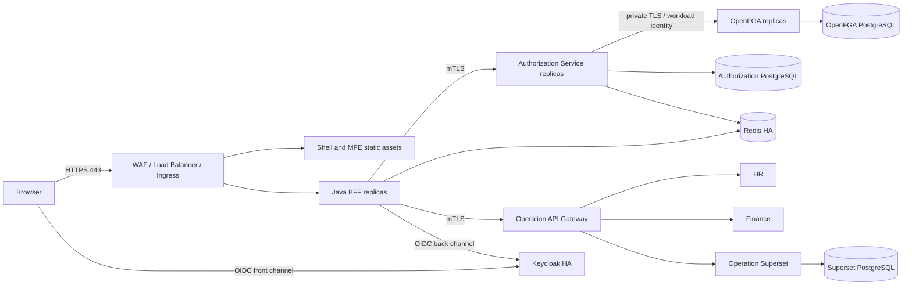

# راهنمای انتشار Production روی Linux

این سند Runbook مرجع انتشار Production است. مخزن فعلی پایه نرم‌افزاری و Compose محیط Demo را دارد، اما **manifest آماده Kubernetes یا Compose سخت‌سازی‌شده Production ندارد**. بنابراین قبل از اولین انتشار باید تیم Platform، artifactهای deployment محیط مقصد را بر اساس الزامات این سند بسازد و در Git/CI کنترل کند.

## ۱. معیار ورود به Production

انتشار فقط زمانی مجاز است که:

- یک tag تغییرناپذیر و تأییدشده وجود داشته باشد؛
- build، unit، integration، contract و E2E موفق باشند؛
- imageها scan، sign و با digest pin شده باشند؛
- هیچ secret واقعی در Git، image یا log نباشد؛
- TLS عمومی و mTLS داخلی آزمایش شده باشند؛
- backup/restore و rollback عملاً تمرین شده باشند؛
- OpenFGA Store و Model مخصوص Production ساخته و pin شده باشند؛
- دیتابیس، Redis، Keycloak و OpenFGA طرح HA و monitoring داشته باشند؛
- allow/deny، grant/revoke، login/logout و Superset smoke test موفق باشند.

## ۲. Topology مرجع



تنها Public endpointها:

```text
https://superapp.example.com
https://iam.example.com
```

OpenFGA، Redis، PostgreSQL، BFF backend port، Authorization Service، Operation Gateway، Superset Operation و سرویس‌های ERP نباید public ingress داشته باشند.

## ۳. انتخاب بستر

برای Production، Kubernetes یا یک orchestrator دارای health probe، rollout و secret integration پیشنهاد می‌شود. اگر الزاماً Linux VM استفاده می‌شود، حداقل این موارد لازم‌اند:

- چند VM در failure domainهای جدا؛
- Load Balancer و health check؛
- systemd یا orchestrator برای restart policy؛
- دیتابیس/Redis مدیریت‌شده یا cluster مستقل؛
- registry خصوصی؛
- Secret Manager؛
- log/metric/trace مرکزی.

یک Docker Compose روی یک VM، حتی با TLS، HA یا Production-Ready محسوب نمی‌شود.

## ۴. DNS و گواهی‌ها

پیش از rollout:

```text
superapp.example.com -> Public Load Balancer
iam.example.com      -> Keycloak Load Balancer
```

الزامات TLS:

- TLS 1.2/1.3 و certificate معتبر؛
- تمدید خودکار certificate؛
- HSTS پس از تأیید کامل HTTPS؛
- trust store اختصاصی برای ارتباط workloadها؛
- برنامه rotation و revoke؛
- private key فقط در Secret Manager/HSM.

برای mTLS حداقل هویت‌های مستقل بسازید:

```text
BFF -> Authorization Service
BFF -> Operation Gateway
Authorization Service -> OpenFGA، یا هویت متناظر Service Mesh
```

## ۵. CI: ساخت artifact تغییرناپذیر

Pipeline روی tag تأییدشده:

```bash
npm ci
npm run lint
npm run typecheck
npm test
npm run build
./mvnw verify
```

سپس imageهای BFF، Authorization Service، Superset و static frontend ساخته شوند. برای Shell/MFE بهتر است artifactهای `dist` داخل image immutable قرار گیرند؛ mount کردن `dist` از host مانند Compose محلی، الگوی Production نیست.

برای هر image:

```text
[ ] tag شامل release و commit SHA است
[ ] digest ثبت شده است
[ ] SBOM تولید شده است
[ ] SCA/image scan موفق است
[ ] signature ثبت شده است
[ ] base image pin شده است
[ ] با user غیر root اجرا می‌شود
[ ] filesystem تا حد ممکن read-only است
[ ] CPU/memory request و limit دارد
```

## ۶. مدیریت Secret و کلیدها

این مقادیر باید فقط از Secret Manager تزریق شوند:

- passwordهای تمام PostgreSQLها و Redis؛
- Keycloak client secret؛
- Token Vault encryption key؛
- Legacy Token Vault key؛
- Superset secret key؛
- private key و passwordهای PKCS12؛
- credential سرویس‌های Legacy؛
- credential اتصال Superset به DWH.

نمونه نام‌گذاری نسخه کلید:

```env
TOKEN_VAULT_KEY_ID=prod-2026-01
LEGACY_TOKEN_VAULT_KEY_ID=legacy-prod-2026-01
```

کلید Token Vault باید ۳۲ بایت تصادفی و Base64 باشد. rotation باید با پشتیبانی decrypt داده‌های موجود، rollout مرحله‌ای و revoke نسخه قبلی طراحی و تست شود.

## ۷. سرویس‌های داده

چهار PostgreSQL منطقی مستقل لازم است:

| دیتابیس | مالک داده |
|---|---|
| Authorization | resource، grant، audit و outbox |
| OpenFGA | tuple/model projection |
| Keycloak | identity، realm و client |
| Superset Operation | dashboard، chart، dataset و metadata |

الزامات:

- TLS با verify-full؛
- user و database مجزا؛
- HA و PITR؛
- encryption at rest؛
- connection limit/pool؛
- backup رمزگذاری‌شده؛
- restore test دوره‌ای؛
- migration و rollback rehearsed.

Redis Production باید TLS، ACL مجزا، Sentinel/Cluster، persistence و eviction policy سازگار با session داشته باشد. namespace محیط‌ها را جدا کنید.

## ۸. Keycloak Production

از `start-dev` و import خودکار realm محلی استفاده نکنید. Keycloak باید با `start`، دیتابیس HA، hostname ثابت و proxy header معتبر اجرا شود.

```env
KC_HOSTNAME=https://iam.example.com
KC_PROXY_HEADERS=xforwarded
KC_HTTP_ENABLED=true
```

Client محرمانه BFF:

```text
Client ID: aurevia-bff
Standard Flow: enabled
Implicit Flow: disabled
Direct Access Grants: disabled
Redirect URI: https://superapp.example.com/login/oauth2/code/public-iam
Post Logout URI: https://superapp.example.com/*
```

BFF:

```env
OIDC_AUTHORIZATION_URI=https://iam.example.com/realms/aurevia/protocol/openid-connect/auth
OIDC_TOKEN_URI=https://iam.example.com/realms/aurevia/protocol/openid-connect/token
OIDC_JWK_SET_URI=https://iam.example.com/realms/aurevia/protocol/openid-connect/certs
OIDC_USER_INFO_URI=https://iam.example.com/realms/aurevia/protocol/openid-connect/userinfo
OIDC_CLIENT_ID=aurevia-bff
OIDC_CLIENT_SECRET=<FROM_SECRET_MANAGER>
```

MFA برای ادمین، brute-force protection، session policy، signing-key rotation، admin audit و backup باید فعال باشند.

## ۹. OpenFGA Production

OpenFGA باید چند replica، دیتابیس HA، image digest ثابت، Playground غیرفعال و endpoint خصوصی داشته باشد. Storeهای محیط‌ها جدا هستند:

```text
aurevia-development
aurevia-staging
aurevia-production
```

ترتیب pipeline:

```text
1. OpenFGA DB migration
2. OpenFGA rollout و health check
3. idempotent lookup/create Store تولید
4. validate infra/openfga/model.fga
5. اجرای infra/openfga/model-tests.yaml
6. انتشار مدل تأییدشده
7. ذخیره Store ID و Model ID در config محیط
8. rollout Authorization Service
9. dry-run reconciliation
10. repair reconciliation و drift check
```

Authorization Service:

```env
OPENFGA_URL=https://openfga.authorization.internal:8443
OPENFGA_STORE_ID=<PRODUCTION_STORE_ID>
OPENFGA_MODEL_ID=<PINNED_MODEL_ID>
OPENFGA_CACHE_NAMESPACE=aurevia:prod:openfga:check
OPENFGA_CACHE_TTL=5s
```

Adapter فعلی OpenFGA در Java credential اختصاصی SDK ندارد. تا زمان تکمیل آن، Service Mesh mTLS/Workload Identity یا Internal Gateway باید فقط Authorization Service را مجاز کند. تکیه بر مخفی‌بودن URL کافی نیست.

## ۱۰. Authorization Service

Migrationهای Flyway را یک Job واحد پیش از rollout اجرا کند. چند replica نباید هم‌زمان مالک migration باشند.

```env
SPRING_PROFILES_ACTIVE=prod
AUTH_DB_URL=jdbc:postgresql://auth-db.internal:5432/aurevia_auth?sslmode=verify-full
POSTGRES_AUTH_USER=<DB_USER>
POSTGRES_AUTH_PASSWORD=<SECRET>
REDIS_HOST=redis.internal
REDIS_PORT=6379
REDIS_PASSWORD=<SECRET>
REDIS_TLS=true

AUTH_TLS_KEYSTORE=/run/secrets/authz-server.p12
AUTH_TLS_KEYSTORE_PASSWORD=<SECRET>
AUTH_TLS_TRUSTSTORE=/run/secrets/workload-ca.p12
AUTH_TLS_TRUSTSTORE_PASSWORD=<SECRET>
AUTH_BFF_CERT_IDENTITY=aurevia-bff
```

Outbox backlog، retry، dead-letter، reconciliation drift، OpenFGA latency و deny spike باید metric و alert داشته باشند.

## ۱۱. Java BFF

```env
SPRING_PROFILES_ACTIVE=prod

REDIS_HOST=redis.internal
REDIS_PORT=6379
REDIS_PASSWORD=<SECRET>
REDIS_TLS=true

TOKEN_VAULT_KEY_ID=prod-2026-01
TOKEN_VAULT_KEY_BASE64=<SECRET>

AUTHORIZATION_URL=https://authorization-service.internal:8082
AUTH_MTLS_KEYSTORE=/run/secrets/bff-authz-client.p12
AUTH_MTLS_KEYSTORE_PASSWORD=<SECRET>
AUTH_MTLS_TRUSTSTORE=/run/secrets/authz-ca.p12
AUTH_MTLS_TRUSTSTORE_PASSWORD=<SECRET>

OPERATION_GATEWAY_URL=https://operation-gateway.internal
GATEWAY_MTLS_KEYSTORE=/run/secrets/bff-gateway-client.p12
GATEWAY_MTLS_KEYSTORE_PASSWORD=<SECRET>
GATEWAY_MTLS_TRUSTSTORE=/run/secrets/gateway-ca.p12
GATEWAY_MTLS_TRUSTSTORE_PASSWORD=<SECRET>

LEGACY_ENVIRONMENT=production
LEGACY_ALLOW_INSECURE_LOCAL=false
LEGACY_LOCAL_SECRETS_ENABLED=false
LEGACY_TOKEN_VAULT_KEY_ID=legacy-prod-2026-01
LEGACY_TOKEN_VAULT_KEY_BASE64=<SECRET>
```

BFF باید حداقل دو replica و graceful shutdown داشته باشد. Session در Redis است؛ در حالت عادی sticky session لازم نیست.

## ۱۲. Operation Gateway و ERPها

Gateway نمونه Nginx در `infra/mock-operation` Production Gateway نیست. Gateway واقعی باید:

- mTLS client identity مربوط به BFF را validate کند؛
- headerهای `Authorization`، `Cookie` و headerهای legacy داخلی دریافتی از اینترنت را پاک کند؛
- فقط routeهای ثبت‌شده و مقصدهای allowlist را بپذیرد؛
- token عمومی و legacy را مطابق نوع route مدیریت کند؛
- timeout، retry فقط برای عملیات امن، circuit breaker و rate limit داشته باشد؛
- request body limit و protection در برابر SSRF داشته باشد؛
- correlation ID و audit امن را عبور دهد.

Base URL سرویس‌ها در Control Plane تعریف می‌شود، نه در کد Frontend. Modern route از `FORWARD_USER_TOKEN` و Legacy route از Outbound Auth Profile و Secret reference استفاده می‌کند.

## ۱۳. Shell و Micro Frontendها

URLهای `localhost:3001..3004` باید حذف شوند. الگوی same-origin پیشنهادی:

```text
https://superapp.example.com/mfe/admin/remoteEntry.js
https://superapp.example.com/mfe/hr/remoteEntry.js
https://superapp.example.com/mfe/finance/remoteEntry.js
https://superapp.example.com/mfe/reports/remoteEntry.js
```

این URLها در Panel Registry ثبت و originهای مجاز در CSP محدود شوند. `remoteEntry.js` باید no-cache یا دارای revalidation باشد، ولی artifactهای hashدار می‌توانند cache طولانی داشته باشند.

Loader مقدار `integrity` را با الگوریتم‌های `sha256`، `sha384` یا `sha512` اعتبارسنجی و به script اعمال می‌کند و برای remoteهای cross-origin مقدار `crossorigin=anonymous` می‌گذارد. در Production باید برای **تمام** panelها مقدار SRI غیرخالی ثبت شود؛ نبودن integrity در دادهٔ Registry برای سازگاری محیط local مجاز است، اما در release checklist محیط Production قابل قبول نیست.

Shell فقط presentation guard است. BFF/Authorization Service/OpenFGA باید هر API را مستقل enforce کنند.

## ۱۴. Superset Production

Public Superset فقط assetهای frontend را فراهم می‌کند و نباید credential دیتابیس/DWH عملیاتی داشته باشد. Operation Superset مالک dashboard، chart، dataset و اتصال DWH است و public port ندارد.

```env
SUPERSET_LOAD_EXAMPLES=no
SUPERSET_REMOTE_USER_ROLE=<APPROVED_MINIMUM_ROLE>
OPERATION_SUPERSET_SECRET_KEY=<SECRET_MANAGER_VALUE>
```

الزامات:

- metadata DB دارای TLS/HA/PITR؛
- DWH account با least privilege؛
- Remote User header فقط از Gateway/BFF مورد اعتماد؛
- جلوگیری از جعل `X-Aurevia-Subject` در ingress؛
- Dashboard/Chart به External Resource canonical متصل؛
- OpenFGA `view` پیش از proxy runtime؛
- export/backup dashboardها و تست restore.

## ۱۵. Ingress، Cookie و Headerها

Ingress باید `X-Forwarded-Proto=https` و host واقعی را درست ارسال کند تا redirect URI صحیح ساخته شود. Cookie BFF:

```text
AUREVIA_SESSION
Secure
HttpOnly
SameSite=Lax
```

الزامات header:

- HSTS؛
- CSP با originهای واقعی MFE؛
- `X-Content-Type-Options: nosniff`؛
- `Referrer-Policy`؛
- `Permissions-Policy`؛
- frame policy متناسب با embedding داخلی؛
- عدم ثبت Cookie، Authorization یا token در access log.

پیکربندی `infra/nginx/nginx.conf` شامل hostname و port محلی است و نباید بدون template/تغییر محیطی در Production استفاده شود.

## ۱۶. Probe و مقیاس‌پذیری

برای BFF و Authorization Service:

- startup probe برای زمان startup/migration؛
- readiness برای پذیرش ترافیک؛
- liveness مستقل از قطعی کوتاه dependency؛
- PodDisruptionBudget؛
- anti-affinity/topology spread؛
- resource request/limit؛
- graceful termination و drain.

readiness نباید ترافیک را به نمونه‌ای بفرستد که dependency حیاتی آن قابل استفاده نیست؛ liveness نیز نباید هنگام قطعی DB/OpenFGA restart storm ایجاد کند.

## ۱۷. ترتیب rollout

```text
1. آماده‌سازی DNS، TLS، NetworkPolicy و Secretها
2. PostgreSQLها و Redis HA
3. Keycloak migration/rollout و client setup
4. OpenFGA migration، Store و Model publish
5. Authorization Flyway migration job
6. Authorization Service rollout
7. reconciliation و drift verification
8. Superset DB migration/init بدون examples
9. Operation Superset rollout
10. ERPها و Operation Gateway
11. BFF canary rollout
12. Shell/MFE artifact rollout
13. Ingress activation
14. smoke/E2E/security tests
15. افزایش تدریجی traffic
```

Migration باید backward-compatible باشد و rollout سرویس بعد از موفقیت Job شروع شود.

## ۱۸. Smoke Test اجباری

```text
[ ] HTTPS و chain گواهی صحیح است.
[ ] Login، callback و logout روی دامنه واقعی درست‌اند.
[ ] token در browser storage، URL یا log وجود ندارد.
[ ] Cookie دارای Secure/HttpOnly/SameSite است.
[ ] Manifest فقط پنل‌های مجاز را برمی‌گرداند.
[ ] Remote Entryها از URL Production و با MIME صحیح می‌آیند.
[ ] user مجاز ALLOW و user غیرمجاز DENY می‌گیرد.
[ ] قطع OpenFGA به fail-closed منجر می‌شود.
[ ] grant به DB/outbox/tuple و revoke به DENY منجر می‌شود.
[ ] BFF بدون client certificate به Authorization/Gateway متصل نمی‌شود.
[ ] سرویس عملیاتی از اینترنت مستقیم قابل دسترس نیست.
[ ] Superset بدون login دوم و فقط برای asset مجاز باز می‌شود.
[ ] header هویت Superset از اینترنت قابل جعل نیست.
[ ] metrics، logs، traces و alertها correlation دارند.
```

## ۱۹. Observability و Incident Readiness

حداقل dashboard/alert:

- login success/failure و callback error؛
- BFF latency/error/saturation؛
- Authorization allow/deny/error؛
- OpenFGA latency/error و cache hit؛
- outbox backlog/retry/dead-letter/drift؛
- Redis latency/eviction/connection؛
- DB pool، replication lag و storage؛
- Gateway upstream error/timeout/rate limit؛
- Superset error و query latency.

Audit به storage تغییرناپذیر یا SIEM ارسال شود. دسترسی مشاهده و export لاگ نیز باید OpenFGA-controlled باشد.

## ۲۰. Backup و Disaster Recovery

Backup شامل Authorization DB، Keycloak DB، OpenFGA DB، Superset DB، configuration و metadata Secretهاست. Redis منبع حقیقت پایدار نیست، ولی از دست رفتن آن sessionها را باطل می‌کند.

ترتیب restore:

```text
1. دیتابیس‌های منبع حقیقت
2. Keycloak و clientها
3. OpenFGA و مدل pin‌شده
4. Authorization Service
5. OpenFGA reconciliation از PostgreSQL
6. Superset metadata و اتصال‌ها
7. Gateway، BFF و Frontend
8. allow/deny و data-access verification
```

RPO/RTO باید عدد مصوب داشته و restore به‌صورت دوره‌ای روی محیط ایزوله آزمایش شود.

## ۲۱. Rollback

برای هر release از قبل ثبت کنید:

- digest نسخه قبلی تمام imageها؛
- Model ID قبلی OpenFGA؛
- compatibility نسخه قبلی با schema جدید؛
- روش rollback MFE/remoteEntry؛
- feature flag یا kill switch مسیرهای جدید؛
- owner تصمیم rollback.

اگر migration غیرقابل بازگشت است، rollback application کافی نیست؛ rollout باید expand/migrate/contract و backward-compatible باشد. هنگام incident مجوز، grant publishing را متوقف، outbox را حفظ، مدل قبلی را فعال، cache را invalidate و reconciliation را پس از تثبیت اجرا کنید.

## ۲۲. Go/No-Go نهایی

```text
[ ] هیچ مقدار localhost، change-me یا secret نمونه باقی نمانده است.
[ ] هیچ finding بحرانی/بالا بدون پذیرش ریسک تاریخ‌دار وجود ندارد.
[ ] backup، restore، key rotation و failover آزمایش شده‌اند.
[ ] Store ID و Model ID دقیقاً متعلق به Production هستند.
[ ] Admin bootstrap و break-glass account کنترل و audit شده‌اند.
[ ] runbook، dashboard، alert و on-call آماده‌اند.
[ ] مالک سرویس و rollback commander مشخص‌اند.
```

تا زمانی که تمام موارد بالا با شواهد قابل ممیزی تأیید نشده‌اند، محیط نباید برچسب Enterprise Production-Ready دریافت کند.
