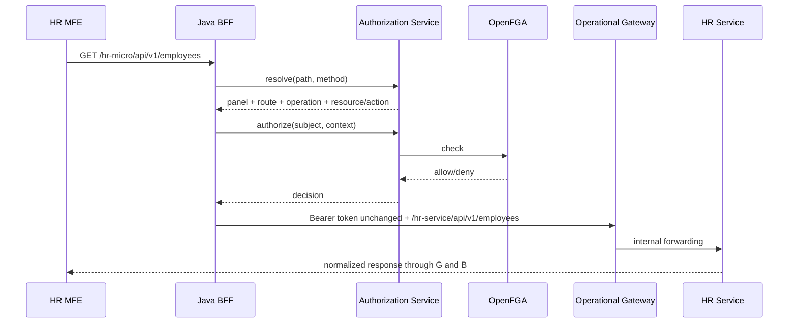

# راهنمای راهبری پویا‌ی Proxy Route

برای backendهایی که endpoint مستقل دریافت token با username/password دارند، راهنمای [تعریف Micro App و سرویس Legacy بدون انتشار نسخه](legacy-service-authentication-fa.md#تعریف-یک-micro-app-از-نوع-legacy-بدون-انتشار-نسخه) را نیز بخوانید. آن سند مرز Token Connection، Secret Store، Auth Profile، Service Target و Operational Gateway را مشخص می‌کند.

## مدل و مرز امنیتی

مرورگر همیشه درخواست same-origin را به BFF می‌فرستد. هیچ `ServiceTarget` از React فراخوانی نمی‌شود و URL مقصد نیز از request کاربر گرفته نمی‌شود. رابطه‌ی runtime چنین است:

```text
Panel → ProxyRoute → ServiceTarget → RouteOperation → Resource + Action
```

`Panel` رجیستری میکروفرانت است. `ProxyRoute` فقط routing را نگه می‌دارد و `RouteOperation` نگاشت مجوز را؛ نقش، کاربر، token و policy اجرایی در جدول route ذخیره نمی‌شوند. `ServiceTarget.gateway_base_url` فقط می‌تواند hostname موجود در `aurevia.routing.approved-gateway-hosts` باشد. حتی پس از ثبت، BFF مقصد را از URL دیتابیس نمی‌سازد و فقط از WebClient ثابت Operational Gateway استفاده می‌کند؛ بنابراین UI به open proxy تبدیل نمی‌شود.

## جریان درخواست



Resolution فقط روی Panel، Target، Route و Operation فعال انجام می‌شود. prefix طولانی‌تر برنده است؛ سپس priority و specificity الگوی operation بررسی می‌شود. تساوی با specificity یکسان `409` و نبود نگاشت `404` می‌دهد و هیچ forwarding صورت نمی‌گیرد. lookup در یک query دیتابیس انجام می‌شود، بنابراین تغییرات commit‌شده بدون restart دیده می‌شوند و request یک نتیجه‌ی immutable واحد دریافت می‌کند.

## استفاده از Admin MFE

در «مرکز مدیریت → راهبری Proxy» سه tab وجود دارد:

1. **Service Targets:** Gateway allowlisted، timeout، limit، referenceهای TLS/Secret Store، وضعیت و health-check سمت سرور.
2. **Proxy Routes:** Panel و Target، prefix، strip، rewrite محدود، methodها، priority و preview/resolve-test.
3. **Route Operations:** method و pattern، Resource/Action معتبر، data policy، limit بدنه و فعال/غیرفعال‌سازی.

Patternهای مجاز segmentهای literal، `{id}`، `*` و `**` انتهایی هستند. regex مدیر اجرا نمی‌شود. rewrite فقط یک prefix ثابت با فرم `^/api/v1` به یک path داخلی مانند `/hr-service/api/v1` است. scheme/host، traversal، encoded slash، درصد، backslash، duplicate slash، control character و dot segment رد می‌شوند.

نمونه seed:

| Panel | ورودی | Target | خروجی Gateway | مجوز |
|---|---|---|---|---|
| HR | `/hr-micro/api/v1/employees` | `operation-gateway` | `/hr-service/api/v1/employees` | `hr.employee:list` |
| Finance | `/finance-micro/api/v1/payments` | `operation-gateway` | `/finance-service/api/v1/payments` | `finance.payment:list` |

در داده‌ی قدیمی، slug نمایشی Panel برابر `hr`/`finance` است و namespace API به‌صورت سازگار `hr-micro`/`finance-micro` باقی مانده است. این compatibility داده و tupleهای OpenFGA موجود را تخریب نمی‌کند؛ Panelهای جدید باید prefix خود را مستقیماً از slug بسازند.

## کنترل‌های عملیاتی

- Token Exchange وجود ندارد؛ access token جاری Public IAM بدون بازنویسی forward می‌شود.
- فقط پاسخ `401` حداکثر یک refresh ایجاد می‌کند؛ `403` refresh نمی‌شود.
- hop-by-hop headerها forward نمی‌شوند؛ فقط headerهای صریح درخواست/پاسخ عبور می‌کنند.
- retry فقط برای GET/HEAD/OPTIONS قابل ثبت است و operationهای unsafe خودکار retry نمی‌شوند.
- optimistic `version` از lost update جلوگیری می‌کند.
- deactivation به‌جای delete مخرب استفاده می‌شود.
- رویدادهای create/update/status، collision و resolve-test با metadata پاک‌سازی‌شده audit می‌شوند.
- production باید TLS/mTLS، Secret Store واقعی، DNS policy و hostname allowlist محدود محیط را تنظیم کند.

## migration و rollback

`V22__dynamic_proxy_route_management.sql` جدول‌های موجود را تکمیل و داده‌های route قدیمی را backfill می‌کند؛ `proxy_permission` ایجاد نمی‌شود و داده‌ای حذف نمی‌گردد. rollback با migration برگشتی جدید انجام می‌شود، نه ویرایش یا حذف V22. قبل از production از PostgreSQL backup بگیرید و Flyway را در مرحله‌ی migration جداگانه اجرا کنید.
