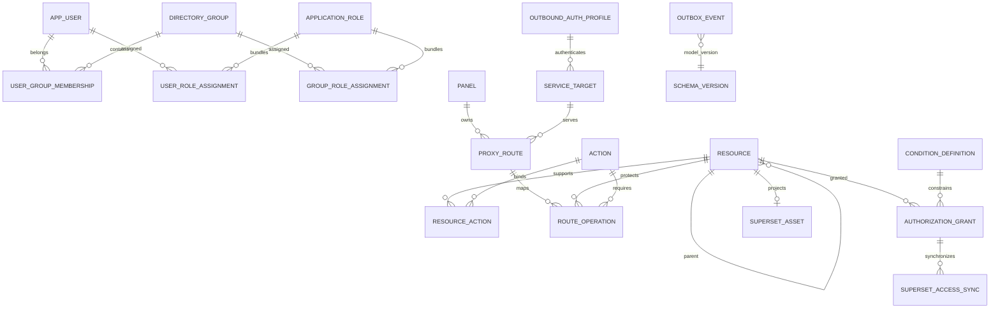

# Control-plane ER diagram

Hard deletion is restricted for resources referenced by grants, routes, audit, or external assets. Archive status preserves historical integrity. The service rejects parent changes that introduce a cycle.
