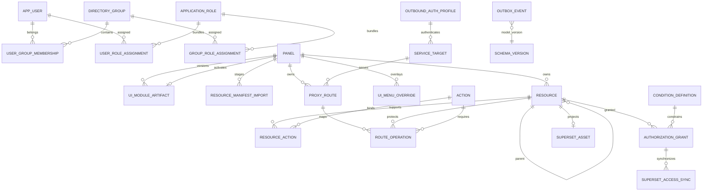

# طراحی داده و ER کنترل‌پلین

این سند مدل فیزیکی موجود را توضیح می‌دهد؛ نام مفهومی `micro_frontend` در معماری، در این پروژه همان جدول canonical به نام `panel` است و جدول موازی دیگری ساخته نشده است.

## نمای جامع



## کاتالوگ Micro Frontend

| جدول/ستون | مسئولیت و قاعده |
|---|---|
| `panel` | ثبت یکتای MFE، آدرس `remoteEntry`، route prefix، mode و classification؛ معادل `micro_frontend` در مدل مفهومی |
| `panel.resource_definition_mode` | یکی از `MANIFEST`، `MANUAL` یا `HYBRID`؛ پیش‌فرض `HYBRID` |
| `panel.classification` | یکی از `REAL` یا `DEMO`؛ اجرای production با `aurevia.demo-data.enabled=false` پنل و منابع DEMO را از data plane حذف می‌کند |
| `panel.resource_manifest_url` | نشانی artifact مستقل JSON؛ backend هیچ Webpack runtimeای اجرا نمی‌کند |
| `ui_module_artifact` | snapshot تغییرناپذیر قرارداد runtime و navigation هر نسخه؛ `active_artifact_id` روی `panel` نسخه فعال را انتخاب می‌کند |
| `resource_manifest_import` | ledger جریان Draft/Preview/Publish با payload، checksum، diff، actor و timestampها |
| `resource` | منبع canonical مجوز با `resource_key` یکتا، parent، source، status، panel و manifest version |
| `ui_menu_override` | فقط overlay نمایشی nodeهای manifest یا nodeهای navigation ساخته‌شده توسط ADMIN؛ کپی Navigation manifest نیست |

سه درخت مستقل‌اند:

```text
Resource Tree       resource.parent_id                       منبع حقیقت مجوز
Navigation Tree     manifest.navigation + ui_menu_override  نحوه نمایش Shell
Permission Graph    authorization_grant -> OpenFGA           چه کسی چه کاری مجاز است
```

هیچ `navigation_node` به‌عنوان `resource` یا `authorization_grant` ساخته نمی‌شود. node نوع `PAGE` فقط با `page_key` به route مانیفست اشاره می‌کند و آن route با `resourceKey + action` به کاتالوگ مجوز متصل است.

## مالکیت و lifecycle

| `resource.source` | تغییر ساختاری | تغییر نام/metadata | permission | نتیجه حذف از manifest |
|---|---:|---:|---:|---|
| `MANIFEST` | فقط از publish نسخه جدید | از publish؛ visibility از پنل راهبری | مجاز | `DEPRECATED`، بدون حذف فیزیکی |
| `ADMIN` | برای راهبر مجاز و تحت validation | مجاز | مجاز | بدون تغییر |

- `resource_key` پس از ایجاد تغییرناپذیر است.
- ریشه `APPLICATION` باید `parent_id = NULL` داشته باشد؛ self-parent، cycle و parent ناسازگار رد می‌شود.
- نسخه مانیفست در محدوده هر `panel` تغییرناپذیر است؛ index یکتای partial در V52 از ثبت payload دوم با همان نسخه جلوگیری می‌کند.
- حذف فیزیکی resourceهای دارای grant، route، audit یا binding خارجی ممنوع است؛ archive/deprecate تاریخچه را نگه می‌دارد.

## تراکنش و سازگاری

انتشار Draft، upsert منابع و actionها، deprecate منابع غایب، ثبت وضعیت `PUBLISHED` و audit در مرز transaction سرویس انجام می‌شود. PostgreSQL منبع حقیقت کنترل‌پلین است؛ outbox رابطه‌ها را به OpenFGA projection می‌کند. failure در projection مجوز runtime ایجاد نمی‌کند و بررسی runtime به صورت default-deny باقی می‌ماند.

Migrationهای مرتبط:

- `V28__canonical_resource_catalog.sql`: resource catalog و ledger اولیه مانیفست.
- `V33__dynamic_ui_plugin_registry.sql`: artifact تغییرناپذیر و overlay منو.
- `V51__microfrontend_governance_catalog.sql`: mode/classification، ownership و workflow کامل.
- `V52__immutable_resource_manifest_versions.sql`: یکتایی `(panel_id, manifest_version)`.
