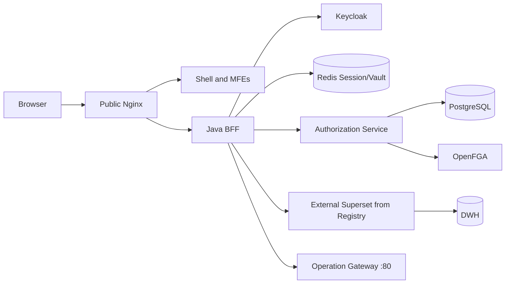

# Getting Started, Design, and Architecture

## Purpose

Aurevia is a Persian-first enterprise super app that composes independently built micro frontends inside one shell. The browser communicates only with the public origin at `localhost:8443`. Access tokens are never exposed to JavaScript; they remain encrypted behind the BFF.

## Technology map

| Layer | Technology |
|---|---|
| Shell and MFEs | React, TypeScript, Webpack Module Federation |
| BFF | Java 21, Spring Boot WebFlux, Spring Security OAuth2 |
| Authorization | Authorization Service, PostgreSQL, OpenFGA |
| Identity | Keycloak, Authorization Code, PKCE, state, nonce |
| Session | Spring Session, Redis, encrypted token vault |
| Analytics | Registry-managed external Superset through the direct BFF connector |
| Public entry point | Nginx exposed on host port 8443 |

## Repository layout

```text
apps/       shell, four product MFEs, and two E2E fixture MFEs
packages/   contracts, HTTP/authorization SDK, translations, and UI guards
services/   BFF, Authorization, shared UI policy, and two E2E fixture services
infra/      Core Compose plus independent identity, MFE, Superset, and E2E overlays
docs/       guides, ADRs, API contracts, diagrams, and threat model
```

## Trust zones



The browser has no direct route to an external Superset or the DWH. The BFF reads its target
from the registry and enforces authorization and the outbound network policy.

## Request flows

### Login

1. The user opens `/auth/login`.
2. The BFF redirects to Keycloak using Authorization Code Flow.
3. Keycloak returns an authorization code to the BFF callback.
4. The BFF redeems the code server-side.
5. Tokens are encrypted and stored in Redis.
6. The browser receives only the opaque `AUREVIA_SESSION` cookie.
7. `GET /api/me/context` returns identity, permissions, the effective UI catalog, routes, and navigation in one response. `/api/v1/me/manifest` is a compatibility projection.

### Normal APIs

```text
Browser -> Nginx /api/* -> BFF -> authorization -> Gateway -> service
```

The BFF must choose a registered destination, normalize the path, allowlist forwarded headers, and deny missing route/action/session/policy data.

### Superset

```text
Static assets:
Browser -> Nginx /static/* -> BFF same-origin proxy

Dynamic traffic:
Browser -> Nginx -> OperationSupersetProxyController
        -> registry base_url -> External Superset -> DWH
```

Superset 5 emits some root-relative endpoints. Nginx recognizes runtime requests from `/reports-runtime/*` and forwards `/superset/*` and the relevant `/api/v1/*` calls through the Java tunnel. `AUREVIA_OPERATION_SUPERSET` is a separate Superset session cookie.

## Local setup

### Prerequisites

- Docker Desktop and Docker Compose
- Node.js version from `.nvmrc`
- Java 21
- The Maven Wrapper included in the repository

### Install and run

```powershell
Copy-Item .env.example .env
npm ci
npm run build
docker compose -f infra/docker-compose/compose.yml up -d --build
```

The base Compose project is Aurevia Core only. Start local Keycloak, MFE artifact servers, and
Superset independently with `npm run identity:up`, `npm run mfe:up`, and `npm run superset:up`
when those demos are required.

Java verification on Windows:

```powershell
$env:JAVA_HOME='C:\Program Files\Eclipse Adoptium\jdk-21.0.12.101-hotspot'
.\mvnw.cmd verify
```

Replace every `change-me` value before non-local use. Never commit real secrets.

### Local URLs

```text
Super App: http://localhost:8443/
Keycloak (optional): http://localhost:8180/
Superset runtime: http://localhost:8443/reports-runtime/superset/welcome/
```

## Data ownership

- PostgreSQL is the source of truth for control-plane metadata, users, groups, roles, grants, audit, and outbox events.
- OpenFGA is the runtime relationship projection.
- Redis owns transient sessions and encrypted token records.
- `panel` is deployment metadata, not an authorization decision.
- `superset_asset` maps an external report/dashboard to an internal resource.

## Security invariants

- Tokens never enter localStorage, sessionStorage, or application JavaScript.
- Spring CSRF protects BFF mutations except the Superset tunnel, where Superset performs its own CSRF checks.
- Authorization Service is an internal BFF dependency: local development uses Basic authentication; the `prod` profile requires BFF workload identity over mTLS.
- Version columns prevent silent concurrent overwrites.
- Audit and application logs must not contain tokens, cookies, passwords, or connection strings.
