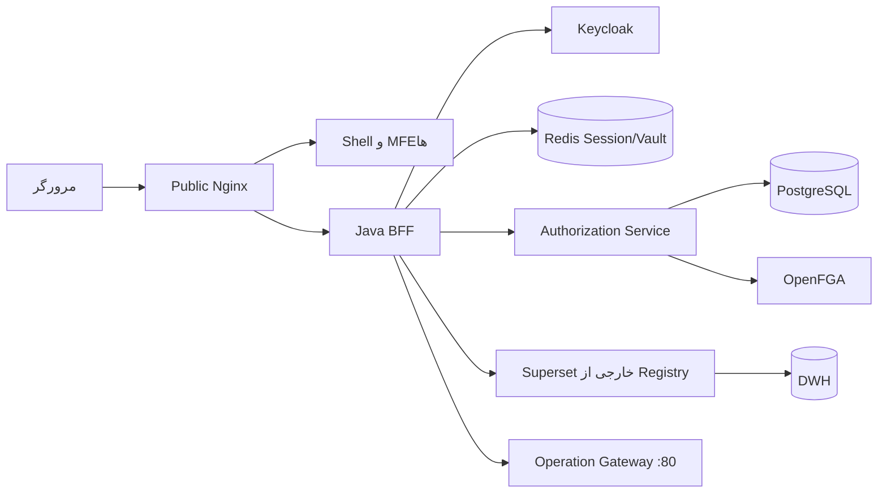

# شروع، طراحی و معماری

## هدف پروژه

Aurevia یک Super App سازمانی فارسی‌محور است که چند Micro Frontend را در یک Shell نمایش می‌دهد. مرورگر فقط با origin عمومی `localhost:8443` صحبت می‌کند. Access Token هرگز به JavaScript داده نمی‌شود و در BFF/Redis نگهداری می‌شود.

## فناوری‌ها

| لایه | فناوری |
|---|---|
| Shell و MFE | React، TypeScript، Webpack Module Federation |
| BFF | Java 21، Spring Boot WebFlux، Spring Security OAuth2 |
| مجوزدهی | Authorization Service، PostgreSQL، OpenFGA |
| هویت | Keycloak با Authorization Code، PKCE، state و nonce |
| نشست | Spring Session و Redis؛ token vault رمز‌شده |
| گزارش | Superset خارجی ثبت‌شده در Registry با اتصال مستقیم و امن BFF |
| ورودی عمومی | Nginx روی پورت 8443 میزبان |

## ساختار مخزن

```text
apps/
  shell/          پوسته، منو و بارگذاری remoteها
  mfe-admin/      مدیریت پنل، منبع، action، کاربر، grant و Superset
  mfe-hr/         نمونه دامنه منابع انسانی
  mfe-finance/    نمونه دامنه مالی
  mfe-reports/    فهرست گزارش‌های مجاز
  mf-test-*/      دو fixture مستقل آزمون SSO و Legacy
packages/
  contracts/      قرارداد TypeScript مشترک
  http-client/    کلاینت same-origin و CSRF
  authorization-sdk/ guard و قرارداد مجوزدهی
  i18n/           ترجمه‌ها
  sh-core-ui/     کنترل‌های UI مبتنی بر permission
services/
  superapp-bff/   OAuth، session، CSRF و proxyهای امن
  authorization-service/ کنترل‌پلین مجوز و registry
  ui-artifact-security/ policy مشترک artifact و URL
  test-*/         دو سرویس fixture آزمون E2E
infra/
  docker-compose/ Core و overlayهای مستقل demo/E2E
  nginx/          ورودی عمومی
  keycloak/       realm توسعهٔ اختیاری
  openfga/        مدل رابطه‌ای و تست‌ها
  superset-operation/ تنظیم دموی Superset مستقل
docs/             معماری، امنیت، API و راهنماها
```

## نواحی اعتماد



مرورگر هیچ route مستقیمی به Superset خارجی یا DWH ندارد؛ URL مقصد فقط در Registry است و
BFF آن را با کنترل مجوز و SSRF policy مصرف می‌کند.

## جریان درخواست

### ورود

1. کاربر `/auth/login` را باز می‌کند.
2. BFF کاربر را با Authorization Code Flow به Keycloak هدایت می‌کند.
3. Keycloak پس از ورود، code را به BFF می‌دهد.
4. BFF در سمت سرور code را به token تبدیل می‌کند.
5. token رمز‌شده در Redis ذخیره می‌شود.
6. مرورگر فقط کوکی opaque با نام `AUREVIA_SESSION` می‌گیرد.
7. `GET /api/me/context` هویت، permission، UI Catalog، route و navigation مؤثر را یک‌جا برمی‌گرداند. `/api/v1/me/manifest` فقط projection سازگاری است.

### APIهای معمولی

```text
Browser -> Nginx /api/* -> BFF -> Authorization check -> Gateway -> Service
```

BFF باید مسیر را از registry معتبر انتخاب، path را normalize و headerها را allowlist کند. نبود route، action، session یا تصمیم معتبر باید به DENY منجر شود.

### گزارش و Superset

```text
GET /static/*
Browser -> Public Nginx -> BFF same-origin proxy

/reports-runtime/* و endpointهای runtime
Browser -> Public Nginx -> OperationSupersetProxyController
        -> Registry base_url -> External Superset -> DWH
```

Superset 5 بعضی endpointها را root-relative تولید می‌کند. Nginx درخواست‌های `/superset/*` و درخواست‌های `/api/v1/*` متعلق به سند `/reports-runtime/*` را به tunnel جاوا هدایت می‌کند. کوکی مستقل `AUREVIA_OPERATION_SUPERSET` نشست داخلی Superset را نگه می‌دارد.

شرح lifecycle مستقل، ثبت URL و امنیت در [راهنمای External Integration](external-integration-superset-fa.md)
و جزئیات asset-level در [راهنمای Superset routing و embedding](superset-routing-and-embedding-fa.md) آمده است.

## راه‌اندازی از صفر

### پیش‌نیازها

- Docker Desktop و Docker Compose
- Node.js مطابق `.nvmrc`
- Java 21
- Maven Wrapper موجود در مخزن

### تنظیم محیط

```powershell
Copy-Item .env.example .env
npm ci
```

تمام مقدارهای `change-me` در `.env` باید برای محیط واقعی تغییر کنند. secret را commit نکنید.

### build و اجرا

```powershell
npm run build
npm run infra:up
```

Compose پایه فقط Aurevia Core را اجرا می‌کند. Keycloak، artifact serverهای MFE و Superset
دمو در صورت نیاز با `npm run identity:up`، `npm run mfe:up` و `npm run superset:up` چرخهٔ
مستقل دارند.

برای تست Java در ویندوز:

```powershell
$env:JAVA_HOME='C:\Program Files\Eclipse Adoptium\jdk-21.0.12.101-hotspot'
.\mvnw.cmd verify
```

### آدرس‌ها

```text
Super App: http://localhost:8443/
Keycloak اختیاری:  http://localhost:8180/
Superset runtime: http://localhost:8443/reports-runtime/superset/welcome/
```

در محیط محلی ابتدا `npm run superset:up` را مستقل از Core اجرا کنید.
`SUPERSET_LOAD_EXAMPLES=yes` باعث می‌شود init یک‌بارمصرف Superset دیتاست‌ها، chartها و
dashboardهای رسمی نمونه را بارگذاری کند. برای محیط غیردمو این گزینه را `no` کنید.

## قرارداد Manifest برای تیم توسعه

پس از login، Shell با `GET /api/me/context` و `credentials: same-origin` context مؤثر را دریافت می‌کند. پاسخ شامل identity، `version`، `expiresAt`، permissionهای مؤثر، `uiCatalog`، route و navigation است. `/api/v1/me/manifest` برای مصرف‌کنندهٔ قدیمی حفظ شده است. شرح request، نمونه JSON، ETag/TTL، قرارداد `MicroFrontendPlugin.App` نسخه `1.0`، سازگاری `mount` نسخه `1`، componentهای `SHCan`/`SHAction`/`SHRouteGuard` و چک‌لیست افزودن قابلیت جدید در بخش [Manifest developer guide](../README.md#manifest-developer-guide) قرار دارد.

manifest فقط کنترل نمایشی است. نمایش دکمه یا route به معنی مجازبودن API نیست و BFF باید هر درخواست محافظت‌شده را دوباره با Authorization Service/OpenFGA بررسی کند.

## داده و مالکیت

- PostgreSQL منبع حقیقت metadata، کاربر، گروه، نقش، grant، audit و outbox است.
- OpenFGA projection سریع روابط برای runtime است.
- Redis فقط داده transient نشست و token vault را نگه می‌دارد.
- جدول `panel` metadata استقرار MFE است و به‌تنهایی مجوز امنیتی محسوب نمی‌شود.
- `superset_asset` گزارش/داشبورد خارجی را به یک `resource` داخلی متصل می‌کند.

## اصول امنیتی

- token در localStorage، sessionStorage یا JavaScript قرار نمی‌گیرد.
- همه mutationهای BFF به‌جز tunnel Superset تحت CSRF خود Spring هستند.
- خود Superset CSRF درخواست‌های tunnel را کنترل می‌کند.
- Authorization Service dependency داخلی BFF است؛ local از Basic Auth و profile تولید از workload identity اجباری روی mTLS استفاده می‌کند.
- حذف منطقی و version برای جلوگیری از overwrite هم‌زمان استفاده می‌شود.
- logها نباید token، cookie، password یا connection string داشته باشند.
