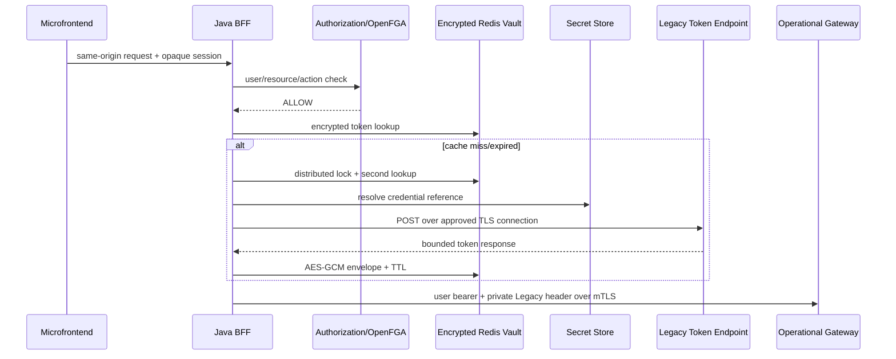

# احراز هویت سرویس‌های Legacy در Aurevia

OpenFGA همیشه کاربر نهایی را روی `RouteOperation.resource/action` مجاز می‌کند. توکن Legacy فقط هویت فنی Java BFF نزد سرویس قدیمی است؛ این دو مستقل‌اند و این فرایند OAuth Token Exchange نیست. مرورگر صرفاً same-origin را صدا می‌زند و هیچ Secret یا Legacy token دریافت نمی‌کند.



## Secret Store و Redis

PostgreSQL فقط `secret://...` را نگه می‌دارد. port اصلی `SecretResolver` است. adapter محلی فقط با `LEGACY_LOCAL_SECRETS_ENABLED=true` فعال می‌شود و باید credential جعلی داشته باشد. production باید adapter Vault/Kubernetes با workload identity و least privilege داشته باشد؛ Authorization Service و OpenFGA حق خواندن Secret ندارند.

namespace مستقل Redis برابر `legacy-token-vault:{environment}:{profileId}:{credentialVersion}` است. tokenها با AES-256-GCM رمز می‌شوند؛ key در Redis/DB نیست. TTL از `expires_in` محدودشده می‌آید. `profileVersion` و `credentialVersion` مانع reuse پس از rotation می‌شوند. production باید Redis TLS و ACL محدود GET/SET/DEL/EVAL داشته باشد.

## قرارداد Gateway

```http
Authorization: Bearer <PUBLIC_IAM_USER_TOKEN>
X-Internal-Legacy-Authorization: Bearer <LEGACY_SERVICE_TOKEN>
```

Gateway باید mTLS کلاینت BFF و user token را اعتبارسنجی کند، header خصوصی را فقط روی route ثبت‌شده به `Authorization` upstream تبدیل و سپس حذف کند. نمونه محلی در `infra/mock-operation/gateway.conf` است. تغییر production Gateway خارج از این مخزن و پیش‌نیاز deployment است.

## Rotation، compromise و outage

برای rotation: Secret جدید با version جدید بسازید، reference را با optimistic version تغییر دهید، cache را invalidate، token-test sanitised را اجرا و Secret قبلی را revoke کنید. در compromise ابتدا profile را غیرفعال و cache را invalidate کنید، credential و دسترسی‌های Secret Store/Gateway را rotate و با approval دوباره فعال کنید. هیچ token/credential خامی وارد ticket یا log نشود.

در outage، سیستم fail-closed است. retry دستی پرتعداد نکنید تا حساب Legacy lock نشود؛ بعد از رفع outage یک token-test کنترل‌شده اجرا کنید.

## مهاجرت `proxy_permission`

داده قدیمی حذف نمی‌شود: panel/path/operation/target به جدول‌های نرمال منتقل، SSO به `FORWARD_USER_TOKEN` و Legacy به target منطقی جدا با `LEGACY_SERVICE_TOKEN` نگاشت می‌شود. credential با ابزار یک‌بارمصرف و بدون چاپ به Secret Store منتقل و rotate می‌شود؛ cached token قدیمی مهاجرت نمی‌کند. rollback با غیرفعال‌کردن route/profile و backup است.

## Threat model

- SSRF/open proxy: connection reference allowlisted و endpoint فقط path نسبی است.
- token theft: عدم نمایش، value objectهای redacted، AES-GCM، TLS/mTLS و header filtering.
- confused deputy: OpenFGA پیش از cache/Secret/token call.
- token storm: lock توزیع‌شده، double-check، lease و wait محدود.
- stale credential: profile/credential version در cache.
- loop: روی 401 فقط یک refresh/retry و روی 403 هیچ refresh انجام نمی‌شود.

سرویس‌های جدید باید Public IAM یا مکانیزم مدرن مصوب را استفاده کنند؛ adapter Legacy فقط برای سازگاری است.
