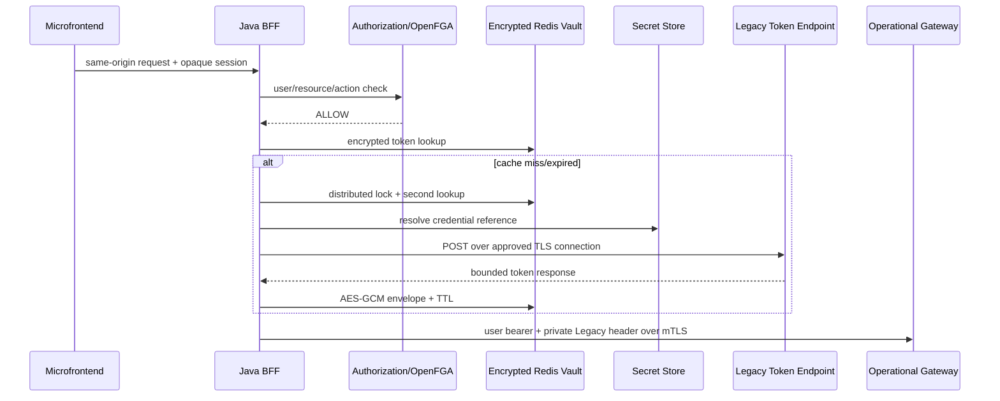

# احراز هویت سرویس‌های Legacy در Aurevia

OpenFGA همیشه کاربر نهایی را روی `RouteOperation.resource/action` مجاز می‌کند. توکن Legacy فقط هویت فنی Java BFF نزد سرویس قدیمی است؛ این دو مستقل‌اند و این فرایند OAuth Token Exchange نیست. مرورگر صرفاً same-origin را صدا می‌زند و هیچ Secret یا Legacy token دریافت نمی‌کند.



## Secret Store و Redis

PostgreSQL فقط `secret://...` را نگه می‌دارد. port اصلی `SecretResolver` است. adapter محلی فقط با `LEGACY_LOCAL_SECRETS_ENABLED=true` فعال می‌شود و باید credential جعلی داشته باشد. production باید adapter Vault/Kubernetes با workload identity و least privilege داشته باشد؛ Authorization Service و OpenFGA حق خواندن Secret ندارند.

namespace مستقل Redis برابر `legacy-token-vault:{environment}:{profileId}:{credentialVersion}` است. tokenها با AES-256-GCM رمز می‌شوند؛ key در Redis/DB نیست. TTL از `expires_in` محدودشده می‌آید. `profileVersion` و `credentialVersion` مانع reuse پس از rotation می‌شوند. production باید Redis TLS و ACL محدود GET/SET/DEL/EVAL داشته باشد.

## قرارداد Gateway

```http
Authorization: Bearer <PUBLIC_IAM_USER_TOKEN>
X-Internal-Legacy-Authorization: Bearer <LEGACY_SERVICE_TOKEN>
```

Gateway باید mTLS کلاینت BFF و user token را اعتبارسنجی کند، header خصوصی را فقط روی route ثبت‌شده به `Authorization` upstream تبدیل و سپس حذف کند. نمونه محلی در `infra/mock-operation/gateway.conf` است. تغییر production Gateway خارج از این مخزن و پیش‌نیاز deployment است.

## Rotation، compromise و outage

برای rotation: Secret جدید با version جدید بسازید، reference را با optimistic version تغییر دهید، cache را invalidate، token-test sanitised را اجرا و Secret قبلی را revoke کنید. در compromise ابتدا profile را غیرفعال و cache را invalidate کنید، credential و دسترسی‌های Secret Store/Gateway را rotate و با approval دوباره فعال کنید. هیچ token/credential خامی وارد ticket یا log نشود.

در outage، سیستم fail-closed است. retry دستی پرتعداد نکنید تا حساب Legacy lock نشود؛ بعد از رفع outage یک token-test کنترل‌شده اجرا کنید.

## مهاجرت `proxy_permission`

داده قدیمی حذف نمی‌شود: panel/path/operation/target به جدول‌های نرمال منتقل، SSO به `FORWARD_USER_TOKEN` و Legacy به target منطقی جدا با `LEGACY_SERVICE_TOKEN` نگاشت می‌شود. credential با ابزار یک‌بارمصرف و بدون چاپ به Secret Store منتقل و rotate می‌شود؛ cached token قدیمی مهاجرت نمی‌کند. rollback با غیرفعال‌کردن route/profile و backup است.

## Threat model

- SSRF/open proxy: connection reference allowlisted و endpoint فقط path نسبی است.
- token theft: عدم نمایش، value objectهای redacted، AES-GCM، TLS/mTLS و header filtering.
- confused deputy: OpenFGA پیش از cache/Secret/token call.
- token storm: lock توزیع‌شده، double-check، lease و wait محدود.
- stale credential: profile/credential version در cache.
- loop: روی 401 فقط یک refresh/retry و روی 403 هیچ refresh انجام نمی‌شود.

سرویس‌های جدید باید Public IAM یا مکانیزم مدرن مصوب را استفاده کنند؛ adapter Legacy فقط برای سازگاری است.

## تعریف یک Micro App از نوع Legacy بدون انتشار نسخه

این سناریو برای زمانی است که `remoteEntry.js` میکروفرانت از قبل منتشر شده و API قدیمی برای هر فراخوانی به token سرویس جداگانه نیاز دارد. نمونه مرجع:

```text
Remote entry:   https://hr.company.example/remoteEntry.js
Public route:   /hr-micro
Gateway route:  /api/v1/hr
Legacy API:     http://130.120.1.2:8090/api/v1/hr
Token endpoint: https://legacy-auth.company.example/api/v1/hr/login
```

مرورگر نباید مستقیماً Legacy API یا endpoint توکن را فراخوانی کند. MFE درخواست same-origin را به BFF می‌دهد؛ BFF ابتدا OpenFGA را check می‌کند و سپس از مسیر Operational Gateway سرویس واقعی را صدا می‌زند.

### پیش‌نیاز زیرساخت

تیم Platform/Security باید hostname سرویس توکن، TLS/truststore و در صورت نیاز mTLS را تأیید کند؛ credential را در Secret Store بگذارد؛ و مسیر `/api/v1/hr` را در Operational Gateway به `http://130.120.1.2:8090/api/v1/hr` نگاشت کند. IP واقعی backend نباید در MFE یا ورودی کاربر باشد. health check، timeout، rate limit و policy هدرها نیز باید در Gateway تعریف شوند.

### ۱. تعریف Token Connection

نسخه فعلی BFF یک connection از پیش تأییدشده را از runtime می‌خواند:

```dotenv
LEGACY_TOKEN_CONNECTION_REF=connection://legacy-auth
LEGACY_TOKEN_CONNECTION_URL=https://legacy-auth.company.example
```

در پروفایل فقط همین reference و path نسبی `/api/v1/hr/login` ثبت می‌شود. `tokenEndpointPath` نباید scheme، hostname، query، fragment، `..`، backslash، percent-encoding یا `//` داشته باشد. HTTP فقط برای localhost توسعه‌ای و با گزینه insecure مجاز است.

متغیرهای `LEGACY_*` در compose فعلی به‌طور پیش‌فرض به BFF map نشده‌اند؛ برای دموی محلی باید آن‌ها را صریحاً به environment سرویس BFF اضافه و سرویس را restart کرد. این کار build کد نمی‌خواهد.

### ۲. ثبت امن credential

username/password هرگز در دیتابیس Authorization Service، route، manifest یا Git ثبت نمی‌شود. ادمین فقط reference زیر را وارد می‌کند:

```text
secret://legacy/hr-prod
```

برای توسعه محلی resolver فایل JSON با `LEGACY_LOCAL_SECRETS_ENABLED=true` قابل فعال‌سازی است:

```json
{
  "secret://legacy/hr-prod": {
    "username": "demo-user",
    "password": "replace-outside-git"
  }
}
```

فایل باید خارج از Git باشد. resolver داخلی فعلی برای production کافی نیست؛ adapter سازمانی Vault/Kubernetes Secret Manager، rotation و audit باید پیاده‌سازی شوند. نبود resolver باعث fail-closed شدن درخواست می‌شود.

### ۳. ثبت Micro App

در مدیریت Micro App/Panel این مقادیر را ثبت کنید:

| فیلد | مقدار نمونه | توضیح |
|---|---|---|
| نام/کلید | `hr` | شناسه پایدار و یکتا |
| Remote entry | `https://hr.company.example/remoteEntry.js` | HTTPS و مبدأ تأییدشده |
| Public path | `/hr-micro` | مسیر same-origin در Super App |
| وضعیت | ابتدا غیرفعال | بعد از تست فعال شود |

«بدون انتشار نسخه» یعنی artifact موجود به شکل پویا register می‌شود؛ frontend جدید بدون build ساخته نمی‌شود.

### ۴. ساخت Outbound Auth Profile

در صفحه Outbound Auth Profiles مقدارهای زیر را وارد کنید:

| فیلد | مقدار نمونه |
|---|---|
| Auth mode | `LEGACY_SERVICE_TOKEN` |
| Token connection ref | `connection://legacy-auth` |
| Token endpoint path | `/api/v1/hr/login` |
| Credential secret ref | `secret://legacy/hr-prod` |
| Request format | متناسب با قرارداد Legacy |
| Transport | `INTERNAL_LEGACY_HEADER` |
| Access token pointer | `/access_token` |
| Expires-in pointer | `/expires_in` |

فرمت‌های موجود `FORM_URLENCODED`، `JSON`، `HTTP_BASIC` و `OAUTH_CLIENT_CREDENTIALS` هستند. `CUSTOM_LEGACY_ADAPTER` فقط وقتی بدون انتشار نسخه قابل انتخاب است که adapter آن قبلاً در کد منتشر شده باشد. نمونه پاسخ متعارف:

```json
{"access_token":"opaque-or-jwt-token","expires_in":900}
```

BFF توکن را با TTL محدود و AES-GCM در Redis cache می‌کند. کلید cache نسخه profile و credential را لحاظ می‌کند؛ در rotation باید cache invalidate شود.

### ۵. تعریف Service Target

Target را به Operational Gateway مورد اعتماد وصل کنید، نه IP واقعی HR:

| فیلد | مقدار نمونه |
|---|---|
| نام | `hr-legacy` |
| Gateway base URL | URL ثابت Operational Gateway |
| Outbound auth profile | پروفایل مرحله قبل |
| وضعیت | ابتدا غیرفعال |

hostname باید در `aurevia.routing.approved-gateway-hosts` باشد. نگاشت IP سرویس در Gateway باقی می‌ماند تا BFF به open proxy تبدیل نشود.

### ۶. تعریف Proxy Route و Operation

Route ورودی MFE را به target وصل کرده و برای هر API operation صریح بسازید:

| Method | Public path | Gateway path | Resource | Action |
|---|---|---|---|---|
| `GET` | `/hr-micro/api/v1/employees` | `/api/v1/hr/employees` | `data_resource:hr-employees` | `read` |
| `POST` | `/hr-micro/api/v1/employees` | `/api/v1/hr/employees` | `data_resource:hr-employees` | `create` |
| `GET` | `/hr-micro/api/v1/payroll` | `/api/v1/hr/payroll` | `data_resource:hr-payroll` | `read` |

route عمومی، wildcard گسترده یا fallback بدون operation تعریف نکنید. هر method/path باید Resource و Action مشخص داشته باشد و OpenFGA پیش از secret، token و Gateway بررسی می‌شود.

### ۷. دسترسی، تست و فعال‌سازی

1. Resourceها را در Resource Tree بسازید یا انتخاب کنید.
2. Action را به user یا role بدهید و در صورت نیاز user را عضو role کنید.
3. Connection Test، Token Test و Cache Test را اجرا کنید؛ خروجی نباید token یا credential خام نشان دهد.
4. resolve مسیر و OpenFGA check را برای کاربر مجاز و غیرمجاز تست کنید.
5. درخواست واقعی API، audit log و correlation ID را بررسی کنید.
6. profile، target، route و panel را فقط پس از موفقیت تست‌ها فعال کنید.

BFF توکن Public IAM کاربر را حفظ و توکن Legacy را فقط در header داخلی می‌فرستد:

```http
Authorization: Bearer <public-user-token>
X-Internal-Legacy-Authorization: Bearer <legacy-service-token>
```

فقط Operational Gateway مجاز است header داخلی را به `Authorization` مقصد تبدیل کند. این header باید در ورودی عمومی حذف/reject شود و هرگز به مرورگر برنگردد.

### مرز «بدون انتشار نسخه»

| تغییر | build/deploy کد | اقدام لازم |
|---|---|---|
| ثبت MFE موجود، profile، target، route و operation | خیر | configuration/database و approval |
| rotation secret | خیر | version جدید و cache invalidation |
| endpoint جدید روی همان connection | خیر | path نسبی و تست |
| hostname جدید token endpoint | خیر، اما runtime change | env/allowlist و restart BFF |
| backend جدید پشت Gateway | معمولاً BFF خیر | تغییر configuration در Gateway |
| قرارداد توکن اختصاصی جدید | بله | پیاده‌سازی و انتشار adapter |

### محدودیت فعلی و Self-Service هدف

نسخه فعلی تنها یک `LEGACY_TOKEN_CONNECTION_REF/URL` سراسری دارد؛ ادمین نمی‌تواند hostname دلخواه را فقط از UI تعریف کند. این مرز عمداً جلوی SSRF را می‌گیرد، ولی self-service چندسرویسی را محدود می‌کند.

برای self-service کامل باید Outbound Connection Registry مجزا شامل `connectionRef`، `baseUrl`، TLS/truststore، client certificate، allowed paths، timeout، environment، owner و version ساخته شود. ایجاد یا تغییر connection باید approval امنیتی، تست اتصال، audit، محافظت secret و allowlist/egress policy داشته باشد؛ Auth Profile فقط به connection تأییدشده ارجاع می‌دهد.

### تفکیک مسئولیت

| نقش | مسئولیت |
|---|---|
| `PLATFORM_SECURITY_ADMIN` | connection، TLS/mTLS، Secret Store، allowlist و approval |
| `MICRO_APP_ADMIN` | panel، profile، target، route و operation |
| `ACCESS_ADMIN` | Resource Tree، role، user و grantهای OpenFGA |
| `AUDITOR` | audit و تست‌های sanitised، بدون ویرایش |

### چک‌لیست تحویل

- endpoint توکن HTTPS و connection آن تأیید شده است.
- credential فقط در Secret Store است و rotation دارد.
- backend فقط از Operational Gateway دسترس‌پذیر است.
- routeها method/path صریح و Resource/Action معتبر دارند.
- حالت allow و deny در OpenFGA تست شده‌اند.
- token، password و header داخلی در log، UI و response افشا نمی‌شوند.
- timeout، circuit breaker، rate limit، health check، rollback و owner مشخص‌اند.
