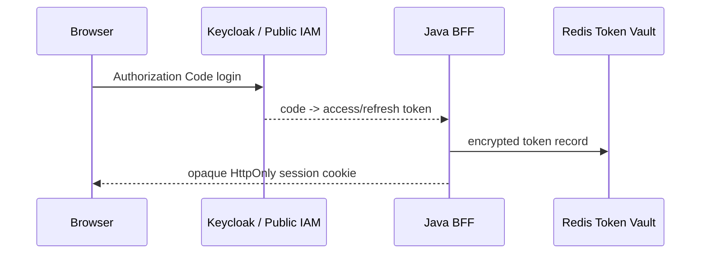
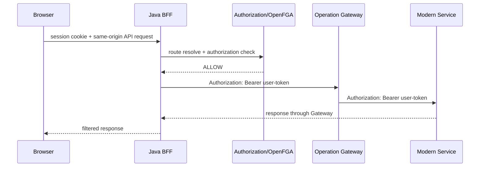

# ارسال امن توکن از BFF به محیط عملیاتی

این سند رفتار فعلی کد برای انتقال credential میان مرورگر، Java BFF، Operation
Gateway و سرویس‌های عملیاتی را توضیح می‌دهد. سه مسیر `FORWARD_USER_TOKEN`،
`LEGACY_SERVICE_TOKEN` و Superset عمداً رفتار یکسانی ندارند.

## خلاصه تصمیم

| مسیر | credential ارسالی BFF به Gateway | credential سرویس نهایی |
|---|---|---|
| سرویس مدرن HR/Finance با `FORWARD_USER_TOKEN` | `Authorization: Bearer <Public IAM access token>` | همان Access Token کاربر |
| سرویس Legacy با `LEGACY_SERVICE_TOKEN` | Access Token کاربر در `Authorization` و credential فنی در header خصوصی | فقط توکن Legacy در `Authorization` |
| Operation Superset | `X-Aurevia-Subject` و cookie نشست Superset | نشست Remote User در Superset؛ بدون Keycloak token |
| Authorization Service/OpenFGA | ارتباط workload داخلی | Access Token کاربر به OpenFGA ارسال نمی‌شود |

مرورگر هیچ Access Token یا Refresh Token دریافت نمی‌کند. JavaScript فقط cookie
نشست opaque و `HttpOnly` را به BFF می‌فرستد.

## چرخه توکن Public IAM

پس از موفقیت Authorization Code Flow، `OidcLoginSuccessHandler`، Access Token و
Refresh Token را در `TokenVaultService` قرار می‌دهد. Token Vault مقدارها را پیش از
ذخیره در Redis رمزنگاری می‌کند و فقط handle آن در نشست BFF قرار می‌گیرد.



برای درخواست عملیاتی، `OperationalProxyController` handle را از session می‌گیرد،
توکن را از Vault می‌خواند و `TokenRefreshService.ensureFresh` را اجرا می‌کند. اگر
توکن نزدیک انقضا باشد، BFF آن را server-side refresh می‌کند. نه توکن قدیمی و نه
توکن جدید به مرورگر برگردانده نمی‌شود.

## سرویس مدرن با FORWARD_USER_TOKEN

Routeهای عادی HR و Finance باید `authMode=FORWARD_USER_TOKEN` داشته باشند.
`UserBearerTokenProvider` همان Public IAM Access Token نشست را به‌عنوان credential
خروجی انتخاب می‌کند.

پس از resolve شدن Route و `ALLOW` شدن OpenFGA check، BFF درخواست زیر را به
Operation Gateway می‌فرستد:

```http
Authorization: Bearer <keycloak-access-token>
X-Aurevia-Subject: <stable-subject>
X-Correlation-ID: <correlation-id>
```

Gateway در مسیر مدرن `Authorization` را تغییر نمی‌دهد؛ در نتیجه سرویس نهایی همان
توکن Keycloak را دریافت و باید issuer، audience، signature، expiry و scopeهای آن
را مستقل اعتبارسنجی کند. اعتماد صرف به `X-Aurevia-Subject` برای سرویس مدرن مجاز
نیست.

جریان کامل:



اگر upstream پاسخ `401` بدهد، BFF فقط یک بار توکن Keycloak را refresh و درخواست
را retry می‌کند. retry نامحدود وجود ندارد.

## سرویس Legacy با LEGACY_SERVICE_TOKEN

سرویس Legacy معمولاً Public IAM token را نمی‌شناسد و credential فنی خود را از
endpoint جداگانه می‌گیرد. BFF توکن Legacy را براساس Outbound Auth Profile دریافت،
رمزنگاری و با TTL محدود cache می‌کند.

BFF تا Gateway دو credential می‌فرستد:

```http
Authorization: Bearer <keycloak-access-token>
X-Internal-Legacy-Authorization: Bearer <legacy-service-token>
```

این dual-token contract فقط روی hop خصوصی BFF به Gateway معتبر است. Gateway در
مرز Legacy باید headerها را تبدیل کند:

```nginx
proxy_set_header Authorization $http_x_internal_legacy_authorization;
proxy_set_header X-Internal-Legacy-Authorization "";
```

بنابراین سرویس نهایی فقط credential Legacy را در `Authorization` دریافت می‌کند و
header خصوصی نیز پاک می‌شود. Public IAM token تا Gateway می‌رسد ولی نباید به
Legacy backend forward شود.

پیش از resolve secret، دریافت یا cache توکن Legacy، OpenFGA باید کاربر نهایی را
برای Resource و Action همان Route مجاز کرده باشد. توکن Legacy مجوز کاربر نیست؛
فقط هویت فنی BFF نزد سرویس قدیمی است.

راهنمای کامل تعریف profile، Secret Reference، rotation و self-service در
[احراز هویت سرویس Legacy](legacy-service-authentication-fa.md) قرار دارد.

## Operation Superset

`OperationSupersetProxyController` عمداً Access Token کاربر را forward نمی‌کند.
پس از OpenFGA check گزارش، BFF فقط headerهای allowlist‌شده، correlation id و هویت
زیر را به Gateway می‌فرستد:

```http
X-Aurevia-Subject: <stable-subject>
Cookie: AUREVIA_OPERATION_SUPERSET=<opaque-superset-session>
```

Operation Gateway، `X-Aurevia-Subject` را فقط روی شبکه خصوصی به Superset منتقل
می‌کند. Middleware تنظیم‌شده در `superset_config.py` آن را به `REMOTE_USER` تبدیل
و Superset نشست مستقل خودش را ایجاد می‌کند. در نتیجه Superset نه Access Token و
نه Refresh Token Keycloak را دریافت می‌کند.

این header فقط زمانی قابل اعتماد است که Gateway درخواست را منحصراً از workload
معتبر BFF بپذیرد. در Production شبکه خصوصی به‌تنهایی کافی نیست و mTLS/Workload
Identity الزامی است.

## Authorization Service و OpenFGA

BFF برای route resolution، Manifest و authorization check از WebClient داخلی
Authorization Service استفاده می‌کند. Public IAM Access Token کاربر به OpenFGA
ارسال نمی‌شود. Authorization Service subject canonical را به شکل `user:<id>` و
object/relation را به OpenFGA check تبدیل می‌کند.

ارتباط داخلی Local ممکن است از bootstrap credential استفاده کند، اما Production
باید mTLS، Secret Store و rotation مستقل داشته باشد. credential workload نباید با
توکن کاربر یا توکن Legacy یکسان باشد.

## الزامات امنیتی Production

- مسیر BFF به Operation Gateway باید HTTPS و mTLS اجباری داشته باشد.
- Gateway فقط client certificate/Workload Identity متعلق به BFF را قبول کند.
- سرویس مدرن JWT را مستقل validate کند و audience مخصوص خودش داشته باشد.
- `X-Aurevia-Subject` و `X-Internal-Legacy-Authorization` از ingress عمومی حذف شوند.
- Gateway قبل از forward، headerهای داخلی ورودی نامعتبر را overwrite یا پاک کند.
- Access Token، Refresh Token و Legacy Token در log، trace، audit payload و error
  response ثبت نشوند.
- Redis Token Vault باید HA، رمزنگاری‌شده، دارای TTL و خارج از دسترس مستقیم
  مرورگر و سرویس‌های عملیاتی باشد.
- مقدارهای `change-me`، HTTP داخلی بدون mTLS و `require-mtls=false` فقط برای Local
  قابل قبول‌اند.
- OpenFGA check باید قبل از Secret lookup، token acquisition و downstream call
  اجرا و خطا در آن برابر DENY شود.

`GatewayWebClientConfiguration` هنگام فعال بودن `aurevia.gateway.require-mtls`
وجود HTTPS، client key store و trust store را اجباری می‌کند.

## تست و عیب‌یابی بدون افشای توکن

برای بررسی مسیر، خود token را چاپ نکنید. موارد زیر کافی هستند:

1. Route resolved دارای `authMode` مورد انتظار باشد.
2. OpenFGA decision و correlation id را در audit بررسی کنید.
3. سرویس مدرن وجود Bearer و نتیجه JWT validation را فقط به‌شکل boolean ثبت کند.
4. برای Legacy بررسی کنید Gateway، header خصوصی را حذف و `Authorization` را
   جایگزین کرده باشد.
5. برای Superset نبودن `Authorization` و وجود `X-Aurevia-Subject` روی hop خصوصی را
   بررسی کنید.
6. پاسخ `401` باید حداکثر یک refresh/retry ایجاد کند؛ `403` نباید token refresh
   ایجاد کند.

## مرجع پیاده‌سازی

| مسئولیت | فایل |
|---|---|
| نگهداری رمزنگاری‌شده Token | `TokenVaultService.java` |
| ذخیره Token پس از Login | `OidcLoginSuccessHandler.java` |
| refresh توکن Keycloak | `TokenRefreshService.java` |
| Proxy سرویس‌های عملیاتی | `OperationalProxyController.java` |
| انتخاب توکن کاربر | `UserBearerTokenProvider.java` |
| انتخاب توکن Legacy | `LegacyServiceTokenProvider.java` |
| WebClient و mTLS Gateway | `GatewayWebClientConfiguration.java` |
| Proxy بدون Keycloak token برای Superset | `OperationSupersetProxyController.java` |
| تبدیل header Legacy و انتقال هویت Superset | `infra/mock-operation/gateway.conf` |

