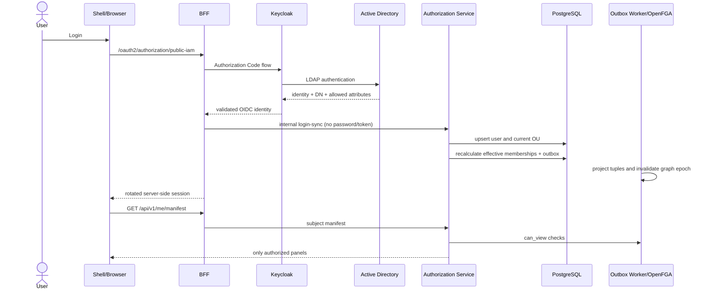
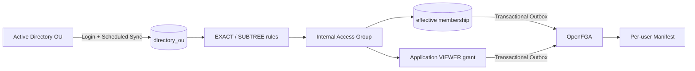
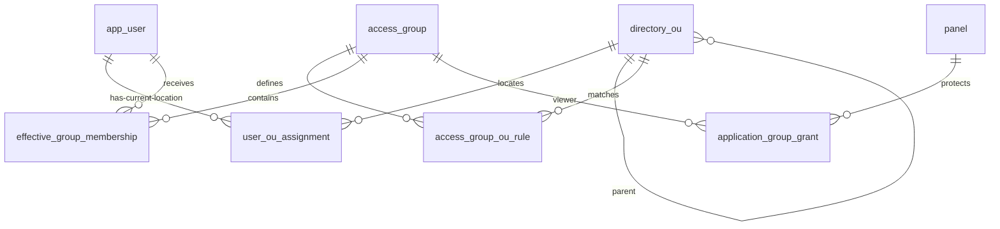

# راهبری دسترسی Microfrontend براساس OU

این سند مرجع واحد طراحی، پیاده‌سازی، امنیت، تست و بهره‌برداری Login و سطح دسترسی Microfrontendها براساس گروه و OU در Aurevia است. مخاطب آن توسعه‌دهنده، مدیر IAM، مدیر سامانه، تیم امنیت و عملیات است و مطالب را از مفاهیم پایه تا جزئیات فایل‌ها و سناریوی اجرایی پوشش می‌دهد.

## ۱. مسئله از پایه

### Authentication چیست؟

Authentication یا احراز هویت پاسخ می‌دهد: «این کاربر چه کسی است؟». در Aurevia کاربر credential خود را فقط به Keycloak می‌دهد. Keycloak در محیط سازمانی از LDAP/Active Directory برای اعتبارسنجی استفاده می‌کند و پس از موفقیت یک هویت OIDC امضاشده می‌سازد. BFF توکن را اعتبارسنجی و در سمت سرور نگهداری می‌کند؛ مرورگر به token خام دسترسی ندارد.

### Authorization چیست؟

Authorization یا مجوزدهی پاسخ می‌دهد: «این کاربر روی این منبع چه عملی می‌تواند انجام دهد؟». دانستن نام کاربر، OU یا موفقیت Login به‌تنهایی مجوز نیست. تصمیم نهایی runtime توسط OpenFGA گرفته می‌شود.

```text
Authentication:  آیا Ali واقعاً Ali است؟
Authorization:   آیا Ali حق دیدن application:accounting را دارد؟
```

### چرا مخفی‌کردن Microfrontend کافی نیست؟

Manifest فقط تعیین می‌کند کدام remote/module در Shell دیده و بارگذاری شود. مهاجم می‌تواند URL یا API را مستقیم صدا بزند. بنابراین دو سطح مستقل داریم:

1. مجوز Application برای نمایش Microfrontend؛
2. مجوز Business/API برای هر عملیات حساس مانند مشاهده فاکتور یا تأیید پرداخت.

Backend و Proxy روی درخواست حساس دوباره Authorization انجام می‌دهند و نبود دسترسی باید `403` ایجاد کند.

## ۲. واژه‌نامه و تفاوت مفاهیم

| مفهوم | مالک | معنا | نمونه |
|---|---|---|---|
| User | Keycloak/AD | هویت انسانی با `issuer + subject` | `ali.accounting` |
| OU | Active Directory | محل کاربر در درخت سازمان | `/Employees/Accounting` |
| AD Security Group | Active Directory | عضویت مستقل و چندگانه | `Finance-Approvers` |
| Directory Group | PostgreSQL projection | تصویر گروه خارجی در `directory_group` | `/HR` |
| Internal Access Group | Aurevia Admin | گروه داخلی برای سیاست دسترسی | `ACCOUNTING_USERS` |
| Role | Aurevia | مجموعه اختیارات کاربردی | `finance-approver` |
| Panel | Aurevia Registry | metadata یک Microfrontend | `finance` |
| Application Resource | OpenFGA | شیء مستقل تصمیم دسترسی | `application:aurevia/finance` |
| Manifest | AuthZ → Shell | فهرست مؤثر Microfrontendها برای یک User | `panels[]` |

یک User در AD معمولاً یک محل اصلی دارد. DN زیر «دو عضویت OU» نیست:

```text
CN=Ali,OU=Accounting,OU=Employees,DC=aurevia,DC=test
```

بلکه مسیر زیر است:

```text
Employees
└── Accounting
    └── Ali
```

کاربر در مقابل می‌تواند عضو چند Security Group مستقل باشد. به همین دلیل `directory_ou` و `directory_group` دو مدل جدا هستند.

## ۳. اجزای سیستم و مسئولیت‌ها

| جزء | مسئولیت | کاری که نباید انجام دهد |
|---|---|---|
| Samba/Microsoft AD | credential، OU، DN، objectGUID و attribute سازمانی | تصمیم دسترسی Aurevia |
| Keycloak | LDAP federation، Login، صدور OIDC claim معتبر | نگهداری policy پیچیده Microfrontend |
| BFF | OIDC callback، session، token vault، ارسال هویت معتبر به AuthZ | دریافت password یا اعتماد به OU ارسالی مرورگر |
| Authorization Service | sync، Rule evaluation، Outbox، Manifest و Admin API | اعتبارسنجی password کاربر |
| PostgreSQL | desired state، audit و explainability | تصمیم runtime مستقل از OpenFGA |
| OpenFGA | graph و تصمیم runtime | LDAP query یا DN parsing |
| Redis | cache کوتاه‌عمر و graph epoch | مرجع دائمی مجوز |
| Shell | مصرف Manifest و بارگذاری remote مجاز | تحلیل LDAP claim یا ساخت permission |
| Microservice/Proxy | check مستقل API و Business Resource | اعتماد به مخفی بودن منو |

## ۴. جریان Login انتها‌به‌انتها



مراحل دقیق:

1. کاربر وارد flow استاندارد OIDC می‌شود.
2. Keycloak credential را مستقیماً با LDAP/AD بررسی می‌کند.
3. Keycloak mapper فقط داده‌های سازمانی مجاز را به هویت امضاشده اضافه می‌کند.
4. BFF `issuer`، `subject`، username، مشخصات عمومی، DN و شناسه Directory را از principal معتبر می‌خواند.
5. BFF هیچ فیلد هویتی را از body/query/header مرورگر قبول نمی‌کند.
6. Authorization Service کاربر را با `(issuer, subject)` idempotently upsert می‌کند.
7. DN با parser استاندارد LDAP تبدیل به OU جاری می‌شود.
8. assignment قبلی در صورت جابه‌جایی غیرفعال می‌شود.
9. Ruleهای Access Group ارزیابی می‌شوند.
10. تغییر membership و event Outbox در یک transaction ثبت می‌شوند.
11. Worker tuple را در OpenFGA اعمال می‌کند و cache epoch را تغییر می‌دهد.
12. Manifest فقط panelهایی را برمی‌گرداند که `can_view=true` دارند.

اگر sync هویت شکست بخورد، Login نباید با یک دسترسی محاسباتی قدیمی و نامطمئن معتبر تلقی شود. نبود DN معتبر موجب حذف مسیر calculated membership می‌شود.

## معماری و مرزبندی مفاهیم

`OU` محل یک کاربر در درخت AD است؛ `AD Security Group` عضویت مستقل Directory است؛ `Access Group` گروه داخلی Aurevia است؛ و `Role` مجموعه‌ای از اختیارات کاربردی است. این چهار مفهوم قابل جایگزینی نیستند.



OpenFGA مرجع تصمیم runtime است. PostgreSQL منبع مدیریت، explainability و desired state است. منطق DN و Rule در OpenFGA اجرا نمی‌شود. جدول `panel` فقط metadata میکرو و شناسه application متناظر را نگه می‌دارد؛ grantها در `application_group_grant` هستند.

## مدل داده



`directory_group/user_group_membership` قدیمی برای Security Groupهای مستقل باقی مانده و به OU تبدیل نشده است. Migration شماره ۳۲ افزوده و غیرمخرب است. rollback امن تا پیش از استفاده: توقف directory sync و حذف جدول‌ها/typeهای V32 به ترتیب وابستگی؛ پس از تولید داده، rollback باید export و تأیید عملیاتی داشته باشد و خودکار نیست.

## Login و Sync

Keycloak پس از LDAP authentication، claimهای `distinguishedName`، `LDAP_ID`، `department`، `title` و `employeeType` را با mapper allowlist شده صادر می‌کند. BFF فقط principal اعتبارسنجی‌شده را به سرویس Authorization می‌فرستد؛ password/token/cookie ارسال یا audit نمی‌شود. کاربر با `(issuer, subject)` upsert می‌شود. DN با `javax.naming.ldap.LdapName` استاندارد parse می‌شود، نه `split(',')`. این موضوع escaped comma مانند `CN=Doe\, Ali` و ورودی malformed را نیز امن مدیریت می‌کند.

OU با `objectGUID` تطبیق داده می‌شود. اگر Login هنوز GUID مربوط به OU نداشته باشد، fallback هش DN فقط نقش bootstrap دارد و Scheduled Sync آن را با رکورد GUIDدار ادغام می‌کند. برای هر کاربر حداکثر یک assignment اصلی AD فعال است. جابه‌جایی، assignment قبلی را soft-disable، عضویت را محاسبه، `membership_version` را افزایش و tuple/cache را با Outbox تغییر می‌دهد. نبود DN معتبر برای عضویت محاسباتی fail-closed است.

Scheduled Sync با service account فقط‌خواندنی OUها و کاربران لینک‌شده را می‌خواند. OUهای گم‌شده حذف نمی‌شوند؛ `active=false` می‌گیرند و اجرای sync در `directory_sync_run` ثبت می‌شود. خطا متن credential یا LDAP payload را ذخیره نمی‌کند.

## قواعد

- `EXACT`: DN محل کاربر و DN OU برابر باشند.
- `SUBTREE`: OU محل کاربر برابر یا فرزند DN انتخاب‌شده باشد.
- `ANY_OF`: match شدن دست‌کم یک Rule؛ رفتار پیش‌فرض و معادل OR.
- `ALL_OF`: match شدن همه Ruleها؛ حالت صریح است. چون یک کاربر معمولاً فقط یک OU اصلی دارد، AND واقعی غالباً باید بعداً با attribute conditionهای allowlist شده ساخته شود.

Preview پیش از ذخیره تعداد اعضا و delta را نشان می‌دهد. عضویت‌ها به تفکیک `source_type/source_id` ذخیره می‌شوند؛ بنابراین حذف یک مسیر، مسیر معتبر دیگر را از بین نمی‌برد. `directory_attributes` فقط سه attribute مجاز را می‌پذیرد و Rule آزاد/اجرای expression ندارد.

### مثال EXACT

```text
User OU: /Employees/Accounting
Rule: EXACT(/Employees/Accounting)       => match
Rule: EXACT(/Employees)                  => no match
```

### مثال SUBTREE

```text
User OU: /Employees/Finance/Accounting
Rule: SUBTREE(/Employees/Finance)        => match
Rule: SUBTREE(/Employees/Sales)          => no match
```

### مثال چند Rule

```text
ANY_OF(SUBTREE(Accounting), SUBTREE(Treasury))
```

هر مسیر کافی است. در `ALL_OF` همه شرط‌ها لازم‌اند. از آنجا که User عموماً فقط یک OU اصلی دارد، `ALL_OF` چند OU اغلب نتیجه‌ای ندارد؛ AND واقعی آینده باید ترکیب OU و attribute مانند `employeeType=EMPLOYEE AND title=ACCOUNTING_EXPERT` باشد.

## چرخه عمر داده و دسترسی

### ایجاد یا Login اول

- `app_user` ساخته می‌شود؛
- OU با external identity ثبت می‌شود؛
- `user_ou_assignment` فعال ساخته می‌شود؛
- membership محاسبه می‌شود؛
- tuple عضویت در Outbox قرار می‌گیرد.

### تکرار Login بدون تغییر

Upsert و Sync idempotent هستند. رکورد User یا OU تکراری ساخته نمی‌شود و اگر نتیجه membership عوض نشده باشد event جدید بی‌دلیل تولید نمی‌شود.

### انتقال User بین OUها

Assignment قبلی حذف فیزیکی نمی‌شود؛ `active=false` و `removed_at` می‌گیرد. Ruleها مجدداً محاسبه می‌شوند. اگر آخرین مسیر معتبر membership از بین برود، tuple گروه حذف و Manifest بعدی فاقد Microfrontend مربوط خواهد بود.

### Rename یا Move یک OU

Scheduled Sync از `objectGUID` به‌عنوان شناسه پایدار استفاده می‌کند؛ بنابراین DN، path، name و parent همان رکورد به‌روزرسانی می‌شوند. fallback هش DN فقط برای bootstrap زمانی است که GUID OU در Login موجود نیست و با داده Scheduled Sync ادغام می‌شود.

### حذف OU

حذف مخرب انجام نمی‌شود. OU مشاهده‌نشده `active=false` می‌شود و audit/sync run باقی می‌ماند. Rule وابسته دیگر match مؤثر ایجاد نمی‌کند.

### چند منبع عضویت

`effective_group_membership` هر مسیر را با `source_type/source_id` نگه می‌دارد. حذف OU Rule فقط همان مسیر را غیرفعال می‌کند؛ اگر membership دستی یا attribute معتبر دیگری وجود داشته باشد tuple نهایی باقی می‌ماند.

## OpenFGA و Outbox

```text
user=user:<oidc-sub>, relation=member, object=group:<access-group-code-lowercase>
user=group:<access-group-code-lowercase>#member, relation=viewer, object=application:aurevia/<panel-slug>
```

مدل فعلی `application.viewer: [user, group#member, role#assignee]` و `can_view` را استفاده می‌کند. ایجاد/حذف membership یا grant همراه رکورد PostgreSQL در همان transaction، event Outbox ایجاد می‌کند. Worker با retry/backoff آن را اعمال و وضعیت grant را `APPLIED/RETRYING/FAILED/REVOKED` می‌کند. reconciliation desired tupleهای OU-based را نیز مقایسه و در حالت repair اصلاح می‌کند. تغییر tuple، epoch سراسری Redis را افزایش می‌دهد؛ در نتیجه cache تصمیم و Manifest بعدی معتبرسازی مجدد می‌شوند. UI تا `APPLIED`، دسترسی را قطعی نشان نمی‌دهد.

### وضعیت‌های Projection

| وضعیت | معنی |
|---|---|
| `PENDING` | desired state در DB ثبت شده ولی هنوز در OpenFGA تأیید نشده است |
| `APPLIED` | tuple با موفقیت اعمال شده است |
| `RETRYING` | اعمال شکست خورده و backoff/retry فعال است |
| `FAILED` | سقف تلاش رد شده و بررسی اپراتور لازم است |
| `REVOKED` | tuple حذف و لغو دسترسی اعمال شده است |

## API و UI

APIهای زیر زیر `/internal/v1/registry/ou-access` و پشت admin authorization موجود هستند: OU list، Access Group CRUD، Rule create/disable، members، preview، application grant/revoke و user explain. BFF هویت actor را از session می‌افزاید؛ header مرورگر مبنای اعتماد نیست.

در MFE Admin تب «دسترسی مبتنی بر OU» شامل درخت read-only OU، گروه/Rule/member/preview، Grant با وضعیت OpenFGA و مسیر توضیح دسترسی User است. Shell هیچ LDAP claim را تفسیر نمی‌کند و همان Manifest فیلترشده با `application:*#can_view` را مصرف می‌کند.

دسترسی application فقط visibility/entry به میکرو است. مسیرهای حساس backend همچنان از proxy route/resource/action و check مستقل OpenFGA عبور می‌کنند؛ پنهان‌شدن منو مجوز API نیست.

### قراردادهای مدیریتی

| Method | Path | کاربرد |
|---|---|---|
| GET | `/ou-access/ous` | درخت و وضعیت OUهای read-only |
| GET | `/ou-access/groups` | Access Groupها و تعداد اعضای مؤثر |
| POST | `/ou-access/groups` | ایجاد گروه محاسباتی |
| PUT | `/ou-access/groups/{id}` | ویرایش metadata، combiner یا وضعیت |
| GET | `/ou-access/groups/{id}/rules` | Ruleهای OU |
| POST | `/ou-access/groups/{id}/rules` | افزودن `EXACT/SUBTREE` |
| DELETE | `/ou-access/groups/{id}/rules/{ruleId}` | soft-disable Rule |
| POST | `/ou-access/groups/{id}/preview` | محاسبه اعضا و delta بدون ذخیره Rule جدید |
| GET | `/ou-access/groups/{id}/members` | علت‌های membership مؤثر |
| GET | `/ou-access/application-grants` | Grantها و وضعیت projection |
| POST | `/ou-access/application-grants` | Grant رابطه VIEWER |
| DELETE | `/ou-access/application-grants/{id}` | Revoke |
| GET | `/ou-access/users/{id}/explain` | مسیر User → OU → Rule → Group → Application |

همه مسیرها در شبکه داخلی Authorization Service قرار دارند و از BFF با workload credential فراخوانی می‌شوند. Admin interceptor نیز actor را با OpenFGA بررسی می‌کند.

## ساختار جدول‌ها و قیود مهم

| جدول | نقش | قید مهم |
|---|---|---|
| `app_user` | هویت OIDC و نسخه membership | یکتایی `(issuer, external_id)` |
| `directory_ou` | تصویر read-only OU | یکتایی external ID و DN در issuer |
| `user_ou_assignment` | OU جاری/تاریخی User | حداکثر یک AD assignment فعال |
| `directory_group` | گروه مستقل Directory قبلی | نباید برای OU استفاده شود |
| `access_group` | گروه داخلی Aurevia | code پایدار و immutable |
| `access_group_ou_rule` | نگاشت OU به Access Group | ترکیب group/OU/mode یکتا |
| `effective_group_membership` | علت membership | یکتایی User/Group/source |
| `application_group_grant` | دسترسی Group به Panel | یک Grant فعال VIEWER |
| `outbox_event` | تحویل قابل اتکای tuple | idempotency key یکتا |
| `directory_sync_run` | نتیجه هر Scheduled Sync | error امن و بدون secret |

Migration این قابلیت `V32__ou_based_application_access.sql` است. Migration افزوده و غیرمخرب است و جدول‌های legacy را بازنویسی نمی‌کند.

## توسعه محلی و سناریوی انتقال

### اجرای محیط توسعه بدون LDAP

اتصال LDAP برای بالا آمدن محیط توسعه اجباری نیست. مقدار پیش‌فرض زیر Scheduled Directory Sync را خاموش نگه می‌دارد:

```env
DIRECTORY_SYNC_ENABLED=false
```

در این حالت Compose را بدون profile به نام `directory` اجرا کنید:

```powershell
docker compose --env-file .env -f infra/docker-compose/compose.yml up -d --build
```

Keycloak از کاربران Local موجود در Realm استفاده می‌کند و Login استاندارد OIDC، session سمت سرور BFF، User upsert، Shell، Manifest و Microfrontendها قابل استفاده می‌مانند. Roleها، Grant مستقیم User و مدل قدیمی `directory_group` نیز مستقل از OU کار می‌کنند.

کاربر Local معمولاً claim معتبر `distinguishedName` ندارد. در نتیجه رفتار OU-based عمداً fail-closed است:

- برای کاربر OU جاری ساخته یا جعل نمی‌شود؛
- assignment فعال OU قبلی کاربر در Login فاقد DN معتبر غیرفعال می‌شود؛
- عضویت‌های `CALCULATED` مبتنی بر OU دوباره محاسبه و در صورت نبود مسیر معتبر حذف می‌شوند؛
- کاربر فقط از طریق OU به Microfrontend دسترسی نخواهد گرفت؛
- دسترسی مستقل User، Role یا Directory Group همچنان قابل استفاده است.

خلاصه قابلیت‌ها در حالت بدون LDAP:

| قابلیت | وضعیت |
|---|---|
| Login کاربران Local در Keycloak | فعال |
| Session و Token Vault در BFF | فعال |
| Shell و بارگذاری Microfrontend | فعال |
| Grant مستقیم User و Role | فعال |
| Admin UI | فعال؛ درخت OU ممکن است خالی یا دارای آخرین داده sync باشد |
| Scheduled LDAP Sync | غیرفعال |
| محاسبه دسترسی جدید براساس OU | غیرفعال و fail-closed |

رکوردهای OU موجود با خاموش‌شدن LDAP به‌صورت مخرب حذف نمی‌شوند. بااین‌حال Login یک User بدون DN معتبر اجازه نمی‌دهد membership محاسباتی نامطمئن همان User به‌عنوان دسترسی معتبر باقی بماند. برای آزمایش کامل OU، Compose را با profile زیر اجرا کنید؛ این profile سرویس Samba و پیکربندی LDAP Keycloak را فعال می‌کند:

```powershell
Copy-Item .env.example .env
# مقادیر local-only را در .env نگه دارید و commit نکنید.
docker compose --env-file .env --profile directory -f infra/docker-compose/compose.yml up -d --build
docker compose --env-file .env -f infra/docker-compose/compose.yml exec `
  -e SAMBA_ADMIN_PASSWORD=$env:SAMBA_ADMIN_PASSWORD samba-ad `
  /bin/sh /config/move-ali-to-sales.sh
```

سپس Scheduled Sync بعدی را منتظر بمانید. seed شامل `Employees/{Accounting,Sales,IT}` و کاربران `ali.accounting`، `sara.sales` و `reza.it` است. همه رمزها local fake و از env هستند.

Keycloak configurator، LDAP federation read-only و mapperها را idempotent ایجاد و Full Sync می‌کند. Samba از نظر LDAP DN/objectGUID و move برای این تست مناسب است؛ رفتار replication، forest trust، Azure AD و برخی کنترل‌های اختصاصی Microsoft AD را شبیه‌سازی نمی‌کند.

### تنظیمات محیطی

| متغیر | هدف |
|---|---|
| `DIRECTORY_SYNC_ENABLED` | فعال‌کردن Scheduled Sync؛ پیش‌فرض false |
| `DIRECTORY_LDAP_URL` | آدرس LDAP داخلی |
| `DIRECTORY_BASE_DN` | ریشه جست‌وجوی OU/User |
| `DIRECTORY_BIND_DN` | service account فقط‌خواندنی |
| `DIRECTORY_BIND_PASSWORD` | secret همان service account |
| `DIRECTORY_ISSUER` | issuer متناظر Keycloak |
| `DIRECTORY_SYNC_INTERVAL_MS` | فاصله اجرای sync |

در محیط production هیچ مقدار نمونه `.env.example` نباید استفاده شود. secretها باید توسط deployment platform یا secret manager تزریق شوند.

## سناریوی مرجع Accounting

1. `ali.accounting` در `/Employees/Accounting` است.
2. Keycloak Login را از Samba/AD انجام می‌دهد.
3. BFF principal معتبر را sync می‌کند.
4. User و OU در PostgreSQL upsert می‌شوند.
5. مدیر `ACCOUNTING_USERS` را می‌سازد.
6. Rule برابر `SUBTREE(/Employees/Accounting)` ساخته می‌شود.
7. membership مؤثر Ali ایجاد می‌شود.
8. Worker tuple `member` را اعمال می‌کند.
9. مدیر گروه را Viewer میکروی Finance/Accounting می‌کند.
10. tuple Viewer اعمال و status برابر `APPLIED` می‌شود.
11. Manifest علی شامل panel مربوط می‌شود.
12. پس از move به `/Employees/Sales`، assignment قبلی غیرفعال می‌شود.
13. membership و tuple حسابداری حذف می‌شوند.
14. graph epoch تغییر می‌کند و Manifest جدید panel را حذف می‌کند.
15. API حساس حسابداری مستقل check می‌شود و باید `403` بدهد.

## Runbook

- LDAP نامطمئن/قطع: sync run را بررسی کنید؛ OU موجود را حذف نکنید؛ calculated access برای Login فاقد DN fail-closed است. bind secret را در secret manager rotate کنید.
- Keycloak: mapper claimها را در token introspection امنِ مدیر بررسی کنید؛ token را در ticket/log paste نکنید. LDAP federation باید `READ_ONLY` باشد.
- OpenFGA: backlog/dead-letter Outbox و وضعیت `RETRYING/FAILED` را بررسی کنید؛ ابتدا endpoint reconciliation را dry-run و سپس repair کنید. UI وضعیت pending را allow تلقی نمی‌کند.
- PostgreSQL: قبل از restore، outbox و membership version را با هم restore کنید و سپس reconciliation اجرا کنید.

## Threat model و محدودیت‌ها

تهدیدهای اصلی: claim تزریقی مرورگر، DN injection، credential leakage، dual-write drift، admin بدون مجوز و اتکا به menu hiding. کنترل‌ها: principal اعتبارسنجی‌شده Keycloak، workload-auth بین BFF و AuthZ، `LdapName`، allowlist attribute، redaction موجود، Transactional Outbox، admin interceptor/audit، fail-closed OpenFGA و check مستقل API.

نسخه فعلی attributeها را امن sync می‌کند اما UI Rule برای attribute هنوز ارائه نمی‌دهد؛ AND کاربردی attribute-based توسعه بعدی است. AD Security Group آینده باید در `directory_group` فعلی sync شود و می‌تواند به Access Group نگاشت شود؛ نباید در `directory_ou` ذخیره شود. تست کامل Login مرورگری به availability موتور Docker و imageها وابسته است.

## نقشه پیاده‌سازی در Repository

| فایل | مسئولیت |
|---|---|
| `OidcLoginSuccessHandler.java` | استخراج claim از principal معتبر و Login Sync |
| `IdentitySyncController.java` | endpoint داخلی و سازگاری group sync قبلی |
| `DirectoryDnParser.java` | parse/validate استاندارد DN |
| `OuRuleEvaluator.java` | EXACT، SUBTREE، ANY_OF و ALL_OF |
| `OuAccessService.java` | user/OU upsert، assignment و membership/outbox |
| `ActiveDirectorySyncJob.java` | Scheduled Sync با objectGUID و soft-disable |
| `OuAccessAdminController.java` | Admin API، preview، explain و grant/revoke |
| `OutboxReconciler.java` | projection، retry و status |
| `OpenFgaReconciliationService.java` | تشخیص/اصلاح drift |
| `V32__ou_based_application_access.sql` | schema و index/constraintها |
| `OuAccessManagement.tsx` | چهار نمای Admin UI |
| `infra/samba-ad/*` | DC، seed و move test |
| `configure-samba-ldap.sh` | federation و mapperهای Keycloak |

## Audit و داده‌های ممنوع

Rule، Group، Mapping و Grant/Revoke audit می‌شوند. Audit فقط actor، event، target، correlation ID و جزئیات امن را نگه می‌دارد. موارد زیر نباید در DB، log، response یا audit قرار گیرند:

- password کاربر یا service account؛
- access/refresh/ID token؛
- cookie و session handle؛
- Authorization header؛
- LDAP response خام یا attribute خارج از allowlist.

## دستورات اعتبارسنجی

```powershell
.\mvnw.cmd test
npm test
npm run typecheck
npm run build
docker compose --env-file .env.example -f infra/docker-compose/compose.yml config --quiet
docker compose --env-file .env --profile directory -f infra/docker-compose/compose.yml up -d --build
```

تست‌های واحد `DirectoryDnParserTest` ورودی escaped/malformed و تست‌های `OuRuleEvaluatorTest` رفتار EXACT/SUBTREE/ANY_OF/ALL_OF را پوشش می‌دهند. تست Java کل BFF و Authorization، typecheck و build frontend باید قبل از merge پاس شوند. اجرای واقعی Login و move به Docker daemon فعال نیاز دارد.

## چک‌لیست آماده‌سازی Production

- LDAP فقط از شبکه داخلی و ترجیحاً LDAPS در دسترس باشد.
- service account حداقل مجوز read داشته باشد.
- Keycloak federation روی `READ_ONLY` بماند.
- issuer و mapper claimها قبل از rollout تأیید شوند.
- secretهای نمونه جایگزین و rotate شوند.
- Migration V32 ابتدا در staging روی snapshot تست شود.
- OpenFGA model و store ID صحیح deploy شده باشند.
- Outbox backlog، dead letter، sync failure و projection latency alert داشته باشند.
- endpointهای Admin فقط برای مدیر مجاز باشند.
- APIهای business تست `403` مستقل داشته باشند.
- سناریوی Accounting → Sales به‌صورت E2E اجرا و audit آن بازبینی شود.

## جمع‌بندی

OU فقط محل سازمانی است و مستقیماً permission نیست. مدیر OUها را به Access Group داخلی نگاشت می‌کند؛ نتیجه به‌صورت membership قابل توضیح نگهداری و با Outbox به OpenFGA منتقل می‌شود. Access Group سپس Viewer یک Application می‌شود. Shell تنها Manifest حاصل از تصمیم OpenFGA را مصرف می‌کند و APIهای حساس نیز تصمیم جداگانه دارند. این جداسازی هم امنیت runtime و هم قابلیت audit، retry، reconciliation و توسعه آینده به Security Group یا LDAP Attribute را حفظ می‌کند.
