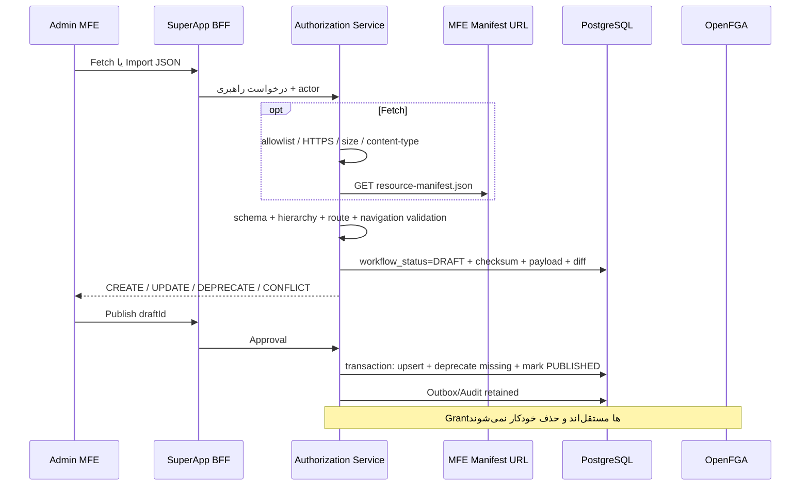

# معماری حاکمیت Micro Frontend، Resource Catalog و Navigation Catalog

نسخه سند: ۲.۱ — منطبق با migrationهای `V51__microfrontend_governance_catalog.sql` و
`V52__immutable_resource_manifest_versions.sql`

این سند مرجع طراحی و عملیات مدل نهایی است. سه مفهوم زیر عمداً از هم جدا هستند:

```text
Resource Tree   = چه قابلیت‌ها و داده‌هایی در سامانه وجود دارد؟
Navigation Tree = این قابلیت‌ها چگونه در Shell دیده می‌شوند؟
Permission      = چه subjectای چه actionای را روی کدام Resource انجام می‌دهد؟
```

منو Resource نیست، URL سرویس Resource نیست و OpenFGA کاتالوگ metadata نیست. این جداسازی
باعث می‌شود تغییر عنوان یا ترتیب منو، شناسه‌های امنیتی و tupleهای OpenFGA را تغییر ندهد.

## ۱. نگاشت به مدل موجود مخزن

برای جلوگیری از ایجاد مفهوم موازی، مدل موجود تکامل یافته است:

| مفهوم معماری | پیاده‌سازی موجود/تکامل‌یافته |
|---|---|
| `micro_frontend` | جدول `panel`؛ شناسه یکتای ثبت MFE |
| `resource` | جدول `resource` و `resource_action` |
| `resource_manifest` | revisionهای `resource_manifest_import` و snapshotهای runtime در `ui_module_artifact` |
| navigation manifest | آرایه `navigation` داخل JSON نسخه‌دار؛ در DB کپی نمی‌شود |
| `navigation_override` | جدول `ui_menu_override`؛ overlay یا گره ADMIN |
| Permission Tree | `authorization_grant` + Outbox + OpenFGA؛ مستقل از دو درخت بالا |

`ui_module_artifact` مقصد runtime شامل Remote Entry، نام container، exposed module و SRI است.
`resource_manifest_import` جریان حاکمیتی metadata شامل Draft، Diff و Approval است. این دو نسخه
ممکن است مستقل منتشر شوند، اما Effective UI Catalog همیشه آخرین Resource Manifest منتشرشده را
روی Artifact فعال اعمال می‌کند.

ترکیب `(panel_id, manifest_version)` یکتا است؛ یک نسخه SemVer محتوای immutable دارد و برای
checksum متفاوت باید نسخه جدید منتشر شود. `module.key` نیز باید دقیقاً با `panel.slug` برابر باشد.

## ۲. مدل داده

### Panel / Micro Frontend

فیلدهای حاکمیتی افزوده‌شده به `panel`:

| فیلد | مقادیر | معنا |
|---|---|---|
| `resource_definition_mode` | `MANIFEST`, `MANUAL`, `HYBRID` | مالک ایجاد ساختار Resource |
| `classification` | `DEMO`, `REAL` | خروجی‌دادن یا حذف MFE از Catalog محیط production |
| `resource_manifest_url` | URL مطلق JSON | آدرس Fetch؛ فقط origin مجاز و بدون query/credential |

پیش‌فرض `HYBRID` است. `MANIFEST` بدون URL معتبر پذیرفته نمی‌شود. در `MANUAL` endpointهای
Fetch/Import رد می‌شوند.

### Resource

فیلدهای اصلی عبارت‌اند از:

- `resource_key`: شناسه canonical و برای همیشه immutable؛
- `type`: یکی از `APPLICATION`, `MODULE`, `PAGE`, `UI_COMPONENT`, `FIELD`,
  `BUSINESS_RESOURCE`, `EXTERNAL_RESOURCE`؛ انواع legacy فقط برای migration قدیمی باقی‌اند؛
- `parent_id`: رابطه در Resource Tree، نه رابطه منو؛
- `source`: فقط `MANIFEST` یا `ADMIN`؛
- `panel_id`: مالک Micro Frontend؛
- `manifest_version`: آخرین revision مالک؛
- `visibility_enabled`: فقط نمایش در Effective Catalog را کنترل می‌کند؛
- `status`: lifecycle؛ حذف Manifest به `DEPRECATED` تبدیل می‌شود.

ریشه `APPLICATION` الزاماً `parent_id=null` دارد. قواعد والد در Service enforce می‌شوند:

| فرزند | والد معتبر |
|---|---|
| `MODULE` | `APPLICATION` |
| `PAGE` | `MODULE` |
| `UI_COMPONENT` | `PAGE` یا `UI_COMPONENT` |
| `FIELD` | `UI_COMPONENT` |
| `BUSINESS_RESOURCE` | `APPLICATION`، `MODULE` یا `BUSINESS_RESOURCE` |
| `EXTERNAL_RESOURCE` | `APPLICATION`، `MODULE`، `PAGE` یا `BUSINESS_RESOURCE` |

self-parent، cycle، والد متعلق به MFE دیگر و تغییر type رد می‌شوند.

### Resource ownership

برای `source=MANIFEST` راهبر می‌تواند permission، Navigation Overlay و visibility را مدیریت
کند؛ ساختار، display metadata و فهرست actionهای پشتیبانی‌شده فقط از publish Manifest تغییر
می‌کنند. Resource ادمین در publish بازنویسی نمی‌شود و برخورد کلید به صورت
`CONFLICT` نمایش داده و publish متوقف می‌شود.

برای `source=ADMIN` راهبر metadata و parent را ویرایش می‌کند و با عملیات Deprecate lifecycle را
تغییر می‌دهد. hard delete وجود ندارد تا Grant، Audit و tupleهای تاریخی بی‌اعتبار نشوند.

## ۳. قرارداد `resource-manifest.json`

هر MFE فایل مستقل JSON کنار `remoteEntry.js` منتشر می‌کند. Backend هیچ کد Webpack یا
`remoteEntry.js` را اجرا نمی‌کند. Webpack فقط فایل JSON reviewشده را عیناً در `dist` قرار می‌دهد.

```json
{
  "schemaVersion": "1.0",
  "module": {
    "key": "hr",
    "name": "Human Resources",
    "nameFa": "منابع انسانی",
    "nameEn": "Human Resources",
    "version": "1.2.0"
  },
  "routes": [
    {
      "key": "employees",
      "path": "/employees",
      "component": "./EmployeeList",
      "resourceKey": "page:hr.employee.list",
      "action": "view",
      "title": "کارکنان"
    }
  ],
  "resources": [
    {
      "key": "page:hr.employee.list",
      "type": "PAGE",
      "name": "Employee List",
      "nameFa": "لیست کارکنان",
      "nameEn": "Employee List",
      "classification": "INTERNAL",
      "actions": ["view"]
    }
  ],
  "navigation": [
    {"key":"hr.nav.root","type":"GROUP","title":"منابع انسانی","order":10},
    {"key":"hr.nav.employees","type":"PAGE","parentKey":"hr.nav.root",
     "pageKey":"employees","title":"کارکنان","order":20}
  ]
}
```

Server ریشه `application:aurevia/{panel.slug}` و گره `module:{module.key}` را در صورت نیاز
می‌سازد. Resource بدون `parentKey` زیر MODULE قرار می‌گیرد. route باید به Resource+Action
تعریف‌شده اشاره کند؛ فقط در `HYBRID` می‌تواند به Resource ادمین موجود و فعال ارجاع دهد.

قواعد Navigation:

- `GROUP` فقط presentation parent است؛
- `PAGE.pageKey` به `routes[].key` اشاره می‌کند، نه Resource؛
- `EXTERNAL_LINK.externalUrl` باید HTTPS باشد؛
- کلیدها unique، lowercase و بدون cycle هستند؛
- Navigation به جدول Resource تبدیل نمی‌شود.

Manifestهای واقعی مخزن در مسیرهای زیر هستند:

- `apps/mfe-admin/resource-manifest.json`
- `apps/mfe-hr/resource-manifest.json`
- `apps/mfe-finance/resource-manifest.json`
- `apps/mfe-reports/resource-manifest.json`

## ۴. جریان Import و Approval



تا قبل از Publish هیچ Resource عملیاتی تغییر نمی‌کند. Publish در صورت checksum mismatch،
ownership conflict، type conflict، parent نامعتبر یا action ناشناخته کامل rollback می‌شود.

اگر Resource متعلق به Manifest در نسخه جدید وجود نداشته باشد، `DEPRECATED` می‌شود؛ حذف فیزیکی
نمی‌شود، چون ممکن است Grant، Audit، binding یا رابطه OpenFGA داشته باشد.

## ۵. Navigation Overlay

Effective Navigation به شکل زیر محاسبه می‌شود:

```text
Manifest Navigation + Admin Overlay + Admin-owned Navigation Nodes
```

Overlay یک node Manifest را کپی نمی‌کند. فقط title، icon، order و hidden را override می‌کند.
ردیف `source=ADMIN` یک گره presentation جدید است و می‌تواند GROUP/PAGE/EXTERNAL_LINK باشد.
حذف Overlay، definition اصلی Manifest را آشکار می‌کند. Resource و Permission با این عملیات
تغییر نمی‌کنند.

## ۶. APIهای راهبری

همه مسیرهای زیر از مرورگر با prefix `/api/v1/admin` و Session+CSRF فراخوانی می‌شوند؛ BFF آن‌ها
را به `/internal/v1/registry` می‌فرستد.

| عملیات | Method و path |
|---|---|
| ثبت MFE | `POST /api/v1/admin/panels` |
| ویرایش MFE | `PUT /api/v1/admin/panels/{panelId}?version={version}` |
| فهرست revisionها | `GET /api/v1/admin/panels/{panelId}/resource-manifests` |
| Fetch و ساخت Draft | `POST /api/v1/admin/panels/{panelId}/resource-manifests/fetch` |
| Import JSON و ساخت Draft | `POST /api/v1/admin/panels/{panelId}/resource-manifests/drafts` |
| Preview Diff | `GET /api/v1/admin/panels/{panelId}/resource-manifests/drafts/{draftId}` |
| Publish Catalog | `POST /api/v1/admin/panels/{panelId}/resource-manifests/drafts/{draftId}/publish` |
| فهرست Overlayها | `GET /api/v1/admin/panels/{panelId}/navigation-overrides` |
| upsert Overlay/Node | `PUT /api/v1/admin/panels/{panelId}/navigation-overrides/{key}` |
| حذف Overlay/Node | `DELETE /api/v1/admin/panels/{panelId}/navigation-overrides/{key}` |

نمونه پاسخ Preview:

```json
{
  "id": "6c8374d0-8268-4e4e-8c50-86a16d81dbda",
  "panelId": "359e2ca9-b73a-45ae-a302-a1645d5f1935",
  "moduleKey": "hr",
  "manifestVersion": "1.2.0",
  "workflowStatus": "DRAFT",
  "checksum": "43aa...",
  "changes": [
    {"resourceKey":"page:hr.employee.list","changeType":"UPDATE"},
    {"resourceKey":"page:hr.payroll","changeType":"DEPRECATE"}
  ]
}
```

نمونه Overlay:

```json
{
  "source": "MANIFEST",
  "nodeType": "PAGE",
  "title": "مدیریت کارکنان",
  "icon": "team",
  "order": 5,
  "hidden": false
}
```

## ۷. Effective UI Catalog و Shell

قرارداد پایدار مرورگر:

```http
GET /api/ui/catalog
```

```json
{
  "catalogVersion": "manifest-sha256-...",
  "generatedAt": "2026-09-06T10:30:00Z",
  "contractVersion": "1.0",
  "modules": [
    {
      "moduleKey": "hr",
      "routePrefix": "hr",
      "classification": "REAL",
      "resourceDefinitionMode": "HYBRID",
      "routes": [{"id":"employees","path":"employees","resource":"page:hr.employee.list","action":"view"}],
      "navigation": [{"key":"hr.nav.employees","type":"PAGE","pageKey":"employees","title":"کارکنان","source":"MANIFEST"}],
      "menus": [{"id":"hr.nav.employees","routeId":"employees","title":"کارکنان","order":20}]
    }
  ]
}
```

`menus` برای backward compatibility نگه داشته شده است؛ Shell جدید `navigation` را ترجیح می‌دهد.
Authorization Service ابتدا moduleهای بدون `application can_view`، سپس routeهای بدون
Resource+Action permission و در پایان Navigation بدون route مجاز را حذف می‌کند. نسخه خروجی
SHA-256 محتوای مؤثر است و پاسخ BFF `private, no-cache` و ETag دارد.

میکروفرانت همچنان `/api/v1/me/manifest` را برای `permissions` و `resourceTree` دریافت می‌کند.
Guard فرانت فقط UX است؛ BFF/Gateway هر operation را دوباره با Authorization Service کنترل می‌کند.

## ۸. Demo و Production

```yaml
aurevia:
  demo-data:
    enabled: true   # local
```

در `application-prod.yml` مقدار false و غیرقابل override تصادفی است. وقتی false باشد، panelهای
`classification=DEMO` و Resource/Permissionهای متعلق به آن‌ها از Effective Catalog حذف می‌شوند.
ADMIN با classification=REAL باقی می‌ماند. داده دمو شرط اجرای معماری یا migrationهای بعدی نیست.

## ۹. کنترل‌های امنیتی Fetch

- URL فقط از فیلد ثبت‌شده panel خوانده می‌شود؛ URL دلخواه در درخواست Fetch پذیرفته نمی‌شود؛
- origin با `aurevia.ui-artifacts.allowed-origins` کنترل می‌شود؛
- production فقط HTTPS و Artifact SRIدار را می‌پذیرد؛
- credential، query و fragment در URL Manifest رد می‌شوند؛
- redirect دنبال نمی‌شود تا allowlist دور زده نشود؛
- timeout اتصال ۵ ثانیه، timeout درخواست ۱۰ ثانیه و سقف پاسخ ۱ MiB است؛
- backend فقط JSON را parse می‌کند و هیچ JavaScript/Webpack runtime اجرا نمی‌شود.

## ۱۰. چک‌لیست انتشار

1. `resourceKey`ها canonical و پایدارند و button/URL به‌عنوان Resource ثبت نشده است.
2. mode و classification پنل درست انتخاب شده‌اند.
3. Remote Entry و Resource Manifest از origin مجاز هستند.
4. Diff بدون `CONFLICT` بازبینی شده و DEPRECATEها آگاهانه تأیید شده‌اند.
5. PAGE navigation به route موجود اشاره می‌کند و cycle ندارد.
6. Permissionهای Resource جدید پیش از فعال‌کردن مسیر business اعطا شده‌اند.
7. `/api/ui/catalog` با کاربر مجاز و غیرمجاز بررسی شده است.
8. در production مقدار `aurevia.demo-data.enabled=false` تأیید شده است.
