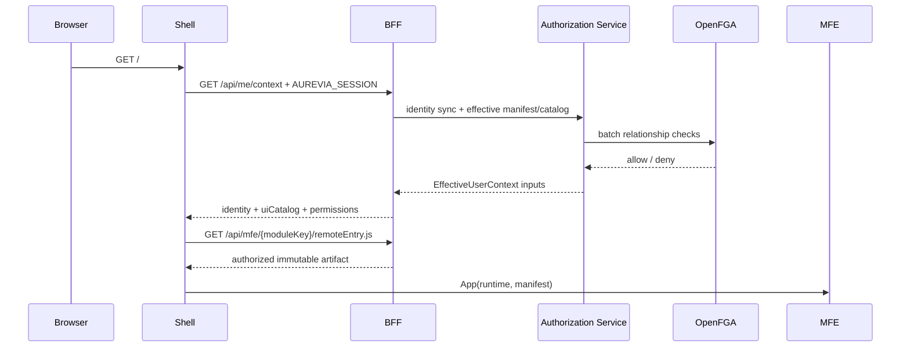

# راهنمای جاری Shell و بارگذاری Micro Frontendها

> وضعیت سند: living و همگام با `apps/shell` و `packages/contracts` در ۲۰۲۶-۰۹-۱۵.

Shell میزبان React برنامه است. پس از ورود، context مؤثر کاربر را می‌گیرد، navigation را از
`uiCatalog` می‌سازد و فقط artifact ثبت‌شده و مجاز را بارگذاری می‌کند. تصمیم امنیتی نهایی
همچنان در BFF، Authorization Service و OpenFGA گرفته می‌شود؛ پنهان‌کردن route یا دکمه صرفاً UX است.

## جریان canonical



`GET /api/me/context` قرارداد single-fetch شِل جاری است. `GET /api/v1/me/manifest` برای
مصرف‌کننده‌های قدیمی و `GET /api/ui/catalog` برای projection تخصصی کاتالوگ حفظ شده‌اند.

در `apps/shell/src/index.tsx`:

1. درخواست context با `credentials: 'same-origin'` ارسال می‌شود؛ JavaScript هیچ bearer tokenی نمی‌بیند.
2. پاسخ 401 یا redirect کاربر را به `/auth/login` می‌فرستد.
3. `uiCatalog.modules` منبع route و navigation است؛ `panels` projection سازگاری باقی می‌ماند.
4. `remote-loader.ts` فقط URLهای context جاری را می‌پذیرد، timeout و SRI را اعمال می‌کند و failure را در همان Remote محدود می‌کند.
5. Remote جاری با `contractVersion: '1.0'` و component `App` اجرا می‌شود.
6. Remote قدیمی با `contractVersion: '1'` می‌تواند موقتاً از قرارداد `mount` استفاده کند.

## قرارداد TypeScript

تعریف منبع حقیقت در `packages/contracts/src/index.ts` است:

```ts
export interface EffectiveUserContext extends EffectiveManifest {
  contractVersion: '1.0';
  identity: { issuer: string; subject: string; username: string };
  tenant: { id: string; name?: string };
  allowedMicros: readonly UiModuleDefinition[];
  dynamicRoutes: readonly (PluginRoute & { moduleKey: string })[];
  navigation: readonly UiNavigationNode[];
  actions: Record<string, readonly string[]>;
}

export interface MicroFrontendPlugin {
  contractVersion: '1.0';
  App: React.ComponentType<{
    runtime: HostRuntime;
    manifest: EffectiveManifest;
  }>;
}
```

`HostRuntime` شامل locale، کاربر فعلی، `moduleKey`، `apiBasePath`، navigation و توابع
same-origin برای login/logout است. MFE نباید subject یا role را از query string، storage یا
دادهٔ قابل‌ویرایش مرورگر معتبر بداند.

## ثبت و انتشار MFE

1. `mf-manifest.json` باید runtime، routeها و navigation را با schema `1.0` تعریف کند.
2. `resource-manifest.json` کاتالوگ مجوز را مستقل از قرارداد runtime تعریف می‌کند.
3. Panel Registry URLهای manifest، artifact و metadata استقرار را نگه می‌دارد.
4. sync کردن MF Manifest artifact revision تغییرناپذیر می‌سازد؛ نسخهٔ تکراری با محتوای متفاوت رد می‌شود.
5. Resource Manifest ابتدا Draft/Diff و فقط پس از publish کاتالوگ مجوز را تغییر می‌دهد.
6. راهبر artifact معتبر را activate یا به revision قبلی rollback می‌کند.
7. profile تولید HTTPS و SRI معتبر را الزامی می‌کند.

در معماری جاری browser آدرس Registry را مستقیماً fetch نمی‌کند؛ artifact از مسیر
same-origin `/api/mfe/{moduleKey}/...` و پس از policy مقصد عبور می‌کند. MFEها می‌توانند بدون
restart Core منتشر یا متوقف شوند، ولی تا ثبت و grant شدن در context کاربر ظاهر نمی‌شوند.

## کنترل مجوز در MFE

```tsx
<SHCan resource="business:hr.employee" action="view">
  <EmployeeList />
</SHCan>
```

Guard باید همان کلید canonical Resource Manifest و route عملیاتی را مصرف کند. حتی اگر guard
اجازه دهد، درخواست API باید از path ثبت‌شدهٔ BFF عبور کند و backend دوباره subject، resource،
action و policy را بررسی کند.

## چک‌لیست افزودن MFE

1. plugin نسخه `1.0` و `App` را export کنید.
2. MF Manifest، Resource Manifest و SRI artifact را تولید کنید.
3. MFE و URLهایش را در Admin ثبت و manifestها را sync/publish کنید.
4. artifact revision را activate کنید.
5. resource/action لازم را به USER، GROUP یا ROLE grant کنید.
6. `GET /api/me/context` را برای کاربر مجاز و غیرمجاز بررسی کنید.
7. allow، deny، revoke، expiry، artifact خراب، SRI غلط و contract ناسازگار را تست کنید.

## خطاهای رایج

| نشانه | بررسی |
|---|---|
| MFE در منو نیست | `uiCatalog`، status ثبت، artifact فعال و grant `can_view` |
| Context برابر 401 | session منقضی یا IdP/redirect اشتباه |
| Artifact برابر 403 | URL policy، SRI، نسخه فعال یا دسترسی module |
| `Incompatible remote contract` | export واقعی باید `1.0/App` یا legacy `1/mount` باشد |
| MFE دیده می‌شود ولی API برابر 403 است | مجوز module با resource/action عملیاتی متفاوت است |
| یک Remote crash می‌کند | MIME/CSP/SRI، exposed module و Error Boundary همان Remote |

inventory فعلی برنامه‌ها، نسخه Admin و مرزهای production در
[وضعیت جاری](current-state-fa.md) ثبت شده‌اند.
