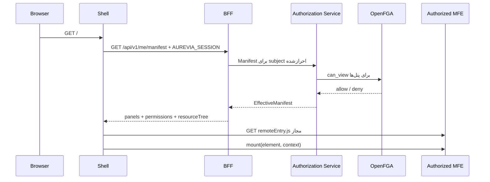

# راهنمای Shell و بارگذاری Micro Frontendها

## Shell چیست؟

`apps/shell` برنامه React میزبان Aurevia است. کاربر بعد از ورود، ابتدا Shell را می‌بیند و Shell بر اساس Manifest مؤثر همان کاربر، منو را می‌سازد و Micro Frontend مجاز را در زمان اجرا بارگذاری می‌کند. Shell خودِ HR، Finance، Admin یا Reports نیست؛ ظرف اجرایی و هماهنگ‌کننده آن‌هاست.

مسئولیت‌های اصلی Shell عبارت‌اند از:

- دریافت Manifest کاربر از BFF؛
- ساخت منو فقط از پنل‌های مجاز؛
- بارگذاری lazy فایل `remoteEntry.js` هر پنل؛
- اجرای قرارداد مشترک `mount` و تحویل locale، Manifest و correlation ID؛
- فراهم‌کردن layout، زبان فارسی/انگلیسی، theme و logout مشترک؛
- محدودکردن خرابی یک Remote با loading state، پیام خطا و Error Boundary؛
- اجرای cleanup مربوط به Remote هنگام تعویض پنل یا unmount.

Shell این مسئولیت‌ها را **ندارد**:

- نگهداری یا خواندن Access Token و Refresh Token مربوط به Keycloak؛
- فراخوانی مستقیم OpenFGA؛
- تصمیم‌گیری نهایی درباره مجوز API؛
- اتصال مستقیم مرورگر به سرویس‌های عملیاتی؛
- اعتماد به مخفی‌بودن منو یا دکمه به‌عنوان کنترل امنیتی backend.

## جریان اجرا پس از Login



جزئیات جریان در `apps/shell/src/index.tsx`:

1. Shell درخواست `GET /api/v1/me/manifest` را با `credentials: same-origin` و یک `X-Correlation-ID` جدید ارسال می‌کند. مرورگر فقط Cookie مات `AUREVIA_SESSION` را می‌فرستد؛ توکن Keycloak در JavaScript قرار نمی‌گیرد.
2. در پاسخ `401`، redirect احراز هویت یا `opaqueredirect`، مرورگر به `/oauth2/authorization/public-iam` هدایت می‌شود.
3. بعد از دریافت Manifest، اولین پنل مجاز انتخاب می‌شود.
4. منوی کناری فقط از `manifest.panels` ساخته می‌شود. پنل denyشده در پاسخ نیست، بنابراین Remote آن نیز بارگذاری نمی‌شود.
5. با انتخاب یک پنل، `RemoteHost`، scope آن را از slug می‌سازد و `loadRemote` را اجرا می‌کند.
6. Remote با context مشترک mount می‌شود و تابع cleanup برگشتی برای زمان تعویض پنل نگهداری می‌شود.

## قرارداد Manifest

Endpoint مرورگر:

```http
GET /api/v1/me/manifest
Cookie: AUREVIA_SESSION=<opaque-session-id>
X-Correlation-ID: <uuid>
```

بخش‌های مورد استفاده Shell:

```json
{
  "version": "manifest-a1b2c3",
  "expiresAt": "2026-08-31T12:01:00Z",
  "panels": [
    {
      "code": "HR",
      "slug": "mfe-hr",
      "nameFa": "منابع انسانی",
      "nameEn": "Human Resources",
      "remoteEntry": "https://superapp.example.com/hr/remoteEntry.js",
      "exposedModule": "./bootstrap",
      "contractVersion": "1"
    }
  ],
  "permissions": {
    "component:hr.employee.create-button": ["view", "execute"]
  }
}
```

`panels` ورودی navigation و Remote Loader است. `permissions` و `resourceTree` از طریق `SHManifestProvider` به MFEها داده می‌شوند تا route، component و field را در سطح نمایش کنترل کنند.

## نحوه بارگذاری Remote

`apps/shell/src/remote-loader.ts` این کنترل‌ها را اعمال می‌کند:

1. `remoteEntry` باید URL کامل با پروتکل `http` یا `https` باشد.
2. URL باید دقیقاً در فهرست `remoteEntry`های Manifest جاری وجود داشته باشد؛ ورودی دلخواه کاربر پذیرفته نمی‌شود.
3. برای هر scope فقط یک script با `data-remote` به صفحه اضافه می‌شود.
4. Webpack share scope مقداردهی و container مربوط به scope پیدا می‌شود.
5. `exposedModule`، که در پروژه‌های فعلی `./bootstrap` است، از container دریافت می‌شود.
6. مقدار `contractVersion` باید برابر `1` باشد؛ نسخه ناسازگار fail می‌شود.

قرارداد TypeScript در `packages/contracts`:

```ts
interface RemoteModule {
  contractVersion: '1';
  mount(element: HTMLElement, context: RemoteContext): () => void;
}

interface RemoteContext {
  locale: 'fa-IR' | 'en-US';
  manifest: EffectiveManifest;
  correlationId: () => string;
}
```

هر MFE باید در `mount` یک React root بسازد و تابعی برگرداند که همان root و listenerهای ایجادشده را پاک کند. استفاده از `correlationId()` برای هر درخواست API امکان ردیابی درخواست در BFF، Authorization Service و سرویس عملیاتی را فراهم می‌کند.

## مرز امنیتی

Manifest و component guardها کنترل **نمایشی** هستند. کاربر ممکن است URL یا درخواست API را دستی تولید کند؛ بنابراین هر API محافظت‌شده باید در BFF/Authorization Service دوباره با subject استخراج‌شده از session و OpenFGA بررسی شود.

```text
Shell/MFE guard = تجربه کاربری و کم‌کردن نمایش قابلیت غیرمجاز
BFF + Authorization Service + OpenFGA = مرز اجرای امنیت
```

Shell نباید subject، role یا user ID را از query string یا local storage معتبر بداند. هویت معتبر فقط از session سمت سرور به دست می‌آید. همچنین MFE نباید Access Token را درخواست یا ذخیره کند؛ فراخوانی‌ها باید same-origin و از مسیر BFF باشند.

## افزودن یک Micro Frontend جدید

1. MFE باید `RemoteModule` نسخه `1` و `./bootstrap` را export کند.
2. `remoteEntry.js` باید روی URL کامل و قابل دسترس از مرورگر منتشر شود.
3. پنل و Application Resource متناظر در پنل Admin ثبت شوند.
4. URL، route base path، semantic version و contract version در Panel Registry تعریف شوند.
5. مجوز `can_view` منبع Application به USER، GROUP یا ROLE داده شود.
6. Role در صورت نیاز به USER یا GROUP انتساب داده شود.
7. با `GET /api/v1/me/manifest` بررسی شود که فقط کاربران مجاز پنل را دریافت می‌کنند.
8. APIهای MFE مستقل از نمایش پنل، OpenFGA check متناظر را enforce کنند.
9. سناریوهای allow، deny، expiry، Remote خراب و contract ناسازگار تست شوند.

تعریف پنل یا تغییر دسترسی به انتشار نسخه جدید Shell نیاز ندارد؛ اطلاعات runtime از Manifest می‌آید. فقط تغییر قرارداد مشترک یا رفتار خود Shell نیازمند build و انتشار Shell است.

## خطاهای رایج

| نشانه | بررسی |
|---|---|
| پنل در منو نیست | پاسخ Manifest، grant `can_view` و عضویت USER/GROUP/ROLE |
| `Remote Entry must be a complete http(s) URL` | مقدار `remoteEntry` باید URL کامل باشد |
| `Remote URL is not allowlisted` | URL فراخوانی‌شده با مقدار Manifest جاری یکسان نیست |
| `Remote failed` | status، MIME type، CSP، DNS و دسترسی مرورگر به `remoteEntry.js` |
| `Incompatible remote contract` | `contractVersion` پنل و export واقعی Remote باید `1` باشند |
| پنل دیده می‌شود ولی API برابر 403 است | UI مجاز است اما مجوز resource/action مربوط به API داده نشده یا منقضی شده است |
| یک Remote خالی یا crash شده است | Console، Error Boundary، export `mount` و cleanup را بررسی کنید |

## شکاف‌های فعلی و الزامات Production

- در loader فعلی مقدار `script.integrity` خالی است، با آن‌که `PanelManifest` فیلد اختیاری `integrity` دارد. برای زنجیره تأمین production باید integrity واقعی به loader متصل، همراه با `crossorigin` مناسب enforce و نسخه artifact immutable شود.
- allowlist فعلی بر اساس URLهای برگشتی Manifest است. Authorization Service باید originهای مجاز production را هنگام ثبت/ویرایش Panel validate کند و CSP نیز همان originها را محدود کند.
- رفتار refresh پس از پایان `expiresAt` باید به‌صورت policy واحد و تست‌شده اجرا شود؛ Manifest منقضی نباید مبنای ادامه نمایش دسترسی حساس باشد.
- برای Remoteها باید timeout، telemetry بارگذاری، نسخه‌پذیری و rollback مستقل تعریف شود.
- نمایش Tag با متن `Online` در UI فعلی health check واقعی backend نیست و نباید برای مانیتورینگ عملیاتی استفاده شود.
