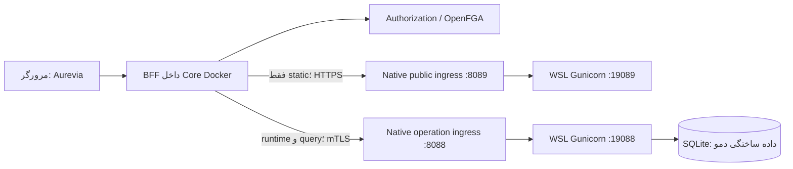
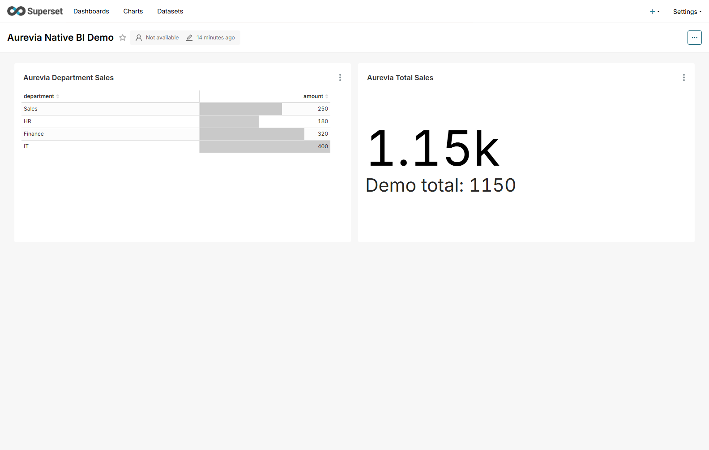

# دموی دو Superset خارج از Docker و اتصال عملیاتی از BFF

این سناریو دو instance واقعی Apache Superset را به‌صورت فرایندهای Gunicorn در Ubuntu/WSL میزبان پروژه اجرا می‌کند؛ هیچ‌یک داخل containerهای پروژه نیستند. HTTPS ورودی نیز فرایند Native Node روی Windows است. این دمو روی همان رایانه و با IP شبکهٔ `192.168.1.6` اجرا می‌شود، نه روی یک سرور فیزیکی دوم.

## آدرس‌ها و نقش‌ها

| جزء | آدرس | نقش |
|---|---|---|
| Super App | `http://localhost:8443` | ورود Keycloak، فهرست گزارش و مشاهده same-origin |
| Superset عمومی | `https://192.168.1.6:8089` | فقط `/static/*` و `/health`؛ سایر مسیرها 404 |
| Superset عملیاتی | `https://192.168.1.6:8088` | dashboard/chart/query؛ اتصال فقط با گواهی client مجاز BFF |
| Gunicorn عمومی | `127.0.0.1:19089` در WSL | backend محلی Superset عمومی |
| Gunicorn عملیاتی | `127.0.0.1:19088` در WSL | backend محلی Superset عملیاتی |

برای مشاهده گزارش، از Super App وارد شوید و بخش «گزارش‌ها» را باز کنید. URL مستقیم Superset عملیاتی برای کاربر مرورگر نیست و بدون client certificate اتصال TLS را رد می‌کند. CA دمو در trust store عمومی Windows یا مرورگر نصب نمی‌شود؛ ابزارها و BFF به‌صورت صریح فقط همین CA را می‌پذیرند.

## جریان واقعی درخواست



OpenFGA اجازه integration و asset را بررسی می‌کند. سپس BFF برای `/static/*` از URL عمومی mapping و برای سایر مسیرها از URL عملیاتی استفاده می‌کند. Operation Gateway در این جریان حضور ندارد. دریافت HTML گزارش به‌تنهایی اثبات اجرای query نیست؛ آزمون دمو مقدار واقعی دادهٔ chart را از پاسخ عملیاتی و از Chrome بررسی می‌کند.

قرارداد تخصصی جدید `/api/integrations/superset/{code}/**` است. مسیرهای سازگار `/superset/*`، `/reports-runtime/*` و APIهای root-relative Superset در Nginx/BFF به همین proxy متصل‌اند. گزارش‌های catalog با URL same-origin برمی‌گردند. تنظیم `APPLICATION_ROOT=/` مقصد حفظ می‌شود.

## نسخه‌ها و نصب

Superset روی `5.0.0`، Python روی شاخه `3.11` و ابزار `uv` روی `0.8.15` تنظیم شده‌اند. وابستگی‌ها با [فایل constraints رسمی Superset 5.0.0](https://github.com/apache/superset/blob/5.0.0/requirements/base.txt) نصب می‌شوند؛ `marshmallow<4` و `setuptools<81` نیز به‌صورت سازگار اعمال می‌شوند. روش migration و init با [راهنمای رسمی نصب PyPI](https://superset.apache.org/docs/installation/pypi/) منطبق است.

پیش‌نیازها: Ubuntu/WSL، `python3`، `curl`، `g++`، Node و Core سالم پروژه. روی این میزبان Python `3.11.13` جدا از Python سیستمی `3.12.3` نصب شده است. برای Ubuntu فاقد compiler:

```powershell
wsl -d Ubuntu -u root --exec bash -lc "apt-get update && apt-get install -y --no-install-recommends python3 curl g++"
```

bootstrap ابزار uv، wheel رسمی PyPI را به‌صورت قطعه‌ای دانلود و SHA256 آن را پیش از استخراج بررسی می‌کند. دانلود کند شبکه به تغییر نسخه یا غیرفعال‌کردن TLS منجر نمی‌شود. مسیر داده Native خارج از repository است:

برای شبکه‌ای که دانلود یک اتصال کند است، پیش از up متغیر
`$env:AUREVIA_SUPERSET_RANGE_DOWNLOAD = '1'` را تنظیم کنید. ابزار `download_wheels.py`
wheel بسته‌های بزرگ را با نسخه همان constraints از PyPI دریافت، قطعه‌ها را ترکیب و SHA256
رسمی را بررسی می‌کند؛ uv از cache محلی `wheels/` استفاده می‌کند. این روش در اجرای این
میزبان برای پایان‌دادن به دانلودهای کند استفاده شد و نسخه یا منبع dependency را تغییر نمی‌دهد.

```text
/home/mahdi/.local/share/aurevia-superset-demo/
  venv/
  privacy-assets/            # override فقط جزء Scarf و manifest هش‌ها
  settings.json              # خصوصی
  tls/                       # CA و گواهی/کلیدها؛ خصوصی
  public/metadata.db
  operation/metadata.db
  operation/analytics.db
  public/gunicorn.pid
  operation/gunicorn.pid
  public/server.log
  operation/server.log
  reports.json               # فقط ID و مشخصات داده ساختگی
```

این مسیر با `AUREVIA_SUPERSET_NATIVE_ROOT` و distro با `AUREVIA_SUPERSET_WSL_DISTRO` قابل انتخاب‌اند. اسکریپت‌های Python و setup برای Linux نیز هستند؛ CLI Linux به تعیین صریح IP نیاز دارد. انتقال به یک سرور مستقل مستلزم دسترسی همان سرور و LAN/DNS واقعی است و در این اجرای میزبان انجام نشده است.

## راه‌اندازی و اتصال Core

از ریشه مخزن و PowerShell اجرا کنید. دمو Docker قدیمی نباید پورت‌های 8088/8089 را اشغال کرده باشد:

```powershell
$env:AUREVIA_SUPERSET_HOST = '192.168.1.6'
npm run superset:native:up
```

این فرمان dependencyها، دو metadata DB، account bootstrap، گزارش‌های ساختگی، گواهی‌ها و فرایندهای Native را آماده می‌کند. اجرای دوباره داده‌ها را حذف نمی‌کند. فایل‌های `.tmp/superset-native/` در Git نادیده گرفته می‌شوند. `.tmp/superset-native/core.env` فقط IP مقصد و `runtime.json` فقط topology دمو را دارد.

برای Core جاری این جلسه که JARهای host و تست SSO/Legacy را با overlay اجرا می‌کند:

```powershell
./mvnw.cmd -pl services/superapp-bff,services/authorization-service -am package -o
docker compose --env-file .env --env-file .tmp/superset-native/core.env -f infra/docker-compose/compose.yml -f infra/docker-compose/compose.e2e-auth-core.yml -f infra/docker-compose/compose.superset-native-core.yml up -d --no-deps --no-build --force-recreate authorization-service aurevia-bff nginx
```

overlay `compose.superset-native-core.yml` هیچ Superset service ایجاد نمی‌کند؛ CIDR دقیق `${AUREVIA_SUPERSET_HOST}/32` و TLS connector را روی BFF/Authz تنظیم و `SUPERSET_DEVELOPMENT_HOST` ارث‌رسیده از Compose توسعه را پاک می‌کند. مقدار development host در سیاست `INTERNAL_ENTERPRISE` مجاز نیست و حفظ آن startup را رد می‌کند. پایه Core مستقل باقی می‌ماند. overlay `compose.e2e-auth-core.yml` مختص Core فعال این جلسه و JAR/secret mount تست‌های قبلی است. در نصب عادی، build یا image به‌روز BFF/Authz را طبق deployment پروژه آماده و overlay Native را با Compose پایه مصرف کنید؛ `--no-build` برای image قدیمی حاوی connector جدید مناسب نیست.

پس از سالم‌شدن BFF و Authorization:

```powershell
npm run superset:native:register
npm run superset:native:verify
npm run superset:native:status
```

ابزار register/verify به Aurevia محلی محدود است و از ورود واقعی Keycloak و CSRF نشست استفاده می‌کند. رمزها از fixture محلی یا متغیر محیطی خوانده می‌شوند و چاپ نمی‌شوند. برای نصب متفاوت، `AUREVIA_SUPERSET_VIEWER` و `AUREVIA_SUPERSET_VIEWER_PASSWORD` و برای آزمون منفی، `AUREVIA_SUPERSET_DENIED_USER` و `AUREVIA_SUPERSET_DENIED_PASSWORD` را با روش خصوصی تنظیم کنید؛ آن‌ها را در history، مستند یا Git قرار ندهید.

برای مشاهده catalog در Shell، MFE Reports نیز باید مستقل فعال باشد. در این جلسه artifact
موجود Reports/Admin با سرویس static اختیاری زیر فعال شده است؛ این‌ها Superset نیستند:

```powershell
docker compose -f infra/docker-compose/compose.mfe-demo.yml up -d mfe-admin mfe-reports
```

در نصب بدون artifact ابتدا workspaceهای مربوط را build کنید. مرورگر آزمون صفحهٔ
`/reports` را باز، سه لینک مجاز را بررسی و URL dashboard را از همان catalog مصرف می‌کند.

## داده و مجوزهای دمو

دادهٔ عملیاتی این دمو از DWH واقعی نمی‌آید. dataset ساختگی `department_sales` چهار ردیف دارد:

| بخش | amount |
|---|---:|
| Sales | 250 |
| HR | 180 |
| Finance | 320 |
| IT | 400 |
| مجموع | 1150 |

یک dashboard منتشرشدهٔ `Aurevia Native BI Demo` با slug `aurevia-native-demo` شامل table chart و big-number chart است. IDها در `reports.json` تولید می‌شوند؛ فرض ثابت‌بودن ID در همه نصب‌ها درست نیست. Public هیچ datasource تحلیلی، chart یا dashboard ندارد.

رجیستری Aurevia دو رکورد `superset-native-public` و `superset-native-operation` با HTTPS، `tlsRequired=true` و mapping پیش‌فرض PUBLIC→OPERATION دریافت می‌کند. سه asset با ID عددی واقعی Superset به instance عملیاتی وابسته‌اند. `externalId` مانند `"1"` است؛ نوع در `assetType` می‌آید.

مقدار `publicPath` این mapping، `/superset-native` است تا با مسیر یکتای mapping قدیمی
`/superset` conflict نداشته باشد. این فیلد به‌تنهایی ingress جدید ایجاد نمی‌کند؛ URL واقعی
dashboard همچنان `/superset/dashboard/{id}/` و مقصد آن mapping پیش‌فرض فعال است.

viewer فعلی `e2e.dual-access` است و VIEW هر سه asset و VIEW بخش Reports را می‌گیرد. `e2e.none` برای تست فقدان مجوز استفاده می‌شود. manager بودن application به viewer داده نمی‌شود. account bootstrap عملیاتی `administrator` با subject مدیر demo هم‌نام است و Admin داخلی Superset است. کاربر عادی در اولین درخواست با Remote User و Gamma ثبت می‌شود. Gamma در این دمو فقط به همان dataset ساختگی datasource access دارد.

Gamma استاندارد Superset مجوز `can_write` روی Dashboard دارد. seed دمو این permission
را از Gamma عملیاتی حذف می‌کند تا UI viewer برای ذخیرهٔ خودکار palette یا ویرایش dashboard
درخواست نوشتنی نسازد. نقش Admin باقی می‌ماند. این تغییر اختصاصی دمو است و باید با سیاست
نقش‌های محیط واقعی تطبیق داده شود؛ `superset init` سپس seed، آن را دوباره اعمال می‌کنند.

## مرز اعتماد و TLS

گواهی‌های دمو ۳۰ روز اعتبار دارند؛ server SAN شامل IP فعلی، localhost و آدرس سازگار میزبان است. frontend عملیاتی CA و client certificate را بررسی و CN `aurevia-bff-native-demo` را الزام می‌کند. جعل header بدون گواهی معتبر راهی به operation ingress ندارد.

BFF یک WebClient تخصصی با hostname verification، timeout، redirect غیرفعال و trust صریح دارد. فایل CA، client certificate و client private key فقط read-only در `/run/superset-native-tls/` mount می‌شوند. حالت `SUPERSET_TLS_REQUIRE_MTLS=true` نبودن CA یا یکی از اجزای client identity و فعال‌بودن HTTP را رد می‌کند. سیاست شبکه `INTERNAL_ENTERPRISE` فقط IP میزبان `/32` را مجاز می‌داند.

Node ingress هدر Authorization و secret ورودی client را حذف می‌کند، secret خصوصی خودش را به Gunicorn عملیاتی می‌فرستد و middleware پس از تأیید آن `REMOTE_USER` را تنظیم می‌کند. Gunicorn فقط روی loopback است. secret برای caller مرورگر قابل مشاهده نیست. فایل‌های خصوصی تنظیمات و کلیدهای Linux با دسترسی محدود نوشته می‌شوند؛ کلید خصوصی CA به Windows یا container کپی نمی‌شود. در Windows، Git ignore جای کنترل ACL سازمانی را نمی‌گیرد؛ این دمو در workspace خصوصی کاربر اجرا شده است.

هویت Keycloak در BFF و Authorization با issuer+subject بررسی می‌شود. middleware Native تنها subject را username می‌کند و برای یک realm دمو تنظیم شده است؛ استقرار چند IdP به نگاشت هویت مستقل نیاز دارد. CSRF خود Superset فعال است: query بدون `X-CSRFToken` معتبر باید رد شود. cookieهای Superset هنگام عبور از BFF برای instance prefix می‌گیرند.

Superset 5 به‌صورت پیش‌فرض `superset.charts.data.api.data` را در فهرست معافیت CSRF
قرار می‌دهد. config Native این مورد را حذف می‌کند تا chart-data POST در این دموی
نشست‌محور CSRF معتبر بخواهد. استثناهای پیش‌فرض log، explore_json و cache screenshot
حفظ شده‌اند؛ ادعای الزام جدید CSRF روی همه POSTهای Superset مطرح نیست.

grant/revoke از outbox به OpenFGA منتقل می‌شوند. آزمون لغو، پاسخ 403 را پس از انتشار
رابطه و invalidation کش بررسی و `propagationMs` را ثبت می‌کند؛ پاسخ موفق DELETE به
معنی تغییر هم‌زمان گراف در همان لحظه نیست. Restore نیز تا بازگشت واقعی 200 بررسی می‌شود.

## تغییرات کد برای این نیازمندی

- `SupersetWebClientConfiguration`: CA/client PEM، الزام mTLS، fail-closed تنظیم ناقص و WebClient اختصاصی.
- `OperationSupersetProxyController`: استفاده از connector اختصاصی و انتخاب URL عمومی فقط برای static، پس از ALLOW، بدون ارسال header هویت یا cookie نشست Superset به آن.
- `JdbcSupersetProxyRepository`: برگرداندن URL و TLS عمومی در کنار مقصد عملیاتی mapping.
- `SupersetAssetService`: مجازشدن خواندن `/api/v1/dashboard/{id}/charts` و
  `/api/v1/dashboard/{id}/datasets` فقط برای dashboard دارای grant. Chrome پیش از این
  اصلاح با دو پاسخ 403 متوقف می‌شد. هفت مورد unit، خواندن مجاز و منع ID دیگر، mutation
  و مسیر فرزند نامرتبط را بررسی می‌کنند؛ مجوز کلی prefix جدید ایجاد نشده است.
- وضعیت favorite برای Dashboard/Chart فقط با درخواست خواندن، Rison معتبر و grant همه
  IDهای درخواستی مجاز است. افزودن ID فاقد مجوز به فهرست، حتی کنار ID مجاز، 403 می‌گیرد.
  هفت unit دیگر، encoded query، نوع asset، فهرست مختلط، ورودی خراب و mutation را بررسی می‌کنند.
- `JdbcSupersetInstanceRepository` و `JdbcSupersetAssetRepository`: اصلاح source منبع
  application و asset از `EXTERNAL_SYNC` به `ADMIN`؛ migration 51 فقط `MANIFEST`/`ADMIN`
  را مجاز می‌داند و migration 58 برای integration نیز `ADMIN` می‌نویسد. مقدار قبلی ثبت
  واقعی instance و dashboard/chart جدید را با `409 DATA_CONFLICT` rollback می‌کرد.
  توضیح و enum مربوط در OpenAPI نیز با قرارداد فعلی هماهنگ شدند.
- `infra/superset-native/`: نصب نسخه مشخص، دو config مستقل، migration، seed، certificate و lifecycle Native.
- `tools/superset-native*.mjs`: HTTPS ingress، up/down/status و مرورگر واقعی.
- `tools/register-superset-native.mjs` و `tools/verify-superset-native.mjs`: ثبت API، مجوزها، query واقعی، revoke/restore و خروجی امن.
- `tools/collect-superset-native-evidence.mjs`: جمع‌آوری نسخه‌های واقعی، نتایج اجرا و metadata عمومی گواهی بدون انتقال credential به مستند.
- `compose.superset-native-core.yml`: overlay شبکه/TLS بدون وابستگی lifecycle به Superset.

seed ردیف layout را با `meta.background` و metadata اولیهٔ رنگ‌ها کامل می‌کند. نبودن
این مقدار در prototype دمو خطای frontend `Cannot read properties of undefined (reading
'background')` می‌داد؛ نتیجه باید با rendering واقعی Chrome بررسی شود، نه فقط GET HTML.

رابط بستهٔ Superset 5.0.0 تصویر صفراندازهٔ Scarf را بدون شرط درخواست می‌کند؛ تنظیم
`SCARF_ANALYTICS=False` در این نسخه آن را متوقف نمی‌کند. `privacy_assets.py` نسخه و
بدنهٔ دقیق همین component را بررسی و یک کپی محلی می‌سازد که فقط component تصویر
در آن `null` برمی‌گرداند. فایل wheel و bundle اصلی تغییر نمی‌کنند. middleware هر دو
instance کپی را در همان مسیر static با `Cache-Control: no-store` ارائه می‌کند، چون نام
فایل همچنان هش upstream را دارد. SHA256 اصلی و نسخهٔ ارائه‌شده در manifest و evidence
ثبت می‌شوند؛ تغییر نسخه یا component ناشناخته راه‌اندازی را متوقف می‌کند تا override
بازبینی شود. آزمون Chrome نبود درخواست HTTP خارج از مبدأ Aurevia را بررسی می‌کند.

در کد قبلی فایل‌های static از `base_url` عملیاتی خوانده می‌شدند؛ URL عمومی mapping عملاً مصرف نمی‌شد. همچنین connector قبلی WebClient عادی بود و client certificate اختصاصی نداشت. این دو رفتار برای دمو شبکه‌ای اصلاح شدند. جزئیات route در [راهنمای مسیریابی](superset-routing-and-embedding-fa.md) آمده است.

## خروجی آزمون

اجرای نهایی دمو در `2026-09-12T19:33:08.254Z`، برابر با ساعت ۲۳:۰۳ تهران در
۱۲ سپتامبر ۲۰۲۶، بدون FAIL یا BLOCKED پایان یافت:

| بررسی | موفق | ناموفق / اجرا نشده |
|---|---:|---:|
| اجرای زنده Native، API، مجوز و Chrome | 26 | 0 / 0 |
| Java: ui-artifact-security | 7 | 0 / 0 |
| Java: superapp-bff | 78 | 0 / 0 |
| Java: authorization-service | 142 | 0 / 0 |
| بازبینی مجدد Swagger در Core جاری | 19 | 0 / 0 |
| جدایی lifecycle Superset از Compose پایه | 1 | 0 / 0 |

در ۲۶ بررسی زنده، PID/cgroup دو Gunicorn خارج از Docker و نبود asset تحلیلی در Public،
TLS/mTLS، رد runtime عمومی، mapping و پنج resource با source صحیح، سه گزارش مجاز،
انتخاب Public برای JavaScript و Operation برای query، مجموع واقعی ۱۱۵۰، رد CSRF ناقص،
منع کاربر فاقد مجوز و ID ناشناخته، favorite مختلط، لغو/بازگردانی و نبود credential بررسی شدند.
Chrome سه لینک catalog و هر دو نمودار را نمایش داد، دو پاسخ chart-data واقعی دریافت کرد
و هر ۷۳ درخواست شبکهٔ مرحلهٔ گزارش در مبدأ Aurevia بود. دادهٔ جدول چهار ردیف و مجموع
نمودار ۱۱۵۰ بود. لغو grant پس از ۴۹۸۸ میلی‌ثانیه به 403 و بازگردانی پس از ۵۹۶۳
میلی‌ثانیه به 200 رسید؛ این‌ها اندازه‌گیری همین اجرا هستند.

[نتیجهٔ امن و کامل اجرا](evidence/superset-native-network-demo-results.json) شامل نسخه‌های
واقعی، نتایج ۲۶ مورد، regression Swagger، آمار JUnit، metadata عمومی گواهی و هش override
Scarf است. خروجی محلی در `target/superset-native/results.json` و تصویر واقعی Chrome در
`target/superset-native/dashboard.png` نیز باقی می‌ماند. هیچ رمز، cookie، JWT یا private
key در evidence منتشر نمی‌شود.



برای تولید دوباره evidence پس از اجرای موفق تست‌های Java و دو verifier، اجرا کنید:

```powershell
npm run swagger:verify
npm run superset:native:verify
npm run superset:native:evidence
```

فرمان evidence در صورت FAIL/BLOCKED، خطای JUnit یا وجود container Superset خروجی
نهایی تولید نمی‌کند. نسخهٔ packageها را از venv می‌خواند و config isolation را دوباره
اجرا می‌کند. snapshot قدیمی بازبینی Swagger در فایل evidence مربوط به همان بازبینی
حفظ شده است؛ regression این دمو در evidence Native قرار دارد.

## توقف، اجرای دوباره و بازگردانی رجیستری

```powershell
npm run superset:native:down
npm run superset:native:status
npm run superset:native:up
```

down فقط فرایندهای Native متعلق به همین ابزار را با بررسی PID/command متوقف می‌کند. دیتابیس‌ها، certificateها، registry و grants باقی می‌مانند. restart Core برای توقف Superset لازم نیست. `registry-before.json` وضعیت instance/mapping پیش از register را نگه می‌دارد؛ ابزار register mapping پیش‌فرض قبلی را حفظ اما از حالت default خارج می‌کند.

برای بازگرداندن مقصد پیش‌فرض قبلی، مدیر از UI «محیط‌های Superset» یا POST به `/api/v1/admin/superset-instances/mappings` با `publicInstanceId`، `operationInstanceId`، `publicPath`، `isDefault=true` و `active` از snapshot استفاده کند. API روی mapping عمومی upsert می‌کند. instanceهای Native را با API PUT یا UI غیرفعال کنید؛ version فعلی رکورد را برای optimistic locking بخوانید. حذف داده با SQL دستی لازم نیست. برای حذف مجوزها از API revoke استفاده کنید؛ down یک rollback رجیستری یا مجوزها نیست.

در صورت تغییر IP یا انقضای گواهی، ابزار عمداً identity موجود را بی‌صدا عوض نمی‌کند. ابتدا Native را متوقف، پوشه TLS موجود را در همان مسیر خصوصی با نام backup نگهداری، سپس با IP جدید up اجرا کنید؛ certificateهای تازه ساخته می‌شوند. overlay Core و URLهای instance را به‌روز و register/verify را تکرار کنید. backup کلیدها خصوصی بماند و پس از پایان نیاز، طبق سیاست نگهداری سازمان حذف شود. تغییر trust/identity نیازمند recreate BFF است.

## عیب‌یابی و محدودیت‌ها

| نشانه | بررسی |
|---|---|
| `Missing native prerequisite` | نصب compiler/curl/python3 در distro انتخاب‌شده |
| پورت 8088/8089 اشغال | بررسی دمو Docker قبلی یا فرایند Native دیگر؛ هر دو دمو هم‌زمان نباشند |
| HTTPS 502 | وضعیت Gunicorn و log خصوصی همان zone؛ forwarding localhost در WSL |
| TLS handshake rejected | انتظار صحیح بدون client certificate؛ در BFF mount، CA، SAN و expiry را بررسی کنید |
| BFF 403 | active mapping، VIEW asset، instance صحیح و ID chart را بررسی کنید |
| Superset 403 | Gamma/datasource permission و CSRF مقصد را جدا از OpenFGA بررسی کنید |
| کاربر محلی دیگری در LAN وصل نمی‌شود | Windows Firewall، routing و دسترسی پورت را از همان کلاینت بررسی کنید |

این اجرا اتصال از همین میزبان و از BFF داخل Docker به آدرس LAN را می‌آزماید؛ یک رایانه فیزیکی دیگر در شبکه در اختیار این آزمون نیست. کلاینت شبکه برای مشاهده Super App علاوه بر اتصال، به hostnameهای صحیح OIDC و HTTPS deployment نیاز دارد؛ تنظیم `localhost` این جلسه مخصوص مرورگر همین میزبان است.

این یک دمو است: metadata و analytics روی SQLite، worker ساده Gunicorn، گواهی کوتاه‌مدت و lifecycle دستی است. برای Production، metadata DB پایدار، DWH approved، cache/worker، secret manager، renewal، monitoring و کنترل permissions/RLS داخلی Superset باید مطابق محیط واقعی آماده شوند. اجرای SQL/chart در Superset توسط خود Superset و datasource permissions کنترل می‌شود؛ آزمون grant در BFF ادعای محدودکردن همه SQLهای دلخواه نیست.
