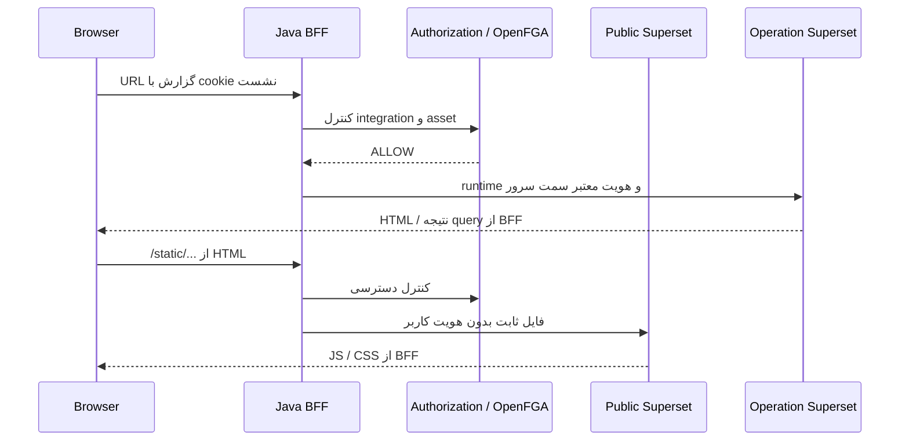

# راهنمای Superset عمومی، عملیاتی، Route و MFE Reports

Superset یک External Integration با lifecycle مستقل از Core است. BFF پس از کنترل مجوز و سیاست شبکه، مستقیماً به URL ثبت‌شده وصل می‌شود. Operation Gateway در مسیر Superset نیست. راه‌اندازی دو instance خارج از containerهای پروژه در [دموی شبکه‌ای Native](superset-native-network-demo-fa.md) و قرارداد رجیستری در [External Integration](external-integration-superset-fa.md) شرح داده شده است.

## دو مسئولیت مستقل

| جزء | مسئولیت | داده تحلیلی | مقصد درخواست BFF |
|---|---|---|---|
| PUBLIC | JS، CSS، font و image همان نسخه Superset | ندارد | `/static/*` از `public_base_url` mapping |
| OPERATION | dashboard، chart، query و اتصال به منبع داده | دارد | سایر مسیرها از `base_url` عملیاتی mapping |

در دموی Docker قدیمی، جزء عمومی یک static server است. در دموی Native هر دو جزء فرایند واقعی Apache Superset هستند؛ middleware عمومی تنها `/static/*` و `/health` را باز می‌گذارد. هیچ dashboard یا API تحلیلی عمومی نمی‌شود. Public و Operation از نسخه یکسان فایل‌های frontend استفاده می‌کنند.

## مسیر درخواست



قرارداد اصلی `/api/integrations/superset/{publicCode}/**` است. BFF mapping را resolve می‌کند، مجوز را می‌سنجد، سپس برای `/static/*` مقصد PUBLIC و برای runtime مقصد OPERATION را انتخاب می‌کند. هر مقصد با SSRF/network policy بررسی می‌شود. در integration عملیاتی بدون mapping، فایل‌های ثابت نیز از همان instance عملیاتی دریافت می‌شوند.

Nginx مسیرهای سازگار `/superset/*`، `/reports-runtime/*`، `/static/*` و APIهای root-relative گزارش را به BFF می‌فرستد. مقصد خارجی از روی URL دلخواه مرورگر انتخاب نمی‌شود. Superset در جدول‌های business proxy مانند `service_target` و `proxy_route` تعریف نمی‌شود؛ برای آن مسیر عمومی موازی ایجاد نکنید.

## احراز هویت و SSO بین Super App و Superset

کاربر یک‌بار از مسیر Authorization Code در Keycloak وارد Super App می‌شود. access/refresh token در vault BFF می‌ماند. در `REMOTE_USER`، BFF پس از کنترل دسترسی، `X-Aurevia-Subject` و `X-Aurevia-Issuer` را از Principal معتبر خودش تولید می‌کند؛ header مشابه مرورگر جایگزین آن نمی‌شود.

Ingress عملیاتی فقط workload مجاز BFF را می‌پذیرد. در دموی Native این شرط با mTLS، CA اختصاصی و بررسی نام client certificate اعمال می‌شود. Ingress به backend loopback یک secret مستقل می‌فرستد و middleware پس از تأیید آن، subject را به `REMOTE_USER` تبدیل می‌کند. Superset با `AUTH_REMOTE_USER` و نقش اولیه `Gamma` نشست خود را ایجاد می‌کند. دموی فعلی یک realm دارد؛ نام کاربر Superset از subject ساخته می‌شود و namespace مستقل برای چند issuer در این middleware پیاده نشده است.

redirect `/login/?next=...` برای ایجاد نشست Superset طبیعی است؛ در حالت Remote User فرم رمز عبور دوم نمایش داده نمی‌شود. account محلی `administrator` برای bootstrap وجود دارد و رمز تصادفی آن در تنظیمات خصوصی میزبان می‌ماند.

نشست BFF با cookie اصلی `AUREVIA_SESSION` از نشست Superset مستقل است. cookie خارجی هنگام عبور از BFF prefix مخصوص instance می‌گیرد؛ نام داخلی Native با دموی Docker قدیمی یکسان نیست. HttpOnly cookie به معنی access token قابل خواندن در JavaScript نیست. در حالت `OIDC` مقصد به client مستقل IdP نیاز دارد؛ Aurevia برای Superset token exchange یا guest token ایجاد نمی‌کند. `authMode` رجیستری به‌تنهایی مقصد خارجی را پیکربندی نمی‌کند.

## ثبت گزارش و دسترسی

1. مدیر dashboard/chart را در instance عملیاتی ایجاد و publish می‌کند.
2. instanceهای PUBLIC و OPERATION در «محیط‌های Superset» ثبت و mapping می‌شوند.
3. asset با `instanceCode` عملیاتی در «گزارش‌ها و داشبوردها» ثبت می‌شود.
4. سطح VIEW، EDIT یا MANAGE به USER، GROUP یا ROLE داده می‌شود.
5. Authorization Service منبع، action و outbox را ثبت و رابطه مجوز را به OpenFGA منتقل می‌کند.
6. `GET /api/v1/reports` فقط assetهای منتشرشده و قابل مشاهده را با URL same-origin برمی‌گرداند.
7. هر navigation و API runtime دوباره در BFF بررسی می‌شود؛ دانستن ID جای grant را نمی‌گیرد.

نمونه metadata معتبر:

```json
{
  "externalId": "1",
  "assetType": "DASHBOARD",
  "title": "Aurevia Native BI Demo",
  "urlPath": "/superset/dashboard/1/",
  "ownerExternalId": null,
  "published": true,
  "instanceCode": "superset-native-operation"
}
```

`externalId` باید با ID واقعی Superset منطبق باشد؛ `dashboard:1` با validator فعلی سازگار نیست. نوع در `assetType` ذخیره می‌شود. resource key توسط سرویس با instance/type/id ساخته می‌شود. منبع والد سازگار `external_resource:superset-public` را با SQL دستی تغییر ندهید.

مجوز Aurevia جای permissions داخلی Superset، datasource access یا RLS را نمی‌گیرد. در دمو Gamma فقط به dataset ساختگی دسترسی می‌گیرد. dashboard و دو chart آن هر سه به viewer داده می‌شوند؛ POST chart data با ID chart بررسی می‌شود.

خواندن وابستگی‌های `/api/v1/dashboard/{id}/charts` و `/datasets` نیز به grant همان
dashboard وابسته است. مجوز آن‌ها به dashboard دیگر، mutation یا سایر زیرمسیرها گسترش
نمی‌یابد. انتشار grant/revoke از طریق outbox است؛ آزمون باید تغییر واقعی پاسخ BFF را پس
از همگام‌شدن OpenFGA بررسی کند، نه بلافاصله پس از transaction دیتابیس.

API خواندن favorite status، query از نوع فهرست Rison مانند `q=!(1)` می‌گیرد. مجوز همه
IDهای آن فهرست با نوع Dashboard/Chart کنترل می‌شود؛ قرارگرفتن ID غیرمجاز کنار ID مجاز
درخواست را رد می‌کند. mutation favorite با VIEW در این proxy مجاز نمی‌شود.

## URL و نمایش داخل MFE Reports

مسیر metadata relative و same-origin است:

```text
Dashboard: /superset/dashboard/{dashboardId}/
Chart:     /explore/?slice_id={chartId}
```

URL نهایی BFF ممکن است prefix `/api/integrations/superset/{code}` داشته باشد. UI باید همان `url_path` معتبر برگشتی BFF را مصرف کند، نه URL مستقیم میزبان عملیاتی.

پیاده‌سازی فعلی `apps/mfe-reports/src/bootstrap.tsx` گزارش را با `target="_blank"` باز می‌کند. iframe هنوز طراحی هدف است؛ نمونه توسعه آینده:

```tsx
<iframe src={report.url_path} title={report.title}
  style={{ width: '100%', height: 'calc(100vh - 180px)', border: 0 }} />
```

برای viewer، origin و prefix URL محدود، CSP و frame policy هماهنگ و کنترل BFF/OpenFGA حفظ شود. مخفی‌کردن کارت یا iframe کنترل مجوز نیست.

## APIهای root-relative و CSRF

Superset 5 درخواست‌هایی به `/api/v1/*`، `/superset/*` و `/static/*` می‌فرستد. Nginx و context نشست BFF آن‌ها را به tunnel Superset هدایت می‌کنند. `APPLICATION_ROOT=/` در مقصد حفظ می‌شود؛ prefix خارجی در BFF مدیریت می‌شود.

APIهای مدیریتی Aurevia از CSRF BFF استفاده می‌کنند. درخواست‌های Superset تابع سیاست CSRF خود مقصد هستند: دریافت token از `/api/v1/security/csrf_token/` و ارسال header `X-CSRFToken`. استثنای Spring CSRF برای tunnel، سیاست CSRF مقصد را غیرفعال نمی‌کند. Superset 5 به‌طور پیش‌فرض chart-data POST را معاف می‌کند؛ config دموی Native این معافیت را حذف کرده و آزمون آن query بدون token را رد می‌کند.

## فایل‌های مرجع

| مسئولیت | فایل |
|---|---|
| ingress و rewrite | `infra/nginx/nginx.conf` |
| دو فرایند Native | `infra/superset-native/manage.py` |
| middleware و تنظیمات | `infra/superset-native/superset_config.py` |
| HTTPS/mTLS میزبان | `tools/superset-native-ingress.mjs` |
| TLS تخصصی BFF | `services/superapp-bff/.../api/SupersetWebClientConfiguration.java` |
| proxy و کنترل runtime | `services/superapp-bff/.../api/OperationSupersetProxyController.java` |
| mapping | `services/authorization-service/.../superset/JdbcSupersetProxyRepository.java` |
| کنترل asset | `services/authorization-service/.../superset/SupersetAssetService.java` |
| catalog گزارش | `services/superapp-bff/.../api/ReportsController.java` |
| مدیریت asset/grant | `apps/mfe-admin/src/SupersetAssets.tsx` |
| MFE گزارش | `apps/mfe-reports/src/bootstrap.tsx` |

فرمان‌ها، نتایج Chrome، آزمون منع دسترسی و توقف/بازگردانی در [مستند Native](superset-native-network-demo-fa.md) آمده‌اند.
