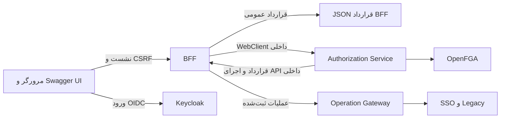

# گزارش بررسی و اصلاح Swagger و OpenAPI — ۲۰۲۶/۰۹/۱۲

این بازبینی روی Swagger موجود Aurevia انجام شد: بارگذاری واقعی صفحه، تولید JSON هر دو قرارداد، نمونه‌های درخواست، ورود OIDC، CSRF، مجوز اجرای API داخلی و اجرای درخواست از مرورگر. ایرادها در کد اصلاح شدند و راهنمای استفاده نیز با رفتار جاری هماهنگ شد. نتیجهٔ قابل ممیزی در [فایل شواهد](evidence/swagger-openapi-review-results.json) نگهداری می‌شود؛ این فایل قرارداد API نیست.

## دامنه و معماری

پرتال دو قرارداد دارد: BFF عمومی و Authorization Service. سرویس‌های اختیاری `test-sso-service` و `test-legacy-service` وابستگی Springdoc و Swagger عمومی مستقل ندارند. APIهای آن‌ها از route ثبت‌شدهٔ BFF استفاده می‌کنند؛ مسیرها و روش احراز هویت در [گزارش آزمون SSO و Legacy](e2e-sso-legacy-proxy-test-fa.md) آمده‌اند. برای این بازبینی port آن سرویس‌ها باز نشد و credential پایین‌دست به مرورگر داده نشد.



UI و تمام درخواست‌های Swagger پس از ورود از origin سوپر اپ استفاده می‌کنند. JSON سرویس مجوزدهی و `Try it out` آن از façade توسعهٔ BFF عبور می‌کنند. این façade در قرارداد عمومی تکرار نمی‌شود، چون `@Hidden` دارد. Basic password یا گواهی mTLS فقط در WebClient سرور مصرف می‌شود.

## ایرادهای پیدا‌شده و اصلاحات

| ایراد مشاهده‌شده | علت | اصلاح و اثبات |
|---|---|---|
| صفحهٔ Swagger پس از ورود `404` می‌داد | catch-all پراکسی عملیاتی قبل از resource handlerهای Springdoc مسیر `swagger-ui` را می‌گرفت | رزرو ریشه‌های `swagger-ui` و `webjars` در mapping پراکسی؛ تست WebFlux و دریافت HTML/assets واقعی |
| JSON قرارداد BFF `500` می‌داد | metadata فارسی `IdentityProviderLoginController` در کاتالوگ نبود | اضافه‌شدن مستندات discovery و login، امنیت anonymous و پاسخ `302` ورود |
| JSON قرارداد Authorization Service `500` می‌داد | endpointهای جدید Identity Provider و External Identity پوشش مستندات نداشتند | مستندسازی ۸ عملیات provider و ۳ عملیات external identity، همراه مثال DTOهای درخواست |
| تست پوشش قبلی این کمبودها را کشف نمی‌کرد | فهرست controllerها در تست ثابت بود | کشف خودکار `@RestController`ها در package API، رعایت `@Hidden` و بررسی تمام متدهای mapped |
| schema برخی درخواست‌ها اشتباه بود | DTOهای هم‌نام، از جمله دو `GrantRequest`، به component مشترک تبدیل می‌شدند | فعال‌شدن `springdoc.use-fqn=true` در هر دو سرویس؛ بررسی required و enum نمونه‌ها با schema واقعی |
| نمونهٔ `identity/login-sync` معتبر نبود | `providerCode` الزامی به مثال قدیمی اضافه نشده بود | تکمیل مثال داخل کد و راهنمای فارسی |
| عملیات در Swagger UI دیده نمی‌شدند | `filter: true` به رشتهٔ `"true"` در config تبدیل می‌شد و UI همان متن را جست‌وجو می‌کرد | حذف فیلتر اولیه و بررسی نمایش و Execute واقعی در Chrome |
| اجرای API داخلی برای مدیر نیز `403` داشت | actionِ `manage` در resource/action کاتالوگ فعال نبود | بررسی `admin` روی `application:aurevia`، مطابق کاتالوگ فعلی؛ semantics آن همچنان `can_manage` است |
| امنیت عملیات catch-all در قرارداد ناقص بود | reflection روی `@RequestMapping` نوع عملیات تولیدشده را مشخص نمی‌کرد | customizer نهایی بر اساس HTTP method، الزام همزمان نشست و CSRF برای mutationهای BFF |
| UI هدرهای actor را از کاربر طلب می‌کرد | metadata API داخلی بدون توضیح façade نمایش داده می‌شد | actor headers در پرتال optional و توضیح فارسی خودکارشدن آن‌ها؛ BFF مقادیر را از نشست می‌سازد |
| غیرفعال‌کردن API docs در dev مسیر اجرای داخلی را حذف نمی‌کرد | شرط فعال‌بودن façade فقط profile بود | افزودن شرط `springdoc.api-docs.enabled=true`؛ تست dev، flag خاموش و prod |
| correlation بررسی مجوز با درخواست اصلی فرق داشت | UUID مستقل برای precheck ساخته می‌شد | استفاده از correlation ورودی در بدنه و header بررسی مجوز؛ تست ارسال و بازنویسی actor جعلی |
| محدودکردن مسیر façade صرفاً به prefix متکی بود | مسیر دارای separator تکراری، encoding یا traversal می‌توانست مبهم باشد | الزام برابری با `RouteNormalizer.normalizePath`؛ تست رد مسیرهای نامعتبر قبل از forwarding |
| نمونهٔ Resource Manifest راهنما با قرارداد جاری فرق داشت | داده‌های route/navigation مربوط به MF Manifest در آن آمده بود | جداسازی مثال Resource Manifest و توضیح چرخهٔ مستقل MF Manifest |

سیاست نشست، CSRF، Token Vault، TLS و مجوز سرویس مقصد پابرجاست. تغییر action بررسی Swagger به معنی دادن grant جدید نیست؛ کاربر فاقد دسترسی مدیریتی در آزمون واقعی `403` گرفت.

## آدرس‌ها و تنظیمات

آدرس محلی پرتال:

```text
http://localhost:8443/swagger-ui.html
```

| مسیر | کاربرد | شرط دسترسی |
|---|---|---|
| `/swagger-ui.html` | هدایت به `/swagger-ui/index.html` | نشست؛ کاربر anonymous به `/auth/login` هدایت می‌شود |
| `/swagger-ui/**` و `/webjars/**` | فایل‌های UI | همان سیاست امنیتی BFF |
| `/v3/api-docs/swagger-config` | تنظیم دو قرارداد | نشست |
| `/v3/api-docs` | JSON قرارداد BFF | نشست |
| `/api/v1/docs/authorization/openapi` | JSON قرارداد داخلی از BFF | نشست و façade فعال |
| `/api/v1/docs/authorization/execute/internal/v1/**` | اجرای API داخلی | نشست، دسترسی `admin` ریشه، مجوز خود endpoint؛ برای mutationها CSRF |
| `/auth/providers` و `/auth/login` | انتخاب provider و شروع ورود | anonymous؛ بدون اطلاعات محرمانه |

| تنظیم | مقدار یا رفتار جاری |
|---|---|
| Java / Spring Boot / Springdoc | ۲۱ / ۳٫۵٫۵ / ۲٫۸٫۱۴؛ نسخه‌ها تغییر نکردند |
| نسخهٔ OpenAPI تولیدشده | `3.1.0` |
| `springdoc.use-fqn` | `true` در هر دو سرویس |
| `swagger-ui.persist-authorization` | `false` |
| validator بیرونی Swagger | غیرفعال، `validatorUrl` خالی |
| فیلتر اولیه | تنظیم نشده؛ قرارداد کامل نمایش داده می‌شود |
| server قرارداد BFF | `/`؛ همان origin |
| server قرارداد Authorization Service | `/api/v1/docs/authorization/execute` |
| `aurevia.documentation.max-openapi-bytes` | پیش‌فرض `2097152` بایت، حد مجاز ۲۵۶ KiB تا ۸ MiB |
| `OPENAPI_MAX_BYTES` | متغیر محیطی سقف مستقل façade؛ سقف WebClientهای عملیاتی تغییر نکرده است |
| façade توسعه | فقط `!prod` و `springdoc.api-docs.enabled=true` |
| profileِ `prod` | API docs و Swagger UI هر دو غیرفعال؛ façade تعریف نمی‌شود |

نام کامل schema از برخورد DTOها جلوگیری می‌کند. این تغییر نام componentهای OpenAPI را عوض می‌کند؛ مصرف‌کننده‌ای که SDK تولید می‌کند باید آن را دوباره تولید کند. URL API و نام فیلدهای JSON به این دلیل تغییر نمی‌کنند.

## استفاده و Try it out

۱. پرتال را باز کنید و با حساب محلی وارد شوید. success handler فعلی بعد از ورود به `/` می‌رود؛ در این حالت آدرس Swagger را دوباره باز کنید.

۲. قرارداد BFF را انتخاب و `GET /api/v1/csrf` را با `Try it out` و `Execute` اجرا کنید. برای GET خواندنی، cookie نشست به‌صورت خودکار ارسال می‌شود و CSRF header لازم نیست.

۳. برای POST، PUT، PATCH یا DELETE مقدار `token` را از پاسخ CSRF بردارید و در `Authorize` برای `csrfToken` وارد کنید. نام header فعلی `X-CSRF-TOKEN` است. اگر قرارداد را عوض کردید، وضعیت Authorize قرارداد انتخاب‌شده را بررسی و در صورت نیاز CSRF را دوباره وارد کنید. مقدار cookie نشست را کپی نکنید.

۴. برای اجرای قرارداد داخلی، قرارداد «۲ - سرویس مجوزدهی» را انتخاب کنید. هدرهای `X-Actor`، `X-Actor-Issuer` و `X-Actor-Subject` توسط BFF از نشست ساخته می‌شوند؛ ورود دستی آن‌ها لازم نیست و actor جعلی جای actor نشست را نمی‌گیرد. دسترسی به خود JSON با اجازهٔ اجرای endpointها یکسان نیست.

۵. شناسه‌های نمونه را با شناسه‌های واقعی حاصل از GETهای رجیستری جایگزین کنید. نمونه‌ها دادهٔ قابل استفاده در محیط production یا دستور ساخت grant نیستند. در POST بررسی دسترسی، `issuer` و `subjectId` باید به هویت واقعی مربوط باشند؛ در محیط محلی اطلاعات کاربر جاری از `GET /api/v1/me` قابل دریافت است.

نشست `AUREVIA_SESSION` opaque و HttpOnly است. OAuth access/refresh token و credential Legacy در Swagger، URL و storage مرورگر قرار نمی‌گیرند. CSRF token راز OAuth نیست؛ با تغییر یا انقضای نشست، CSRF همان نشست را دوباره دریافت کنید. مسیرهای Superset از مدل CSRF مستقل خود استفاده می‌کنند و customizer جدید آن‌ها را به CSRF عمومی BFF تبدیل نمی‌کند.

## روش اجرای آزمون‌ها

Core، Keycloak، OpenFGA و وابستگی‌های local باید آماده باشند. برای مجموعهٔ رگرسیون SSO/Legacy، stack اختیاری و کاربران آزمون نیز باید آماده باشند؛ راه‌اندازی آن‌ها در [گزارش مربوط](e2e-sso-legacy-proxy-test-fa.md) آمده است.

```powershell
.\mvnw.cmd -pl services/superapp-bff,services/authorization-service -am package -o
npm run swagger:verify
npm run e2e:auth:verify
```

گزینهٔ `-o` فقط وقتی dependencyهای Maven از قبل cache شده‌اند مناسب است. در این محیط، overlay اختیاری Core فایل JAR ساخته‌شدهٔ میزبان را mount می‌کند. پس از build، بارگذاری کد جدید با این فرمان انجام شد:

```powershell
docker compose --env-file .env -f infra/docker-compose/compose.yml -f infra/docker-compose/compose.e2e-auth-core.yml up -d --no-deps --no-build --force-recreate authorization-service aurevia-bff nginx
```

قبل از اجرای verifier باید BFF و Authorization Service healthy باشند. در استقرار معمولی بدون overlay، JAR میزبان خودکار وارد image نمی‌شود؛ image سرویس تغییرکرده را طبق روش build/deploy پروژه بازسازی کنید.

`swagger:verify` تنها origin محلی با hostnameِ `localhost` را قبول می‌کند. `AUREVIA_BASE_URL` پیش‌فرض `http://localhost:8443` است. رمز مدیر از `AUREVIA_DEMO_PASSWORD` یا fixture محلی Keycloak خوانده می‌شود و در خروجی چاپ نمی‌شود. کاربر بدون مجوز از کاربران محلی آزمون یا fixture realm انتخاب می‌شود. فایل‌های موقت audit در `.tmp/swagger/` از Git کنار گذاشته شده‌اند.

| خروجی | محتوا |
|---|---|
| `target/swagger/results.json` | نتیجهٔ امن هر مورد Swagger، خلاصهٔ دو قرارداد و اجرای مرورگر |
| `target/swagger/swagger-execute.png` | تصویر محلی اجرای موفق Swagger؛ artifact تولیدشده، خارج از Git |
| `target/e2e-auth/results.json` | اجرای مجدد ۴۱ سناریوی SSO/Legacy |
| `services/*/target/surefire-reports/TEST-*.xml` | شمارش واقعی JUnit هر ماژول |
| [شواهد بازبینی](evidence/swagger-openapi-review-results.json) | snapshot امن نتایج این بازبینی و شمارش آزمون‌ها |

آزمون زنده Swagger، HTML/assets، تنظیم دو قرارداد، summary فارسی، یکتایی operationId، required بودن پارامترهای مسیر، resolve شدن referenceها، فیلدهای الزامی و enum مثال‌ها، CSRF، رد مسیر غیرمجاز، رد کاربر بدون مجوز و اجرای Chrome را بررسی می‌کند. نبود وابستگی ضروری مورد مربوط را `BLOCKED` می‌کند؛ وجود FAIL یا BLOCKED باعث exit غیرصفر است.

آزمون مرورگر با Chrome/Edge نصب‌شده و CDP موجود پروژه انجام می‌شود: ورود واقعی Keycloak، اجرای GET مربوط به CSRF در BFF، تغییر قرارداد، GET پنل‌ها و POST بررسی دسترسی با CSRF. شبکهٔ پس از ورود، storage، URL و نبود Authorization header از نوع Bearer/Basic نیز بررسی می‌شوند. برای actor و CSRF، آزمون صرفاً به بازشدن صفحه اکتفا نمی‌کند.

## فایل‌های مرتبط و مسئولیت نگهداری

| فایل یا مجموعه | مسئولیت |
|---|---|
| `pom.xml` و pom دو سرویس | نسخه‌های وابستگی؛ UI در BFF و تولید JSON داخلی در Authorization Service |
| `services/superapp-bff/src/main/java/com/aurevia/bff/api/OperationalProxyController.java` | رزرو مسیر assets بدون تغییر تصمیم مجوز پراکسی عملیاتی |
| `services/superapp-bff/src/main/java/com/aurevia/bff/api/DeveloperDocumentationController.java` | façade، محدودیت مسیر/حجم، بررسی admin، actor و correlation |
| `services/superapp-bff/src/main/java/com/aurevia/bff/docs/BffOpenApiConfiguration.java` | tags، summaries، مثال‌ها، پاسخ login و security هر روش HTTP |
| `services/authorization-service/src/main/java/com/aurevia/authz/docs/ApiDocumentationCatalog.java` | کاتالوگ توضیحات فارسی endpointها |
| `services/authorization-service/src/main/java/com/aurevia/authz/docs/ApiDocumentationExamples.java` | payloadهای نمونهٔ پاک‌سازی‌شده مطابق DTO |
| `services/authorization-service/src/main/java/com/aurevia/authz/docs/ApiSchemaDocumentation.java` | توضیح schema/پارامترها، enum provider و actor headers پرتال |
| `services/{superapp-bff,authorization-service}/src/main/resources/application.yml` | مسیرها، نام کامل schema و config Swagger |
| `services/{superapp-bff,authorization-service}/src/main/resources/application-prod.yml` | غیرفعال‌سازی قرارداد و UI در production |
| `OpenApiDocumentationCoverageTest` در هر دو سرویس | کشف خودکار endpointهای فاقد مستندات فارسی/مثال |
| `SwaggerResourceRoutingTest` و fixture آن | اثبات تقدم resource handler و حفظ route عملیاتی |
| `BffOpenApiSecurityTest` | امنیت catch-allهای تغییردهنده و قرارداد ورود anonymous |
| `DeveloperDocumentationControllerTest` | محدودیت buffer، profile/flag و رد مسیر نامعتبر |
| `SwaggerExecutionAuthorizationTest` | مجوز admin ریشه، رد کاربر، actor نشست و correlation |
| `tools/verify-swagger.mjs` و `package.json` | فرمان مستقل و نتیجهٔ PASS/FAIL/BLOCKED |
| `tools/swagger-browser-e2e.mjs` | اجرای واقعی Swagger و کنترل مرورگر/شبکه |
| [راهنمای Swagger](swagger-openapi-fa.md) و [فهرست OpenAPI](openapi/README-fa.md) | راهنمای روزمره و دسترسی به قرارداد جاری |

کنترل امنیت سرور در SecurityConfigurationهای موجود، Token Vault، RouteNormalizer و interceptor مجوز داخلی اعمال می‌شود. این فایل‌ها برای فعال‌کردن Swagger از کنترل‌های خود خالی نشده‌اند. هنگام افزودن endpoint، DTO و mapping منبع حقیقت هستند؛ metadata فارسی و مثال را همزمان به‌روز و آزمون پوشش و verifier زنده را اجرا کنید.

## نتایج واقعی اجرای نهایی

اجرای نهایی Swagger در `2026-09-12T18:23:44.762Z`، برابر ساعت ۲۱:۵۳:۴۴ تهران، پایان یافت. اجرای مجدد proxyها در `2026-09-12T18:17:22.652Z` پایان یافت. این شمارش از نتیجهٔ واقعی runnerها و XMLهای Surefire استخراج شده است.

| مجموعه | PASS | FAIL / ERROR | BLOCKED / SKIPPED |
|---|---:|---:|---:|
| JUnit ماژول `ui-artifact-security` | ۷ | ۰ | ۰ |
| JUnit ماژول `superapp-bff` | ۷۰ | ۰ | ۰ |
| JUnit ماژول `authorization-service` | ۱۲۸ | ۰ | ۰ |
| آزمون مستقل Swagger، شامل مرورگر واقعی | ۱۹ | ۰ | ۰ |
| رگرسیون زندهٔ SSO/Legacy، شامل چهار سناریوی مرورگر | ۴۱ | ۰ | ۰ |
| مجموع موارد اجراشده | **۲۶۵** | **۰** | **۰** |

سه Execute مرورگر داخل مورد `BROWSER-SWAGGER` قرار دارند و دوباره به مجموع اضافه نشده‌اند. چهار سناریوی مرورگر SSO/Legacy نیز داخل همان ۴۱ مورد هستند. نتیجهٔ اجرای قدیمی frontend جزو شمارش این بازبینی نیست.

| قرارداد runtime | operation | operationId یکتا | reference خراب | نمونهٔ درخواست بررسی‌شده |
|---|---:|---:|---:|---:|
| BFF | ۵۲ | ۵۲ | ۰ | ۸ |
| Authorization Service | ۱۳۰ | ۱۳۰ | ۰ | ۵۰ |

در هر دو قرارداد، summary فارسی، پاسخ و پارامترهای required مسیر بررسی شدند. در مرورگر، GETِ `/api/v1/csrf`، GETِ `/internal/v1/registry/panels` و POSTِ `/internal/v1/authorize/check` از دکمهٔ Execute پاسخ `200` دادند. بدنهٔ POST و header ضد-CSRF واقعی بررسی شدند و تصمیم `ALLOW` بود. هر ۱۶ درخواست شبکه از همان origin بود؛ دو asset درون‌صفحه‌ای `data:` درخواست به سرور بیرونی نبودند. Authorization header از نوع Bearer/Basic و token احراز هویت در storage یا URL دیده نشد.

فایل شواهد، نتیجهٔ همهٔ موارد و خلاصهٔ Java را دارد و با checker موجود از نظر JWT، credential Legacy و رمزهای واقعی کاربران محلی پاک‌سازی/بررسی شده است. تصویر تولیدشدهٔ مرورگر فقط artifact محلی است؛ secretهای محیط، cookieها و فایل‌های تنظیمات خصوصی به مستندات منتقل نشده‌اند.

## حدود ادعا و موارد وابسته به محیط

- آزمون نمونه‌ها required و enum را کنترل می‌کند؛ جای validator کامل JSON Schema یا اجرای تمام ۱۸۲ operation نیست. شناسه، URL و reference مثال‌ها همچنان باید برای محیط واقعی جایگزین شوند.
- قرارداد catch-all پراکسی BFF عملیات ثبت‌شده در دیتابیس یا schema پایین‌دست را خودکار به operationهای مستقل تبدیل نمی‌کند. پاسخ `Map` یا byteهای upstream نیز قرارداد کامل SDK آن سرویس نیست.
- پارامتر ادامهٔ مسیر catch-all نباید با `/` شروع شود. Swagger ممکن است separatorهای داخل path parameter را encode کند؛ RouteNormalizer مسیر مبهم یا separator کدشده را رد می‌کند. اجرای سه endpoint مشخص در UI، اثبات اجرای همهٔ مسیرهای catch-all در Swagger نیست؛ رگرسیون ۴۱‌موردی مسیرهای SSO/Legacy را با کلاینت و مرورگر خود آن برنامه‌ها بررسی می‌کند.
- پاسخ‌های خطای مستندشده عمومی‌اند؛ قالب واقعی ممکن است با error handler Spring یا سرویس upstream فرق داشته باشد. از correlation، status و قرارداد همان endpoint استفاده کنید.
- غیرفعال‌بودن façade در prod و با flag خاموش در تست بررسی شد. استقرار کامل production با گواهی واقعی mTLS، ingress نهایی و secret manager بیرونی در این بازبینی اجرا نشده است.
- Node این میزبان `22.14.0` بود و کمتر از نسخهٔ اعلام‌شدهٔ پروژه است؛ verifierها در همین محیط اجرا شدند. نسخه‌های اعلام‌شدهٔ پروژه تغییر نکردند؛ CI باید از نسخهٔ موردنیاز پروژه استفاده کند.
