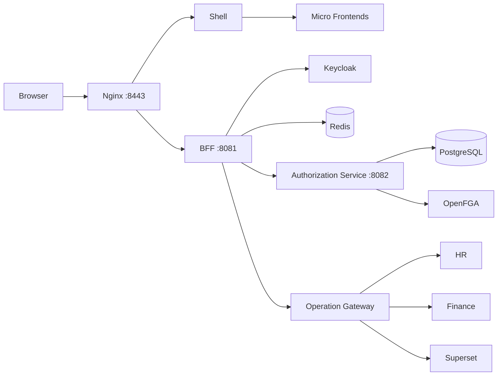

# راهنمای آموزشی صفر تا تسلط تیم فنی Aurevia

این سند برای onboarding توسعه‌دهنده‌ای نوشته شده که هیچ شناخت قبلی از پروژه ندارد. هدف این است که عضو تیم پس از مطالعه بتواند پروژه را اجرا کند، مسیر هر درخواست را دنبال کند، کد هر لایه را بفهمد، قابلیت جدید بسازد، دسترسی OpenFGA تعریف کند و خطاهای رایج را عیب‌یابی کند.

منظور از «خط‌به‌خط» در این راهنما توضیح هر خط مؤثر و هر بلوک منطقی کد است. فایل‌های تولیدشده مانند `*.d.ts`، خروجی‌های `dist/` و `target/` و lockfileها منطق دست‌نویس ندارند و نباید به‌جای source ویرایش شوند.

## ۱. تصویر ذهنی پروژه در پنج دقیقه

Aurevia یک Super App است. کاربر یک Shell را باز می‌کند؛ Shell بر اساس دسترسی کاربر چند Micro Frontend مستقل را بارگذاری می‌کند. مرورگر مستقیم به سرویس‌های سازمانی، OpenFGA یا Superset عملیاتی متصل نمی‌شود. همه درخواست‌ها از Nginx و BFF عبور می‌کنند.



سه قانون را همیشه به خاطر بسپارید:

1. Keycloak می‌گوید کاربر چه کسی است؛ OpenFGA می‌گوید چه کاری مجاز است.
2. Manifest فقط UI را تنظیم می‌کند؛ API باید دوباره مجوز را enforce کند.
3. access token هرگز وارد JavaScript، localStorage یا sessionStorage نمی‌شود.

## ۲. واژه‌نامه ضروری

| اصطلاح | تعریف ساده |
|---|---|
| Shell | برنامه میزبان که منو و MFEها را نمایش می‌دهد |
| MFE | برنامه React مستقل که در runtime داخل Shell mount می‌شود |
| Module Federation | مکانیزم Webpack برای بارگذاری کد remote در runtime |
| BFF | Backend For Frontend؛ تنها backend مورد استفاده مرورگر |
| OIDC | پروتکل ورود مبتنی بر OAuth2 و identity token |
| Authorization Code Flow | جریان امن ورود که code در backend به token تبدیل می‌شود |
| Manifest | snapshot پنل‌ها و permissionهای مؤثر کاربر برای UI |
| Resource | چیزی که محافظت می‌شود؛ صفحه، API، رکورد یا dashboard |
| Action | کار کسب‌وکاری روی resource؛ view، update، approve و غیره |
| Relation | رابطه مستقیم OpenFGA؛ viewer، editor، manager و غیره |
| Permission | نتیجه محاسباتی OpenFGA؛ can_view، can_edit و غیره |
| Tuple | سه‌تایی user/relation/object در OpenFGA |
| Outbox | صف تراکنشی PostgreSQL برای projection امن tupleها |
| Token Vault | نگهداری رمز‌شده tokenها در Redis سمت سرور |
| Control Plane | APIهای تعریف resource، role، grant و registry |
| Data Plane | مسیر runtime درخواست واقعی کاربر |

## ۳. ابزارها و اجرای پروژه

نسخه‌های پایه:

- Node.js 22.14.0
- npm 10.9.2
- Java 21
- Spring Boot 3.5.5
- OpenFGA رسمی 1.18.1
- Apache Superset رسمی 5.0.0
- PostgreSQL 17
- Redis 8

اجرای محلی:

```powershell
Copy-Item .env.example .env
npm ci
npm run build
npm run infra:up
```

تست:

```powershell
npm test
$env:JAVA_HOME='C:\Program Files\Eclipse Adoptium\jdk-21'
.\mvnw.cmd verify
```

آدرس‌ها:

| برنامه | URL |
|---|---|
| Super App | `http://localhost:8443` |
| Admin MFE مستقل | `http://localhost:3001` |
| HR MFE مستقل | `http://localhost:3002` |
| Finance MFE مستقل | `http://localhost:3003` |
| Reports MFE مستقل | `http://localhost:3004` |
| Keycloak | `http://localhost:8180` |
| OpenFGA API | `http://localhost:8080` |
| Superset tunnel | `http://localhost:8443/reports-runtime/superset/welcome/` |

کاربر توسعه:

```text
username: administrator
password: local-change-me
```

## ۴. ساختار ریشه مخزن

### `package.json`

- `workspaces` تمام appها و packageهای frontend را در یک dependency graph قرار می‌دهد.
- `build --workspaces --if-present` build هر workspace را اجرا می‌کند.
- `dev:mfe:*` هر remote را روی پورت مستقل اجرا می‌کند.
- `infra:up` Compose را با `.env` و profile کامل Superset بالا می‌آورد.
- `infra:down` تمام سرویس‌های همان profile را متوقف می‌کند.

### `pom.xml`

- Maven reactor والد دو سرویس Java است.
- نسخه Java و Spring Boot را یک‌جا pin می‌کند.
- اجرای `mvnw verify` هر دو سرویس و تست‌ها را پوشش می‌دهد.

### `tsconfig.base.json`

- strictness و تنظیمات مشترک TypeScript را تعریف می‌کند.
- هر workspace با `extends` آن را مصرف می‌کند.

### `.env.example`

قرارداد تنظیمات محیطی است، نه محل secret واقعی. فایل `.env` محلی باید ignored بماند. مقادیر `change-me` برای production ممنوع‌اند.

## ۵. Frontend از اولین خط تا mount شدن MFE

### ۵.۱ `apps/shell/public/index.html`

- document پایه مرورگر است.
- فقط container ریشه را فراهم می‌کند.
- Webpack bundle را هنگام build تزریق می‌کند.

### ۵.۲ `apps/shell/src/index.tsx`

ترتیب importها:

- React و `createRoot` runtime UI را می‌آورند.
- Ant Design layout، menu، feedback و locale را فراهم می‌کند.
- `EffectiveManifest` و `PanelManifest` قرارداد compile-time هستند.
- `SHManifestProvider` manifest را در context مشترک قرار می‌دهد.
- `loadRemote` remoteEntry را امن و lazy بارگذاری می‌کند.

ثابت `empty` یک manifest بسته و بدون permission می‌سازد. کاربرد آن جلوگیری از undefined context است، نه اعطای دسترسی.

`RemoteBoundary` یک React Error Boundary است:

1. در حالت عادی children را render می‌کند.
2. اگر MFE هنگام render exception بدهد، `getDerivedStateFromError` مقدار `failed` را true می‌کند.
3. فقط همان remote با Alert جایگزین می‌شود و Shell از کار نمی‌افتد.

`RemoteHost` مسئول lifecycle remote است:

1. `host` عنصر DOM مقصد mount را نگه می‌دارد.
2. `error` و `loading` state نمایشی هستند.
3. scope از slug پنل ساخته می‌شود؛ مثلاً `mfe-hr` به `aurevia_hr` تبدیل می‌شود.
4. `loadRemote` URL کامل، exposed module و allowlist تمام remoteهای manifest را می‌گیرد.
5. remote پس از load، تابع `mount` را با locale، manifest و correlation-id factory اجرا می‌کند.
6. مقدار برگشتی `mount` cleanup است و هنگام unmount شدن panel فراخوانی می‌شود.
7. متغیر `cancelled` مانع mount دیرهنگام پس از تغییر route می‌شود.

`App` جریان اصلی Shell است:

1. locale، manifest، panel انتخاب‌شده و خطا را در state نگه می‌دارد.
2. در اولین `useEffect`، `/api/v1/me/manifest` را same-origin fetch می‌کند.
3. 401، 302 یا opaque redirect باعث شروع OIDC login می‌شود.
4. اولین panel مجاز پس از دریافت manifest انتخاب می‌شود.
5. `ConfigProvider` RTL/LTR و theme را اعمال می‌کند.
6. `SHManifestProvider` snapshot واحد permission را به تمام remoteها می‌دهد.
7. Menu فقط از `manifest.panels` ساخته می‌شود.
8. محتوای panel داخل `RemoteBoundary` و `RemoteHost` اجرا می‌شود.

آخرین خط `createRoot(...).render(<App/>)` React را به DOM متصل می‌کند.

### ۵.۳ `apps/shell/src/remote-loader.ts`

این فایل قلب Module Federation runtime است:

1. URL با `new URL` parse می‌شود.
2. protocol فقط `http:` یا `https:` پذیرفته می‌شود.
3. URL باید در allowlist پنل‌های manifest باشد؛ URL دلخواه کاربر پذیرفته نمی‌شود.
4. اگر script قبلاً load شده باشد دوباره inject نمی‌شود.
5. یک `<script src="remoteEntry">` به document اضافه می‌شود.
6. خطای network یا script به Promise rejection تبدیل می‌شود.
7. Webpack share scope initialize می‌شود.
8. container از `window[scope]` گرفته می‌شود.
9. `container.init` dependencyهای singleton مانند React را هماهنگ می‌کند.
10. `container.get(exposedModule)` factory ماژول remote را می‌دهد.
11. `contractVersion` قبل از استفاده باید با Shell سازگار باشد.

### ۵.۴ فایل‌های `webpack.config.cjs`

در هر MFE:

- `entry` برابر `src/index.ts` است.
- `output.publicPath='auto'` chunkها را نسبت به remote URL پیدا می‌کند.
- `clean:true` خروجی قدیمی را حذف می‌کند.
- `ts-loader` TypeScript/TSX را compile می‌کند.
- `HtmlWebpackPlugin` حالت standalone را با `index.html` می‌سازد.
- `ModuleFederationPlugin` نام scope، `remoteEntry.js` و `./bootstrap` را تعریف می‌کند.
- React، ReactDOM، Ant Design و contracts singleton هستند.
- devServer روی پورت مخصوص MFE اجرا و CORS remote را فعال می‌کند.

### ۵.۵ الگوی مشترک هر MFE

`src/index.ts` فقط `standalone` را async import می‌کند. async boundary لازم است تا shared moduleها قبل از initialize شدن مصرف نشوند.

`src/standalone.ts`:

1. `mount` را از bootstrap می‌گیرد.
2. عنصر `#root` را پیدا می‌کند.
3. یک manifest بسته محلی می‌سازد.
4. remote را مستقل از Shell mount می‌کند.

`src/bootstrap.tsx`:

1. `contractVersion='1'` را صادر می‌کند.
2. component اصلی دامنه را تعریف می‌کند.
3. `mount(element, context)` یک React root می‌سازد.
4. context داده‌شده توسط Shell را به componentها می‌رساند.
5. cleanup تابع `root.unmount` را برمی‌گرداند.

### ۵.۶ Admin MFE

`bootstrap.tsx` چهار workspace مدیریتی را در Tabs جمع می‌کند:

- Access Studio
- Panel Registry
- Superset Assets
- Identity and Roles

تابع `api`:

1. URL را فقط زیر `/api/v1/admin` می‌سازد.
2. cookie session را با `credentials:'same-origin'` می‌فرستد.
3. برای mutation ابتدا CSRF را از `/api/v1/csrf` می‌گیرد.
4. header نام‌گذاری‌شده توسط backend را اضافه می‌کند.
5. پاسخ غیرموفق را exception می‌کند.

`AccessStudio.tsx` UX یکپارچه درخت resource، subject و grant را فراهم می‌کند. `Panels.tsx` URL کامل Remote Entry، exposed module و route را مدیریت می‌کند. `SupersetAssets.tsx` دارایی خارجی Superset را به resource داخلی قابل grant تبدیل می‌کند.

### ۵.۷ HR و Finance MFE

هر دو فایل bootstrap این الگو را دارند:

1. متن فارسی/انگلیسی در object ثابت قرار دارد.
2. تابع request فقط prefix همان دامنه را فراخوانی می‌کند.
3. GETها employee/payment/dataset را load می‌کنند.
4. mutationها CSRF می‌گیرند.
5. loading، error، retry و empty state جدا هستند.
6. actionهای UI با `SHAction` پوشانده می‌شوند.
7. backend همچنان مجوز را دوباره بررسی می‌کند.

### ۵.۸ Reports MFE

- `/api/v1/reports` فقط assetهای publish‌شده و مجاز را می‌خواند.
- URL گزارش از metadata server می‌آید.
- runtime گزارش زیر `/reports-runtime` باز می‌شود.
- هیچ guest token در frontend تولید یا ذخیره نمی‌شود.

## ۶. packageهای مشترک

### `packages/contracts/src/index.ts`

- `Locale`: localeهای پشتیبانی‌شده.
- `PresentationMode`: hide، disable یا readOnly.
- `PanelManifest`: قرارداد deployment هر remote.
- `ResourceType`: هفت نوع resource.
- `ManifestResource`: گره قابل نمایش درخت.
- `EffectiveManifest`: قرارداد پاسخ BFF.
- `RemoteModule`: قرارداد binary بین Shell و MFE.
- `RemoteContext`: context runtime هنگام mount.

تغییر breaking در این فایل نیازمند افزایش `contractVersion` و migration هماهنگ تمام remoteهاست.

### `packages/sh-core-ui/src/index.tsx`

- Context داخلی manifest جاری را نگه می‌دارد.
- `SHManifestProvider` snapshot را منتشر می‌کند.
- hook دسترسی action را در `manifest.permissions[resource]` جست‌وجو می‌کند.
- `SHCan` در allow، children و در deny، fallback را render می‌کند.
- `SHRouteGuard` fallback استاندارد Access Denied دارد.
- `SHAction` بر اساس mode عنصر را hide، disable یا read-only می‌کند.

این package security boundary نیست؛ فقط presentation boundary است.

### `packages/i18n/src/index.ts`

translation catalog و توابع direction/text را متمرکز می‌کند تا Shell و MFEها رفتار locale یکسان داشته باشند.

## ۷. Nginx عمومی

`infra/nginx/nginx.conf` را به ترتیب بخوانید:

1. `events {}` بخش اجباری Nginx است.
2. `include mime.types` از MIME اشتباه JS جلوگیری می‌کند.
3. Docker DNS resolver برای upstreamهای پویا تنظیم می‌شود.
4. correlation id ورودی یا request id جدید انتخاب می‌شود.
5. server روی 8080 داخل کانتینر گوش می‌دهد و host روی 8443 publish می‌شود.
6. CSP، nosniff و Referrer-Policy روی پاسخ‌ها قرار می‌گیرند.
7. `location /` Shell و SPA fallback را سرو می‌کند.
8. `/api`, `/auth`, `/oauth2`, `/login` به BFF می‌روند.
9. `/hr-micro` و `/finance-micro` فقط به BFF می‌روند.
10. `/reports-runtime` به tunnel Java بازنویسی می‌شود.
11. `/static` فقط assetهای public Superset را می‌دهد.
12. endpointهای root-relative Superset با referrer قابل اعتماد به tunnel هدایت می‌شوند.

## ۸. BFF: ورود، نشست و Token Vault

### `SuperappBffApplication.java`

entry point Spring Boot است. `main` context reactive را راه‌اندازی می‌کند؛ business logic نباید اینجا قرار گیرد.

### `security/SecurityConfig.java`

1. health، root و شروع login public هستند.
2. هر route دیگر session معتبر می‌خواهد.
3. Spring CSRF روی mutationها فعال است.
4. tunnel Superset از Spring CSRF مستثناست چون Superset CSRF خودش را دارد.
5. OAuth2 login از success handler سفارشی استفاده می‌کند.
6. logout، vault cleanup را اجرا می‌کند.

### `application.yml`

- پورت BFF و forwarded headers را تنظیم می‌کند.
- cookie نشست را HttpOnly، Secure و SameSite=Lax می‌کند.
- Redis session و namespace vault را مشخص می‌کند.
- registration `public-iam` client-id/secret و redirect template دارد.
- authorization URI عمومی است تا مرورگر Keycloak را ببیند.
- token/JWK/userinfo URI داخلی Docker هستند.
- مقصد Authorization Service و Gateway از env می‌آید.

### `OidcLoginSuccessHandler.java`

پس از تبدیل code به token:

1. subject، username، email و groups را از principal می‌گیرد.
2. identity snapshot را به Authorization Service می‌فرستد.
3. tokenهای OAuth را در vault رمز‌شده ذخیره می‌کند.
4. session id را برای جلوگیری از fixation عوض می‌کند.
5. فقط vault handle را در session می‌گذارد.
6. کاربر را به Shell redirect می‌کند.

### `TokenVaultCrypto.java`

- key از Base64 و دقیقاً با طول معتبر AES خوانده می‌شود.
- برای هر encryption IV تصادفی جدید ساخته می‌شود.
- AES-GCM هم محرمانگی و هم integrity می‌دهد.
- key id کنار ciphertext rotation آینده را ممکن می‌کند.
- ciphertext خراب باید decrypt failure بدهد، نه داده ناقص.

### `TokenVaultService.java`

- access token، refresh token و expiry را serialise می‌کند.
- payload قبل از Redis رمز می‌شود.
- TTL رکورد محدود به عمر refresh/session است.
- JavaScript هیچ endpoint دریافت token ندارد.

### refresh

- `RefreshCoordinator` برای هر handle فقط یک refresh هم‌زمان می‌پذیرد.
- `TokenRefreshService.ensureFresh` نزدیک expiry پیش‌دستانه refresh می‌کند.
- اگر upstream یک بار 401 بدهد، refresh کنترل‌شده و یک retry انجام می‌شود.
- خطای refresh token قبلی را overwrite نمی‌کند و session باید نامعتبر شود.

## ۹. BFF Controllerها

### `CsrfController`

token تولیدشده Spring را به شکل `{headerName, token}` برمی‌گرداند تا frontend نام header را hardcode نکند.

### `MeController`

- `/api/v1/me` اطلاعات هویت جاری را می‌دهد.
- `/api/v1/me/manifest` subject را به Authorization Service می‌فرستد.
- bearer token به frontend داده نمی‌شود.

### `AdminProxyController`

- فقط prefix مدیریت را proxy می‌کند.
- Basic credential workload را BFF اضافه می‌کند.
- actor و correlation id برای audit ارسال می‌شوند.
- مقصد از configuration می‌آید، نه request کاربر.

### `OperationalProxyController`

ترتیب کامل درخواست:

1. path با `RouteNormalizer` normalize می‌شود.
2. method و path به route resolver فرستاده می‌شوند.
3. resolver resource/action/limit را برمی‌گرداند.
4. check مجوز با subject جاری اجرا می‌شود.
5. DENY به 403 تبدیل می‌شود.
6. vault handle از session خوانده می‌شود.
7. token decrypt و در صورت نیاز refresh می‌شود.
8. body با سقف registry خوانده می‌شود.
9. فقط headerهای allowlist‌شده forward می‌شوند.
10. bearer اصلی و correlation id به Gateway می‌روند.
11. یک 401 می‌تواند یک refresh/retry ایجاد کند.
12. response size و timeout enforce می‌شوند.
13. فقط content-type و content-disposition مجاز به مرورگر برمی‌گردند.

### `OperationSupersetProxyController`

همان اصل proxy محدود را برای تمام methodهای Superset پیاده می‌کند، Locationهای root-relative را بازنویسی می‌کند و اجازه نمی‌دهد مرورگر Operation Superset را مستقیم ببیند.

### `RouteNormalizer`

- URL مقصد فقط host/scheme allowlist‌شده را می‌پذیرد.
- backslash، traversal، control character و encoded slash مبهم رد می‌شوند.
- path خروجی canonical است تا registry و proxy یک چیز را بررسی کنند.

## ۱۰. Authorization Service

### entry و security

`AuthorizationServiceApplication` scheduling را برای reconciler فعال می‌کند. `SecurityConfig` health را public و `/internal/**` را با credential داخلی محافظت می‌کند. این API browser-facing نیست.

### `IdentitySyncController`

1. issuer + external subject کلید پایدار کاربر است.
2. login باعث upsert profile می‌شود.
3. group pathها normalize می‌شوند.
4. snapshot membership قبلی با snapshot جدید جایگزین می‌شود.
5. username صرفاً display/search است و identity key نیست.

### `AuthorizationController`

`check`:

1. subject به `user:<subjectId>` تبدیل می‌شود.
2. action با تابع `permission` نگاشت می‌شود.
3. resource باید از قبل object canonical باشد.
4. adapter OpenFGA check را اجرا می‌کند.
5. true به ALLOW و هر false/error به DENY تبدیل می‌شود.
6. decision id یکتا ساخته می‌شود.

`manifest`:

1. panelهای active را می‌خواند.
2. هر panel را با OpenFGA `can_view` فیلتر می‌کند.
3. roleهای مستقیم و group-roleهای منقضی‌نشده را محاسبه می‌کند.
4. grantهای USER، GROUP و ROLE را union می‌کند.
5. permission map را با resource key می‌سازد.
6. resourceهای مجاز و ancestorهای آن‌ها را وارد tree می‌کند.
7. نسخه content-derived، ETag و expiry یک‌دقیقه‌ای می‌سازد.

### `AccessAdminController`

- CRUD resource و action را انجام می‌دهد.
- هفت type resource را validate می‌کند.
- والد ناموجود، self-parent و cycle را رد می‌کند.
- action را به resource متصل می‌کند.
- grant برای USER/GROUP/ROLE می‌سازد.
- action را به relation OpenFGA تبدیل می‌کند.
- grant و outbox در یک transaction ثبت می‌شوند.
- revoke حذف فیزیکی نیست؛ status به ARCHIVED می‌رود.
- هر mutation audit تولید می‌کند.

### `IdentityAdminController`

- groupهای sync‌شده را read-only نمایش می‌دهد.
- role کاربردی می‌سازد.
- role را به user یا group assign/revoke می‌کند.
- assignment نیز outbox relation مربوط به `assignee` می‌سازد.

### `RegistryController`

- metadata پنل‌ها را مدیریت می‌کند.
- Remote Entry باید URL کامل معتبر باشد.
- optimistic locking با version از lost update جلوگیری می‌کند.
- archive جای delete فیزیکی را می‌گیرد.

### `RouteResolutionController`

1. فقط routeهای active را بررسی می‌کند.
2. prefix باید روی مرز segment match شود.
3. طولانی‌ترین prefix برنده است.
4. method و relative pattern operation را تعیین می‌کنند.
5. resource، action، body limit، response limit و timeout برگردانده می‌شوند.
6. route ناشناخته deny/404 است.

### `SupersetAssetController`

دارایی Superset را به `EXTERNAL_RESOURCE` داخلی متصل می‌کند تا dashboard خارجی نیز همان مدل grant، audit و manifest را داشته باشد.

## ۱۱. OpenFGA خط‌به‌خط مفهومی

`infra/openfga/model.fga`:

- `model schema 1.1` نسخه زبان مدل است.
- `type user` هویت نهایی است.
- `type group` relation عضویت user را دارد.
- `type role` relation assignee از user یا group memberset می‌پذیرد.
- `application` ریشه مجوزهاست.
- `resource` پنج نوع داخلی catalog را نمایندگی می‌کند.
- `external_resource` dashboard و سامانه خارجی را نمایندگی می‌کند.
- `parent` ارث‌بری را فعال می‌کند.
- relationهای viewer/editor/manager grant مستقیم‌اند.
- `can_*` permissionهای computed هستند.
- عبارت `can_view from parent` دسترسی والد را به فرزند می‌رساند.

نمونه tuple:

```text
user:administrator | manager | application:aurevia
application:aurevia | parent | resource:module:hr
group:hr#member | assignee | role:hr-viewer
role:hr-viewer#assignee | viewer | resource:business:hr.employee
```

### `OpenFgaConfiguration`

- base URL، Store ID و Model ID را از env می‌گیرد.
- retry SDK را محدود می‌کند.
- نبود Store ID معتبر خطای configuration است.

### `OpenFgaRelationshipAdapter`

`check`:

1. user/relation/object را hash می‌کند.
2. Redis cache را می‌خواند.
3. cache miss به OpenFGA می‌رود.
4. نتیجه true/false پنج ثانیه cache می‌شود.
5. خرابی Redis مانع OpenFGA check نمی‌شود.
6. خرابی OpenFGA fail closed و false است.

`write/delete`:

- SDK tuple را تغییر می‌دهد.
- cache همان check دقیق invalid می‌شود.
- delete tuple ناموجود idempotent تلقی می‌شود.
- سایر خطاها exception هستند تا outbox retry کند.

### `OutboxReconciler`

1. هر پنج ثانیه اجرا می‌شود.
2. ۵۰ event آماده را با `FOR UPDATE SKIP LOCKED` claim می‌کند.
3. event type را به write/delete تبدیل می‌کند.
4. payload استاندارد user/relation/object را می‌خواند.
5. adapter را فراخوانی می‌کند.
6. موفقیت `processed_at` را پر می‌کند.
7. failure attempts و last_error را ثبت می‌کند.
8. backoff تا سقف پنج دقیقه افزایش می‌یابد.

شرح کامل relationها و محدودیت‌های فعلی در [مرجع OpenFGA](architecture-openfga-complete-fa.md) است.

## ۱۲. PostgreSQL و migrationها

قاعده: migration اجراشده را هرگز ویرایش نکنید؛ migration جدید forward-only بسازید.

| Migration | آموزش مسئولیت |
|---|---|
| V1 | enumها، user/group/role، panel، route، resource، grant، policy، audit و outbox |
| V2 | catalog پایه action/resource/panel |
| V3 | کاربران و actionهای توسعه |
| V4 | catalog گزارش نمونه |
| V5 | سطح‌های دسترسی Superset |
| V6 | یکتایی partial برای grant فعال |
| V7 | group، role و admin bootstrap |
| V8 | routeهای HR/Finance |
| V9 | authorization پنل و operationهای کامل |
| V10 | URL کامل MFEها |
| V11 | افزودن `API_RESOURCE` |
| V12 | درخت نمونه تمام هفت resource type |
| V13 | bootstrap tupleهای parent با outbox |

مالکیت داده:

- PostgreSQL منبع حقیقت control plane است.
- OpenFGA projection runtime است.
- Redis transient است.
- در تعارض، ابتدا PostgreSQL و outbox repair می‌شوند و سپس projection بازسازی می‌شود.

## ۱۳. Policy و قواعد دامنه

`StructuredPolicyEvaluator` فقط field/operatorهای allowlist‌شده را اجرا می‌کند؛ script آزاد ندارد. context ناقص، operator ناشناخته و obligation نامعتبر deny هستند.

`OperationalRules` دو نمونه enforcement دامنه دارد:

- `enforceOrgScope`: rowها را به orgUnit subject محدود می‌کند.
- `enforcePaymentApproval`: maker نمی‌تواند approver همان پرداخت باشد.

OpenFGA مجوز کلی را می‌دهد؛ این قواعد محدودیت داده/فرآیند را enforce می‌کنند.

## ۱۴. Superset کامل

معماری دو بخش دارد:

- Public Superset container فقط static assetها را سرو می‌کند.
- Operation Superset کامل dashboard، chart، dataset و query را اجرا می‌کند.

`superset_config.py`:

- metadata DB را از env می‌گیرد.
- Remote User authentication را فعال می‌کند.
- middleware هویت `X-Aurevia-Subject` را به `REMOTE_USER` تبدیل می‌کند.
- ثبت خودکار کاربر با role پایه Gamma انجام می‌شود.
- cookie مستقل و path ریشه برای endpointهای root-relative تنظیم می‌شود.
- ProxyFix و application root برای tunnel فعال‌اند.

init container:

1. migration Superset را اجرا می‌کند.
2. admin محلی را idempotent ایجاد می‌کند.
3. roleها را sync می‌کند.
4. تعداد dashboardها را می‌خواند.
5. فقط اگر صفر و `SUPERSET_LOAD_EXAMPLES=yes` باشد نمونه‌های رسمی را load می‌کند.
6. فقط همین container یک شبکه egress bootstrap دارد.
7. runtime بدون host port و بدون egress می‌ماند.

## ۱۵. افزودن یک قابلیت جدید از صفر

مثال: قابلیت «مرخصی» در HR.

### مرحله database

1. migration جدید بسازید.
2. resource `business:hr.leave` با والد `module:hr` ثبت کنید.
3. actionهای `view`, `create`, `approve` را متصل کنید.
4. route operationهای GET/POST/approve را به همان resource/action وصل کنید.

### مرحله OpenFGA

1. بررسی کنید action موجود به permission درست نگاشت شده است.
2. `approve` اکنون به `can_edit` می‌رود.
3. grant role مناسب را بسازید.
4. model test مثبت و منفی اضافه کنید.

### مرحله backend

1. سرویس عملیاتی endpoint را پیاده کند.
2. org scope و maker-checker لازم را enforce کند.
3. BFF مقصد جدید دلخواه نمی‌خواهد؛ route registry کافی است اگر prefix موجود باشد.

### مرحله frontend

1. typeهای دامنه را تعریف کنید.
2. request helper را زیر `/hr-micro/api/v1/leaves` نگه دارید.
3. loading/error/empty state بسازید.
4. دکمه ایجاد را با `SHAction resource="business:hr.leave" action="create"` بپوشانید.
5. approve را با action متناظر محافظت کنید.

### تست پذیرش

- user مستقیم مجاز است.
- group/role مجاز است.
- user نامرتبط UI را نمی‌بیند.
- bypass دستی frontend از backend 403 می‌گیرد.
- revoke پس از projection دسترسی را حذف می‌کند.
- expiry و OpenFGA outage fail closed هستند.

## ۱۶. استراتژی تست

Frontend:

- permission موجود/ناموجود در `sh-core-ui`؛
- modeهای hide/disable/readOnly؛
- remote loader URL validation؛
- loading/error/empty و cleanup remote.

BFF:

- CSRF؛
- crypto round-trip و ciphertext خراب؛
- RouteNormalizer attack cases؛
- retry فقط برای عملیات امن؛
- token refresh concurrency؛
- response/body limit.

Authorization:

- policy allow/deny/error؛
- maker-checker؛
- cache hit/miss و OpenFGA failure؛
- outbox idempotency؛
- manifest USER/GROUP/ROLE و ancestor tree.

OpenFGA model tests:

- direct user؛
- group membership؛
- role assignment؛
- inheritance؛
- unrelated user deny؛
- editor implies view؛
- manager implies all expected permissions.

## ۱۷. عیب‌یابی مرحله‌ای

### Login `?error`

1. لاگ Keycloak را برای `invalid_client_credentials` ببینید.
2. `OIDC_CLIENT_SECRET` BFF و secret client Keycloak باید برابر باشند.
3. redirect URI باید دقیقاً `localhost:8443/login/oauth2/code/public-iam` را بپذیرد.
4. callback قدیمی را reuse نکنید؛ flow جدید شروع کنید.

### MFE خطای Nginx

1. `/remoteEntry.js` باید 200 و JavaScript باشد.
2. `/` باید `index.html` مستقل بدهد.
3. dist باید build جدید داشته باشد.
4. remote URL در manifest باید کامل و allowlisted باشد.
5. scope و slug باید به نام Module Federation منطبق باشند.

### API برابر 403

1. subject جاری را کنترل کنید.
2. route resolution را بررسی کنید.
3. resource/action operation را ببینید.
4. grant status/expiry را بررسی کنید.
5. outbox `processed_at/last_error` را ببینید.
6. tuple object/relation را با model مقایسه کنید.
7. TTL پنج‌ثانیه‌ای cache را در نظر بگیرید.

### Superset 500/502

1. operation-superset-db healthy باشد.
2. init باید exit code صفر داشته باشد.
3. operation-superset healthy باشد.
4. gateway باید DNS آن را resolve کند.
5. BFF باید gateway را روی شبکه مشترک ببیند.
6. `/reports-runtime/login/` باید cookie مستقل Superset بسازد.

## ۱۸. Observability

هر request باید correlation id را از Nginx تا BFF، Authorization Service، Gateway و سرویس حفظ کند.

metricهای ضروری production:

- login success/failure؛
- token refresh failure؛
- BFF 401/403/5xx؛
- OpenFGA check latency/error/deny rate؛
- Redis latency/error؛
- outbox depth و oldest age؛
- route miss؛
- Superset health/query latency؛
- PostgreSQL connection pool و replication/backup health.

هرگز token، cookie، password، secret، connection string یا PII خام را log نکنید.

## ۱۹. مرز Production

معماری فعلی production-shaped است، اما پیش‌فرض‌های repo production-ready نیستند. قبل از انتشار واقعی:

- HTTPS و Secure cookie واقعی؛
- secret manager و rotation؛
- workload identity/mTLS به‌جای Basic Auth داخلی؛
- Redis و PostgreSQL HA + backup/PITR؛
- OpenFGA persistent و drift reconciliation؛
- اجرای policy در مسیر اصلی check؛
- ثبت decision log؛
- validation relation بر اساس object type؛
- تکمیل share/export و action mapping؛
- WSGI production برای Superset؛
- CSP و rate-limit backend مشترک؛
- network policy و image scanning/SBOM؛
- حذف example data و تمام `change-me`ها.

## ۲۰. فایل‌های تولیدشده و قانون ویرایش

فایل‌های `*.d.ts` declaration خروجی TypeScript هستند. اگر کنار source قرار گرفته‌اند:

- برای فهم runtime، فایل `.ts` یا `.tsx` را بخوانید.
- declaration را دستی ویرایش نکنید.
- اگر build آن را تغییر داد، منبع type یا تنظیم output را اصلاح کنید.

همین قانون برای `dist/`, `target/`, bundleهای شماره‌دار و artifactهای Docker صادق است.

## ۲۱. ترتیب پیشنهادی مطالعه برای عضو جدید

روز اول:

1. همین سند تا بخش ۷.
2. اجرای پروژه و login.
3. مشاهده Network tab و manifest.
4. تغییر کوچک ترجمه و build یک MFE.

روز دوم:

1. بخش‌های BFF و Authorization.
2. دنبال‌کردن یک GET منابع انسانی با correlation id.
3. ساخت و revoke یک grant در Admin.
4. مشاهده event outbox و نتیجه OpenFGA.

روز سوم:

1. migration و route registry.
2. افزودن resource/action آزمایشی.
3. model test مثبت و منفی.
4. اجرای تست‌های Java و frontend.

روز چهارم:

1. Superset tunnel.
2. threat model و ADRها.
3. تمرین failureهای Redis/OpenFGA/Gateway.
4. مرور checklist Production.

## ۲۲. نقشه مستندات تکمیلی

| نیاز | سند |
|---|---|
| معماری OpenFGA و همه relationها | [architecture-openfga-complete-fa.md](architecture-openfga-complete-fa.md) |
| مرجع فایل‌به‌فایل | [code-reference-fa.md](code-reference-fa.md) |
| ترتیب اجرای کد | [code-walkthrough-fa.md](code-walkthrough-fa.md) |
| مدل دسترسی | [access-control-fa.md](access-control-fa.md) |
| عملیات و عیب‌یابی | [operations-fa.md](operations-fa.md) |
| امنیت و تهدیدها | [threat-model.md](threat-model.md) |
| تصمیم‌های معماری | [adr/](adr/) |
| APIها | [openapi/](openapi/) |

