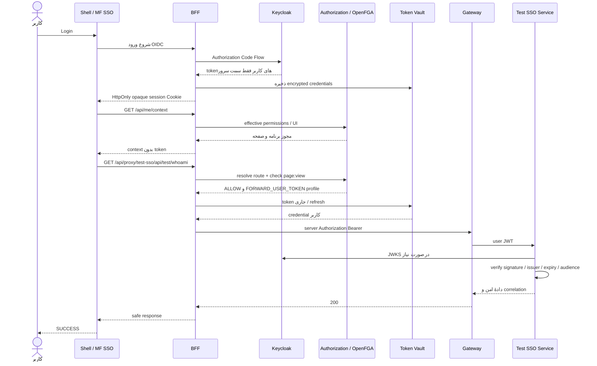
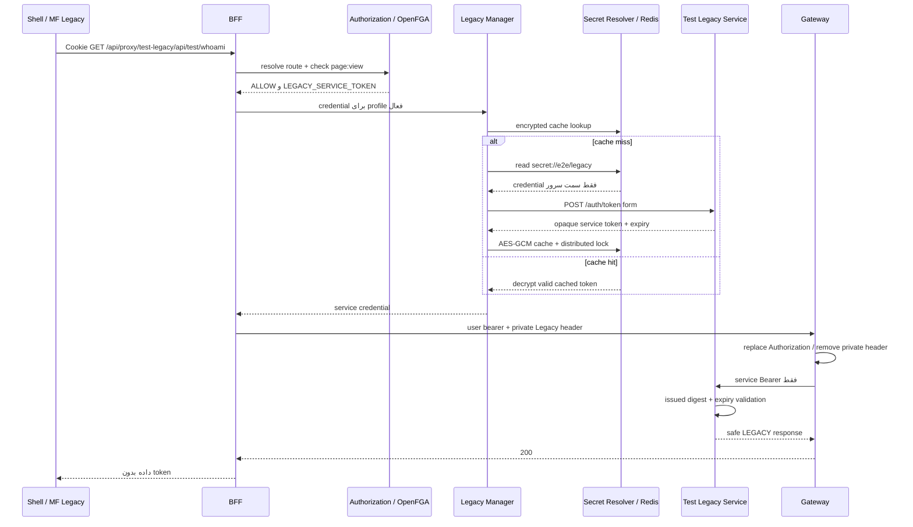

# گزارش آزمون سرتاسری دو برنامه مستقل SSO و Legacy در Aurevia

زمان اجرای نهایی: {{RUN_AT}}. این گزارش از خروجی واقعی runner و فایل‌های Surefire تولید شده است. نتیجهٔ اجرای زنده: **PASS={{PASS}}، FAIL={{FAIL}}، BLOCKED={{BLOCKED}}**.

کارهای انجام‌شده برای این نیازمندی:

- دو مایکروفرانت‌اند مستقل و دو سرویس Java برای مسیرهای SSO و Legacy ساخته و اجرا شدند.
- هر برنامه با Manifest منابع و Manifest رابط کاربری مستقل از طریق API رسمی مدیریت ثبت شد.
- مسیرهای proxy، مقصد پایین‌دست و روش احراز هویت در Registry موجود تعریف شدند؛ مسیر اختصاصی در Shell اضافه نشد.
- چهار کاربر با مجوزهای هر دو برنامه، فقط SSO، فقط Legacy و بدون دسترسی با ورود واقعی Keycloak آزموده شدند.
- فراخوانی موفق هر دو سرویس، رد مجوز و credential نامعتبر، تغییر پویای مسیر، cache توکن Legacy، امنیت session و ثبت correlation بررسی شدند.
- اشکال‌های wiring، مجوز مدیریت، انتقال status خطا، ثبت audit و وابستگی DNS شناسایی و اصلاح شدند؛ آزمون‌های regression مربوط نیز اجرا شدند.
- نتیجه‌های امن، فرمان‌های اجرای مستقل و محدودیت‌های آزمون در این سند و فایل evidence ثبت شدند. فایل‌های secret و تصویرهای محیط محلی وارد Git نمی‌شوند.

## 1. هدف تست

اثبات زنجیرهٔ کامل ورود واقعی کاربر، مجوز مؤثر OpenFGA، نمایش Microfrontend مجاز در Shell، درخواست همان مایکروفرانت‌اند به BFF، resolve مسیر ثبت‌شده، کنترل مجوز در سرور، انتخاب credential متناسب با authMode، اعتبارسنجی در سرویس پایین‌دست و برگشت نتیجه به صفحه است. دو سرویس و دو MF اضافه شده‌اند؛ Shell هیچ مسیر اختصاصی برای آن‌ها در source ندارد. دادهٔ پاسخ آزمایشی است، ولی ورود، token، registry و authorization واقعی‌اند.

## 2. معماری نهایی

Shell مبتنی بر React و Webpack Module Federation است. قرارداد plugin نسخهٔ 1.0 با App و runtime میزبان استفاده می‌شود. BFF مبتنی بر Spring WebFlux با Cookie session ورود OIDC را انجام می‌دهد. PostgreSQL منبع registry و grant است و transactional outbox رابطه‌ها را به OpenFGA می‌نویسد. Redis محل session، vault رمز‌شده و cache رمز‌شدهٔ Legacy است.

OperationalProxyController مسیر /api/proxy/{panelSlug}/{path} را از Authorization Service resolve می‌کند. route_operation منبع و business action را تعیین می‌کند؛ تصمیم OpenFGA پیش از خواندن vault یا دریافت token Legacy گرفته می‌شود. مقصد عملیاتی فقط Operation Gateway مورد اعتماد است. gatewayBaseUrl در registry اجازهٔ تبدیل BFF به یک proxy دلخواه اینترنتی را نمی‌دهد. BFF برای هر درخواست mode را از outbound_auth_profile متصل به service_target می‌گیرد.

Resource Catalog ساختار domain و مجوزها را نگه می‌دارد. UI Manifest مسیر، navigation و runtime را نگه می‌دارد. routes داخل /api/me/context مسیرهای UI هستند و جایگزین proxy_route یا route_operation نیستند. خدمات پایین‌دست و Gateway هیچ port منتشرشده روی host ندارند.

## 3. اجزای ایجادشده

| مسیر | نقش |
|---|---|
| apps/mf-test-sso | MF مستقل با resource-manifest و mf-manifest |
| apps/mf-test-legacy | MF مستقل برای مسیر Legacy |
| services/test-sso-service | Resource Server واقعی JWT، Java 21 / Spring Boot |
| services/test-legacy-service | Token endpoint و API با credential سرویس opaque |
| infra/docker-compose/compose.e2e-auth.yml | چرخهٔ اجرای مستقل چهار جزء |
| infra/docker-compose/compose.e2e-auth-core.yml | overlay اختیاری برای JAR جاری، secret resolver و gateway |
| infra/e2e-auth/gateway-routes.conf | دو upstream از شبکهٔ داخلی و پاک‌سازی header خصوصی |
| tools/e2e-auth/prepare.mjs | تولید credential محلی خارج از git |
| tools/e2e-auth/session.mjs و browser.mjs | ورود واقعی OIDC و Chrome/CDP |
| tools/e2e-auth/verify.mjs و report.mjs | اجرای matrix و تولید گزارش از evidence |

برای Java یک profile اختیاری e2e-sso-legacy به pom اصلی اضافه شده است. build پیش‌فرض اجبار به ساخت demo ندارد. اصلاحات محدود در BFF و manifest fetcher با تست regression همراه‌اند.

## 4. تنظیمات Microfrontend اول

نام workspace برابر @aurevia/mf-test-sso، نام remote برابر aurevia_test_sso، exposedModule برابر ./plugin و port توسعه یا artifact host برابر 3011 است. remoteEntry ثبت‌شده http://localhost:3011/remoteEntry.js و apiBasePath برابر /api/proxy/test-sso است. آدرس صفحه در Shell: http://localhost:8443/test-sso/home.

App از SHRouteGuard و HTTP client میزبان استفاده می‌کند. دکمهٔ Call از runtime.http به /api/test/whoami درخواست می‌زند، نام کاربر و mode و correlation امن را نشان می‌دهد و وضعیت SUCCESS فقط پس از تطبیق سرویس، authenticated و SSO نمایش داده می‌شود. فایل standalone نیز context واقعی BFF را می‌خواند و هیچ permission یا token ساختگی نمی‌سازد.

## 5. تنظیمات Microfrontend دوم

workspace برابر @aurevia/mf-test-legacy، remote برابر aurevia_test_legacy، exposedModule برابر ./plugin و port برابر 3012 است. apiBasePath برابر /api/proxy/test-legacy و صفحهٔ Shell برابر http://localhost:8443/test-legacy/home است. همین runtime و guard استفاده می‌شوند؛ تنها انتظار پاسخ LEGACY و test-legacy-service متفاوت است. صفحه و bootstrap هیچ username/password سرویس یا token را نمی‌خوانند.

Nginx در Compose فقط artifactها را ارائه می‌کند؛ اجرای standalone همراه با proxy BFF با فرمان‌های dev جداگانه انجام می‌شود. ورود ابتدا در Shell انجام می‌شود. دو dev server هم‌زمان با artifact containerهای همان port اجرا نمی‌شوند.

## 6. Resource Manifest هر Microfrontend

هر فایل schemaVersion=1.0، module key و resource مستقل PAGE با action=view و classification=INTERNAL دارد. key منبع اول page:test-sso.home و دومی page:test-legacy.home است. navigation، remoteEntry، API URL و UI layout وارد Resource Manifest نشده‌اند. runtime/routes/navigation در mf-manifest.json مستقل قرار دارند و هر route به همین resource و action=view اشاره دارد.

نمونهٔ واقعی SSO:

{{RESOURCE_MANIFEST}}

Resource Keyهای صفحه به objectهای resource:page/test-sso.home و resource:page/test-legacy.home تبدیل می‌شوند. root کاربردی application:aurevia/test-sso و application:aurevia/test-legacy هنگام ثبت/انتشار در catalog قرار می‌گیرد.

نمونهٔ واقعی Legacy:

{{LEGACY_RESOURCE_MANIFEST}}

## 7. نحوه Register شدن Microfrontendها

runner با session واقعی administrator از /api/v1/admin استفاده می‌کند. GET /panels ثبت موجود را پیدا می‌کند؛ POST یا PUT /panels با version، slug، remoteEntry، resourceManifestUrl و mfManifestUrl انجام می‌شود. POST /panels/{id}/resource-manifests/fetch فایل را سمت سرور fetch و validate می‌کند؛ در صورت DRAFT، POST /panels/{id}/resource-manifests/drafts/{draftId}/publish آن را منتشر می‌کند. سپس POST /panels/{id}/frontend-manifests/sync نتیجهٔ SUCCESS را کنترل می‌کند.

پنل‌های TEST_SSO و TEST_LEGACY، connection/profile، target، proxy route و عملیات از APIهای مدیریت ثبت می‌شوند؛ SQL دستی، grant ساختگی یا fixture مبتنی بر manifest hardcode در Shell وجود ندارد. اجرای مجدد grantهای ACTIVE همین کاربران برای همین دو app را حذف و matrix را بازسازی می‌کند. تغییرات route/profile version دارند و optimistic concurrency رعایت شده است.

## 8. تنظیمات Proxy Route

| مشخصه | SSO | Legacy |
|---|---|---|
| panelSlug / serviceSlug | test-sso | test-legacy |
| مسیر بیرونی | /api/proxy/test-sso/api/test/whoami | /api/proxy/test-legacy/api/test/whoami |
| target | e2e-sso | e2e-legacy |
| gatewayBaseUrl | http://operation-gateway:80 | http://operation-gateway:80 |
| upstreamBasePath | /test-sso-service | /test-legacy-service |
| authMode واقعی enum | FORWARD_USER_TOKEN | LEGACY_SERVICE_TOKEN |
| profile code | e2e-sso | e2e-legacy |
| روش مجاز | GET | GET |
| operationها | /api/test/whoami و /api/test/data | /api/test/whoami و /api/test/data |
| resource/action | page:test-sso.home / view | page:test-legacy.home / view |

rewritePattern پیشوند /api/proxy/test-sso یا test-legacy را با /test-sso-service یا /test-legacy-service جایگزین می‌کند. Gateway این پیشوند سرویس را حذف می‌کند. نتیجهٔ resolve به مسیر داخلی /api/test/whoami می‌رسد. stripPrefix=0، priority=100، retryEnabled=false و active=true ثبت شده‌اند. route operationها authorizationRequired=true دارند.

## 9. تعریف Route در پنل/Registry

Admin APIهای /outbound-connections، /outbound-auth-profiles، /service-targets، /proxy-routes و /proxy-routes/{id}/operations از طریق BFF به registry موجود Authorization Service می‌روند. اتصال connection://e2e/legacy فقط http://test-legacy-service:8092 را معرفی می‌کند. secret://e2e/legacy مرجع credential است؛ مقدار credential در registry ذخیره نشده است.

PUT /proxy-routes/{id}?version={version} تنظیمات را تغییر می‌دهد. PATCH /proxy-routes/{id}/status?version={version} با active=false یا true مسیر را غیرفعال/فعال می‌کند. عملیات اصلی route resolution و authorization در هر درخواست انجام می‌شود. تست‌ها بدون restart یا rebuild مسیر را تغییر و سپس در finally بازگردانده‌اند.

## 10. جریان احراز هویت SSO

مرورگر به Shell و BFF وارد می‌شود، به Keycloak واقعی realm aurevia هدایت می‌شود و authorization code به callback سرور برمی‌گردد. BFF tokenها را دریافت و در vault سمت سرور نگه می‌دارد. Cookie فقط شناسهٔ opaque session دارد. MF درخواست same-origin خود را همراه Cookie می‌فرستد. BFF پس از کنترل route و مجوز، token کاربر همان session را از vault و refresh service می‌گیرد و Authorization: Bearer را فقط روی درخواست server-to-server قرار می‌دهد.

Gateway credential کاربر را به test-sso-service می‌رساند. Nimbus decoder و resource server امضا با JWKS واقعی، الگوریتم RS256، issuer، expiration با skew صفر، subject غیرخالی و audience=account را بررسی می‌کنند. سرویس هیچ bypass یا bearer mock ندارد. subject و username پاسخ با identity واقعی همان کاربر مقایسه شده‌اند.

## 11. جریان احراز هویت Legacy

ورود و مجوز کاربر همان جریان BFF/OIDC است. پس از تصمیم ALLOW، LegacyServiceTokenProvider به manager موجود رجوع می‌کند. manager profile و connection تأییدشده را می‌خواند، credential را از FileSecretResolver می‌گیرد و در cache miss به /auth/token داخلی form می‌فرستد. token opaque صادرشده با prefix legacy_، random 32 byte و TTL=120 ثانیه در پاسخ token endpoint فقط بین سرورها جابه‌جا می‌شود.

BFF credential Legacy را در X-Internal-Legacy-Authorization خصوصی و credential کاربر را در Authorization روی درخواست Gateway می‌گذارد؛ Gateway فقط در location Legacy، Authorization downstream را جایگزین و header خصوصی را حذف می‌کند. سرویس Legacy digest SHA-256 tokenهای صادرشده و expiry را کنترل می‌کند. token SSO، token نامعتبر و درخواست بدون credential رد می‌شوند. پاسخ UI فقط دادهٔ امن و mode را دارد.

## 12. نحوه انتخاب authMode توسط BFF

OperationalProxyController از resolveRoute یک outboundAuthProfileId می‌گیرد و profile فعال را می‌خواند. FORWARD_USER_TOKEN به provider کاربر و LEGACY_SERVICE_TOKEN به provider سرویس resolve می‌شود. دو App نمی‌توانند با header مرورگر mode یا credential را تعیین کنند. تست parameterized کنترل می‌کند DENY پیش از vault/refresher/provider متوقف شود و bearer تزریق‌شدهٔ مرورگر credential خروجی سرور را تغییر ندهد.

## 13. نحوه دریافت OAuth2 Token

Login از OAuth2 authorization-code flow و registration واقعی BFF استفاده می‌کند. token به session مرورگر serialize نمی‌شود؛ SessionIdentity و vault handle جایگزین اشیای OAuth2 شده‌اند. TokenRefreshService در server token جاری را ارائه می‌کند. issuer آزمایش http://localhost:8180/realms/aurevia و JWKS داخل Docker از host.docker.internal:8180 دریافت می‌شود.

فقط برای تست expiry/signature یک client محلی e2e-token-negative با token lifespan=10 ثانیه در Keycloak ایجاد شده است. runner از server-side direct grant یک token واقعاً امضاشده می‌گیرد، پس از exp صبر می‌کند و HTTP 401 سرویس را می‌سنجد. این client بخشی از ورود MF یا قرارداد مرورگر نیست؛ JWT جعلی به جای token واقعی استفاده نشده است.

## 14. نحوه دریافت Legacy Token

profile موجود requestFormat=FORM_URLENCODED، tokenEndpointPath=/auth/token، tokenResponsePointer=/access_token، expiresInResponsePointer=/expires_in، tokenTypeResponsePointer=/token_type، expirySkewSeconds=5 و credentialTransport=INTERNAL_LEGACY_HEADER دارد. timeoutها و maxTokenResponseSize محدودند و host/port اتصال در allowlist موجود قرار گرفته است.

manager موجود AES-GCM encrypted Redis cache و lock توزیع‌شده دارد. تست از Admin API invalidate-token، سپس دو call موفق و cache-status استفاده کرده و cache=miss و cache=hit را در log امن کنترل کرده است. secret مفقود باعث 502 با پیام عمومی می‌شود؛ credential، پاسخ token endpoint یا cause خصوصی به UI برنمی‌گردد. در finally profile صحیح بازگردانده شده و call بعدی 200 است.

فایل محلی .tmp/e2e-auth/secrets/e2e/legacy.json و demo.env در gitignore هستند. password تصادفی را prepare تولید می‌کند و مقدارش در گزارش، log یا نتیجه ذخیره نمی‌شود. Redis legacy cache با vault key موجود رمز می‌شود؛ identity session در namespace aurevia:session:v2 token ندارد.

## 15. جریان کنترل دسترسی

CanonicalIdentityResolver user را با زوج issuer/subject شناسایی می‌کند. runner پس از login واقعی هر کاربر، رکورد canonical را از Admin /users می‌یابد و grant را برای user ID واقعی می‌نویسد. application visibility و مجوز صفحه دو check جداگانه‌اند؛ به همین دلیل برای هر app مجاز، هم root application و هم PAGE action=view grant داده شده است.

grant registry با outbox به OpenFGA می‌رود. runner context مؤثر واقعی را poll می‌کند و سپس API مستقیم را نیز می‌سنجد. پنهان بودن منو تنها معیار نیست: کاربران فاقد مجوز از BFF 403 می‌گیرند. missing session برابر 401 است.

## 16. مجوزهای OpenFGA

| کاربر محلی | application و PAGE مجاز |
|---|---|
| e2e.dual-access | هر دو test-sso و test-legacy |
| e2e.sso-only | فقط test-sso |
| e2e.legacy-only | فقط test-legacy |
| e2e.none | هیچ‌کدام |

view برای صفحه به viewer/can_view و visibility برنامه به can_view application:aurevia/{slug} ترجمه می‌شود. action باید در catalog همان resource نیز فعال باشد؛ صرف inherited manager در FGA یک action ناموجود را معتبر نمی‌کند. همین قاعده mismatch قدیمی manage در endpoint مدیریت profile را آشکار کرد.

## 17. رفتار /api/me/context

context واقعی شامل contractVersion، identity(issuer/subject/username)، tenant با id=default، organizations، allowedApplications، allowedMicros، dynamicRoutes، navigation، resources، actions، policies و uiCatalog است. فیلدهای manifest قبلی نیز برای قرارداد سازگار موجودند. applications در قرارداد فعلی فهرست Superset است؛ برای این MFها allowedApplications و allowedMicros خوانده می‌شوند. remoteEntry مؤثر از مسیر same-origin /api/mfe/{moduleKey}/remoteEntry.js ارائه می‌شود.

نمونهٔ امن actual برای کاربر دو دسترسی، استخراج‌شده از evidence نهایی:

{{CONTEXT}}

خروجی کامل امن همین run در [evidence JSON](evidence/e2e-sso-legacy-proxy-results.json) است. raw token، password یا secret در آن نیست. آزمون context در هر هشت حالت visibility را با matrix مقایسه کرده است.

## 18. تست‌های مثبت

ثبت و انتشار منابع، sync UI، ورود administrator و چهار کاربر، call whoami برای دو mode، تطبیق subject/username SSO، data هر دو سرویس، cache miss/hit، فعال‌سازی route، بازگرداندن rewrite و secret، correlation، و چهار سناریوی مرورگر اجرا شده‌اند. در Chrome واقعی، منوهای Shell، mount شدن plugin، نام کاربر، کلیک دکمهٔ MF و SUCCESS حاصل از downstream کنترل می‌شوند.

## 19. تست‌های منفی

نبود session برابر 401؛ نبود permission برابر 403؛ مسیر ناشناخته، متد POST بدون operation مجاز با CSRF صحیح، route disabled و rewrite به مسیر ناموجود برابر 404 هستند. مقصد ثبت‌نشده 169.254.169.254 توسط Admin API با 400 رد شده است. سرویس SSO بدون credential، signature نامعتبر، token واقعی منقضی‌شده یا credential Legacy، HTTP 401 می‌دهد. سرویس Legacy بدون credential، token نامعتبر یا credential SSO نیز 401 می‌دهد. token endpoint با password نادرست 401 است؛ secret مفقود BFF را fail closed با 502 متوقف می‌کند.

## 20. تست‌های امنیتی

Chrome/CDP درخواست‌های protected را بررسی کرده است: فقط same-origin BFF، بدون Authorization bearer مرورگر و بدون تماس مستقیم با downstream. URL، document.cookie، localStorage و sessionStorage از نظر token بررسی شده‌اند. Cookie session در JavaScript دیده نمی‌شود و در login واقعی HttpOnly ثبت شده است. Redis session متن serialize‌شدهٔ SessionIdentity را دارد و هیچ OidcIdToken، DefaultOidcUser، OAuth2AuthorizedClient یا JWT ندارد.

responseهای موفق، context و application/edge/Keycloak logها با pattern JWT، token Legacy، Authorization: Bearer و secretهای شناخته‌شده اسکن شده‌اند. backendها و Gateway port host ندارند. direct negative probe فقط یک container موقت روی شبکهٔ مورد اعتماد است و token از stdin curl فرستاده می‌شود؛ برای تست port یا CORS باز نشده است.

این نتیجه دربارهٔ run محلی مشاهده‌شده است. TLS تولید، زمان‌بندی refresh در مدت طولانی، rotation keyها و آزمون امنیتی کل محصول در این suite ادعا نشده‌اند.

## 21. آزمون مدیر سامانه

ADMIN-SSO و ADMIN-LEGACY ثبت واقعی registry را کنترل می‌کنند. ADMIN-UNAUTHORIZED تلاش کاربر sso-only برای POST proxy-routes را با 403 می‌سنجد. route status، rewrite، outbound profile update، invalidate-token و cache-status با session واقعی administrator و CSRF اجرا می‌شوند. رگرسیون AdminProfileActionTest مشخصاً action=test برای token/connection test و action=invalidate-token برای invalidation را بررسی می‌کند؛ actionهای کاتالوگ تغییر نکرده‌اند.

## 22. آزمون مدیریت پویای مسیرها

غیرفعال‌سازی Legacy بلافاصله call را به 404 تبدیل کرده، فعال‌سازی آن 200 برگردانده است. تغییر rewrite SSO به /missing-e2e-destination برابر 404 شده و restoration برابر 200 است. هیچ restart، build یا ویرایش Shell در فاصلهٔ این mutationها انجام نشده است. target غیرمجاز در registration نیز 400 است. عملیاتی بودن admin/registry در runtime اثبات شده است.

## 23. آزمون ثبت رویداد و هم‌بستگی درخواست

BFF اکنون PROXY_AUDIT با subject، application، route، decision، target، authMode، status، correlationId و timestamp ثبت می‌کند؛ token ثبت نمی‌شود. نتیجهٔ اجازهٔ اولیه status=0 دارد و outcome واقعی جداگانه با status پاسخ نوشته می‌شود. PublicApiLoggingWebFilter resourceId، businessAction و authorizationResult را از exchange ثبت می‌کند و ResponseStatusException را با status واقعی، نه 500 عمومی، log می‌کند.

evidence نهایی هم‌بستگی: {{AUDIT}}. همان UUID در header/request و پاسخ downstream، log BFF، log test-sso-service و /api/v1/admin/logs/correlation/{id} موجود است. storedEntries تعداد رکوردهای واقعاً خوانده‌شده از API audit است.

## 24. ماتریس آزمون‌ها

جدول دسترسی (visibility context و backend HTTP، هر دو در همان تست):

{{ACCESS_MATRIX}}

تمام موردها، expected و actual و وضعیت مستقل آن‌ها:

{{TEST_MATRIX}}

## 25. نمودار توالی Mermaid برای SSO



## 26. نمودار توالی Mermaid برای Legacy



## 27. فرمان‌های ساخت، اجرا و آزمون

همهٔ فرمان‌ها از root repository اجرا می‌شوند. پیش‌نیاز: Java 21، npm 10.9.2، Node 22.15+، Docker Compose، Chrome یا Edge محلی و .env آمادهٔ Core. برای نصب تازه از .env.example و راهنمای موجود fresh-install-validation-fa.md استفاده شود. bootstrap خود PostgreSQL/OpenFGA لازم را بالا می‌آورد و شناسه‌های واقعی را در .env می‌نویسد؛ سپس infra:up imageهای Core را می‌سازد. overlay اختیاری image را build نمی‌کند و JAR host را mount می‌کند.

فرمان‌های واقعی Windows برای ساخت و اجرای کامل (پس از آماده‌سازی .env):

```powershell
npm ci
npm run build --workspace=@aurevia/shell
npm run openfga:bootstrap
npm run identity:up
npm run infra:up
.\mvnw.cmd -P e2e-sso-legacy package
npm run e2e:auth:build
npm run e2e:auth:prepare
npm run e2e:auth:core:up
npm run e2e:auth:up
npm test
npm run e2e:auth:verify
npm run e2e:auth:report
```

اگر imageها و dependencyها از قبل موجودند، npm ci و ساخت اولیهٔ Core لازم نیستند؛ همین session از imageهای cache استفاده کرده است. Keycloak و Core باید healthy شوند و سپس verify اجرا شود. برای Java بر Linux فرمان ./mvnw -P e2e-sso-legacy package است. build مستقل Java: .\mvnw.cmd -pl services/test-sso-service -am -P e2e-sso-legacy package و همین فرمان با services/test-legacy-service. راه‌اندازی مستقل containerها:

```powershell
docker compose --env-file .tmp/e2e-auth/demo.env -f infra/docker-compose/compose.e2e-auth.yml up -d --build test-sso-service
docker compose --env-file .tmp/e2e-auth/demo.env -f infra/docker-compose/compose.e2e-auth.yml up -d --build test-legacy-service
docker compose --env-file .tmp/e2e-auth/demo.env -f infra/docker-compose/compose.e2e-auth.yml up -d mf-test-sso
docker compose --env-file .tmp/e2e-auth/demo.env -f infra/docker-compose/compose.e2e-auth.yml up -d mf-test-legacy
```

این فرمان‌ها پس از اجرای Core overlay استفاده می‌شوند. برای توسعهٔ MF مستقل، ابتدا container artifact همان port را stop و سپس در دو terminal این فرمان‌ها را اجرا کنید:

```powershell
npm run dev:mf-test-sso
npm run dev:mf-test-legacy
```

متغیر AUREVIA_BFF_URL می‌تواند مقصد proxy dev server را تعیین کند؛ پیش‌فرض http://localhost:8443 است. برای مشاهدهٔ صفحات از Shell وارد شوید. usernameهای چهار کاربر در بخش 16 و passwordهای تصادفی فقط در .tmp/e2e-auth/users.json محلی هستند. administrator از realm محلی یا AUREVIA_DEMO_PASSWORD runner خوانده می‌شود. runner فقط localhost را provision می‌کند.

فرمان‌های واقعاً اجراشدهٔ validation در این session شامل npm test، build Shell، e2e:auth:build، typecheck هر دو workspace، .\mvnw.cmd -P e2e-sso-legacy verify -o، .\mvnw.cmd -pl services/superapp-bff -am clean package -o و .\mvnw.cmd -pl services/authorization-service -am test -o هستند. dependency جدید Resource Server یک بار با Maven online resolve شده است. آخرین report از فایل‌های unique آخرین Surefire خوانده می‌شود؛ focused testهای تکراری دوباره شمرده نمی‌شوند.

برای توقف چهار demo: npm run e2e:auth:down. این فرمان volumeهای Core را حذف نمی‌کند. برای بازگشت Core بدون overlay، پس از stop کردن demoها فرمان docker compose --env-file .env -f infra/docker-compose/compose.yml up -d --no-build --force-recreate aurevia-bff authorization-service operation-gateway را اجرا کنید. imageهای Core باید شامل source اصلاح‌شده باشند؛ در غیر این صورت هنگام بازگشت overlay، اصلاحات JAR host دیگر بارگذاری نمی‌شوند و imageها باید با source جاری rebuild شوند. registry و کاربران محلی باقی می‌مانند؛ در پنل Admin می‌توان پنل‌ها و routeهای demo را deactivate کرد.

## 28. نتایج واقعی آزمون‌ها

| مجموعهٔ آزمون | PASS | FAIL | BLOCKED / اجرا‌نشده |
|---|---:|---:|---:|
| Java، آخرین XML هر تست | {{JAVA_PASS}} | {{JAVA_FAIL}} | {{JAVA_SKIP}} |
| npm test، اجراشده در این session | 42 | 0 | 0 |
| live E2E + Chrome | {{PASS}} | {{FAIL}} | {{BLOCKED}} |
| مجموع caseهای این سه suite | {{TOTAL_PASS}} | {{TOTAL_FAIL}} | {{TOTAL_BLOCKED}} |

Java detail: {{JAVA_DETAIL}}. Build و typecheckها موفق بودند و به عنوان case اضافی شمرده نشده‌اند. screenshotهای local و browser evidence در target/e2e-auth ذخیره شده‌اند؛ نتیجهٔ امن و قابل نگهداری در docs/evidence/e2e-sso-legacy-proxy-results.json کپی می‌شود. evidence JSON شامل expected/actual هر case، context و audit واقعی است.

اجرای اول 39 case داشت: 35 PASS و 4 FAIL به علت شبکهٔ probe مستقیم SSO. پس از اصلاح probe و افزودن دو check امنیت session/admin، اجرای دوم 41 case داشت: 40 PASS و 1 FAIL به علت mismatch action مدیریت cache. جدول بالا فقط اجرای نهایی پس از اصلاحات را نشان می‌دهد و شکست‌های تاریخی حذف یا موفق نام‌گذاری نشده‌اند. در صورت dependency غایب، runner case اجرا‌نشده را BLOCKED می‌نویسد؛ AUREVIA_BROWSER_E2E=false نیز چهار browser case را BLOCKED می‌کند.

## 29. اشکال‌های شناسایی‌شده

1. Interface ResourceManifestFetcher از ManifestFetcher جدا مانده بود و HttpManifestFetcher آن port را implement نمی‌کرد؛ Authorization Service هنگام wiring bean لازم برای ResourceManifestService را نداشت.
2. WebClient در resolveRoute خطای 4xx را بدون ترجمهٔ status به BFF منتقل می‌کرد؛ مسیر ناشناخته یا غیرفعال می‌توانست به 500 تبدیل شود.
3. PublicApiLoggingWebFilter همهٔ exceptionها را 500 ثبت می‌کرد و اطلاعات مجوز/منبع proxy روی exchange موجود نبود؛ audit با outcome واقعی ناسازگار می‌شد.
4. خطای private adapter Legacy نیاز به نگاشت امن server-side داشت؛ در نبود secret باید fail closed با 502 و پیام عمومی باشد.
5. endpointهای token-test، connection-test و invalidate-token مجوز manage را می‌خواستند، در حالی که catalog integration.auth-profile چنین actionی ندارد. تصمیم runtime پیش از FGA manager inheritance درخواست را رد می‌کرد.
6. Gateway قدیمی DNS Keycloak را هنگام startup resolve می‌کرد؛ توقف dependency اختیاری می‌توانست Core gateway را از startup بازدارد.
7. harness مستقیم SSO از شبکهٔ BFF credential-egress درخواست می‌زد، در حالی که Resource Server عمداً روی operation-services است. این چهار failure به isolation درست شبکه مربوط بود.
8. Dockerfile سرویس demo در context root نمی‌توانست JAR target را COPY کند چون .dockerignore اصلی آن را حذف می‌کرد؛ context مستقل سرویس این اشکال را حل کرد.

## 30. اصلاحات و آزمون‌های رگرسیون

HttpManifestFetcher اکنون ResourceManifestFetcher و در نتیجه ManifestFetcher را تأمین می‌کند؛ ManifestFetcherWiringTest این wiring را کنترل می‌کند. AuthorizationServiceClient HTTP error را با همان status و پیام عمومی به ResponseStatusException تبدیل می‌کند؛ RouteResolutionStatusTest پنج status را می‌سنجد.

PROXY_AUDIT و exchange attributes اضافه شده‌اند و PublicApiLoggingWebFilter status واقعی را ثبت می‌کند؛ چهار تست status و تصمیم DENY موجودند. LegacyServiceTokenProvider خطا را به 502 عمومی بدون private cause تبدیل می‌کند و تست missing-secret واقعی نیز آن را تأیید کرده است.

AdminProxyController از actionهای موجود test و invalidate-token استفاده می‌کند؛ AdminProfileActionTest سه endpoint را می‌سنجد. OperationalProxyAuthorizationTest چهار ترکیب allow/deny و provider را پوشش می‌دهد. LegacyCredentialsTest صدور و expiration واقعی token را کنترل می‌کند.

Gateway DNS را request-time resolve می‌کند و optional include مسیرهای دو demo را اضافه می‌کند؛ config پیش‌فرض به وجود آن‌ها وابسته نیست. probe مستقیم SSO روی شبکهٔ operation-services اجرا می‌شود؛ هیچ شبکه یا port production برای راحت‌تر شدن تست باز نشده است. JARهای هر سرویس از context خود سرویس ساخته می‌شوند.

## 31. محدودیت‌ها و ریسک‌های باقی‌مانده

این یک demo محلی روی HTTP و Keycloak محلی است؛ گواهی TLS، mTLS، secret manager تولید، Windows ACL، HA یا penetration test کل محصول با آن تأیید نشده است. mode=0600 در prepare روی Windows جایگزین ACL مناسب محیط تولید نیست. credential Legacy در محیط container fixture برای اجرای محلی استفاده می‌شود؛ production باید resolver و سیاست secret عملیاتی خودش را داشته باشد.

Node نصب‌شده در session نسخهٔ 22.14.0 بود و از حداقل مصوب 22.15.0 کمتر است؛ build و تست‌ها با آن موفق شدند، ولی toolchain مصوب تغییر نکرده است. Webpack Shell warning اندازهٔ bundle موجود را داشت. imageهای عمومی cache با همان نسخهٔ pinned برای نام mirror محلی tag شدند؛ نسخه‌های PostgreSQL/Redis/Keycloak/OpenFGA تغییر نکردند.

چهار کاربر و client کوتاه‌عمر فقط در realm محلی ایجاد شده‌اند؛ runner destructive cleanup realm یا DB ندارد. grantهای همین چهار user و همین دو app هنگام اجرای مجدد بازسازی می‌شوند. screenshotها target محلی‌اند و نباید به دلیل وجود نام کاربر یا مسیر محیط به طور خودکار منتشر شوند.

fixture قدیمی /oauth-demo و Superset در scope این اجرای زنده نبودند و موفقیت آن‌ها از نتیجهٔ این دو برنامه استنتاج نشده است. تغییر DNS startup مشکل وابستگی Core را رفع می‌کند؛ ارتباط قدیمی fixture با شبکهٔ مستقل Keycloak نیاز به بررسی جداگانه دارد. refresh طولانی‌مدت، expiry خودکار cache در run چندساعته، rotation و contention موازی cache اینجا بررسی نشده‌اند؛ cache miss/hit/invalidation، expired JWT واقعی و expiry واحد Legacy بررسی شده‌اند.

## 32. نتیجهٔ نهایی

نتیجهٔ actual: {{FINAL_CONCLUSION}}. اجرای واقعی Chrome زنجیرهٔ login تا SUCCESS هر دو MF را برای یک کاربر اثبات می‌کند؛ کاربران فقط SSO، فقط Legacy و بدون دسترسی در context/UI و backend کنترل شده‌اند. routeها از registry موجود و Admin API در زمان اجرا تغییر می‌کنند. credential پایین‌دست در response، storage، درخواست browser یا logهای مشاهده‌شده پیدا نشده است.

مرجع قابل بازبینی: [نتایج امن تمام caseها](evidence/e2e-sso-legacy-proxy-results.json)، source runner و فایل‌های unique Surefire محلی. شمارش فقط از موردهای واقعاً اجراشده است.
